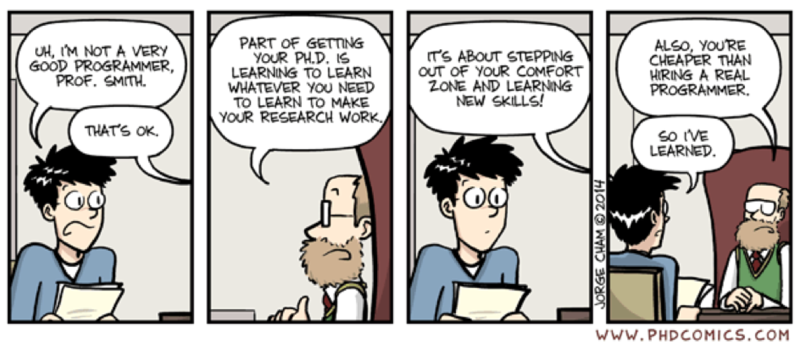

```{r setup, include=FALSE}

#   smaller: yes
# subtitle: IT101 - Getting started
# logo: img/00/uni.png

  # iosp::ioslides_plus:
  #   footer: "IT101"
  #   box_colours:
  #     bg-my_colour: "slateblue2"
  #     bg-epipgx: [ "gold", "darkmagenta"]
  #     bg-unilu: ["#ee2a28", "darkred"]
  #     bg-mechepi: [ "lightskyblue", "darkorange"]
  #     bg-ilae: ["darkmagenta", "darkorchid1"]
  #     bg-my_colour2: ["tomato3", "tomato2"]
  #     bg-intro: ["tomato3", "darkorange"]
  #     bg-my_colour3: ["springgreen4", header_text: "#FFD700"]
  #     bg-lcsb: ["darkred", "lightblue1"]
  #     


knitr::opts_chunk$set(echo = TRUE)
```


## Content | Bioinformatics {.build}


### Genomics {.box-6 .bg-blue}
 * Introduction to genetics
 * Introduction to the Unix Shell
 * Basic flow and algorithms
 * Next-generation sequencing - exome sequencing
 * Practical
 
### Databases {.box-6 .bg-yellow .stretch}
 * Statistical analysis environment R
 * Basic data structures
 * Reproducible science and reporting


## Speakers {.bg-blue}

Speaker            | Institute|Subject
-------------------|--------|---------
Reinhard Schneider | LCSB   | Introduction
Nikola de Lange | LCSB      | Unix Shell, R
Patrick May | LCSB          | NGS
Daniel Stieber | LNS        | Genetics
Roland Krause | LCSB        | R, Course moderator

## Timing

### Course times {.box-6 .bg-green}
 * Start 9:45
 * Lunch break 12:30 - 13:30
 * End (17:00)
 * Exercise/ Home work
 
### Schedule  {.box-6 .bg-blue}
 [Moodle](https://moodle.uni.lu/course/view.php?id=93#section-1)
 

```{css, echo = FALSE}
.box-body {
  font-size: 16pt;
  }

.box-body > .chunk > h3 {
  font-size: 16pt;
  line-height: 24pt;
}

.ss {
  font-size: 16pt;
  
}

.p {
 font-size: 16pt;
}
```


# IT101 - Basic data management

## Scientific data management

### Dr Bruce Banner {.box-6  .bg-green .stretch  .build}
Unrealistic depiction of a scientist

 ... can throw cars around and resist gun shots  
 
 ... has 7 PhDs  
 
 ... stores all research data in a database  
 
### {.box-4 .offset-1 }


## Humans operating computers | Introduction 
   


### Learning objectives {.box-8 .offset-1 .bg-red .icon}

 * Reproduciblity in the research data life cycle
 * How to manage your data
 * How to look and analyse your data
 * Solving issues with computers


## Typical flow of data {.smaller .build}

###  Source data ➡️ {.col-3 .box .bg-green .outline}
 * Raw experimental results 
 * Large data sets
 * Manually collected data
 * External data sets
 
###  Intermediate➡️ {.col-3 .box .bg-blue .stretch} 
 * Derived data
 * *Tidy* data 
 * Curated sets

###  Analysis ➡️  {.col-3 .box .bg-yellow .icon .stretch}
 * Exploratory
 * Model building
 * Hypothesis testing

###  Manuscript{.box-3 .warning .bg-unilu .stretch}
Reproduce  
  + all numbers paper
  + summaries
  + images and graphs
  
### Preserve {.box-3 .bg-green .stretch}
One data set (planned)
Several versions (common)

### Reproduce {.box-3 .bg-blue .stretch}
Several builds

### Trace  {.box-3 .bg-yellow .stretch}
Multiple iterations.

### Track {.col-3 .box .bg-lcsb .stretch}
Through multiple versions.

# All data processing is computation. {.bg-lcsb}


 
## Receiving and sending data 

### E-mail is not a data transfer solution {.box-6  .bg-yellow .smaller .stretch}
 * Avoid transfer of any data by e-mail
 * E-mail is a poor repository
 * Data can be read on passage
 * Use a file sharing service 

 * Special precautions for sensitive data (not covered here in detail)
* Sensitive data must be encrypted on transfer

### Solutions for data transfer{.box-6  .bg-blue .smaller .stretch}
 * Share on central server
 * Drop-IT service (SIU uni.lu recommendation)
 * ownCloud share (BioCore)
 * Dropbox, Google Drive, OneDrive, iCloud are not generally advised but many collaborators might rely on it
 

## Storing your data {.build}

### Advice  {.box-6  .bg-unilu .smaller .stretch}
 * Use institutional media for storage of all data
 * Disable write access to relevant source data


## Filenames | Conventions {.build}

### Examples {.box-12  .bg-advice .smaller}
 `Iris-setosa_samples_1927-05-12.csv`\
 `PI102_Mouse_EEG_2018-11-03_1245.tsv`\
 `Bioinfiniti_FullProposal_2018-11-15_1655.docx`

### Dates according to ISO8601 {.box-4  .bg-advice .smaller .stretch}
`2018-12-03`

`2018-12-06_1700`

### Separators {.box-4  .bg-lcsb .smaller .stretch}
 * No spaces
 * Underscore to separate
 * Hyphen to combine

### General principles {.box-4 .bg-blue}
 * Machine readable
 * Human readable
 * Plays well with default ordering 

### Source {.outline .box-12}
From Jenny Bryan by CC-BY
https://speakerdeck.com/jennybc/how-to-name-files


 
# Backup

## Taking care of your back-up {.build}

### No automatic back-up {.box-7 .bg-unilu}
You have to take care of your own back-up!
Research data, particularly sensitive data should be in a single place.

### 3-2-1 Back-up {.box-5   .bg-yellow .stretch}
 * Three copies
 * Two different media
 * One off-site copy

### Local data {.box-4 .bg-green }
 * Working documents on your laptop
 * Copy on an external hard drive
 * Online share (owncloud)

### Group data {.box-4 .bg-blue }
 * Research data generated in group
 * Back-up by central IT
 * Georesilient copy

### Sensitive data {.box-4 .bg-yellow }
 * Data set on virtual machine
 * Encryption
 * Online share (owncloud)

## Why is your workflow not reproducible?

### Lack of *provenance*  {.box-7  .bg-intro .smaller .stretch}
 * Input data from downloaded from “some website” 
 * Copy & paste operations
 * Manual text entry
 * Analysis not coded
 * Intermediate and final data not stored or overwritten

## Learning to code workflows and analysis

### Excel alone {.box-6 .bg-green} 
 + Is great for looking at data.
 + Data entry is fast.
 + Analysis flow is hidden and not in focus. 

### Coding {.box-6 .bg-blue}
 + Is great for controling analysis workflow
 + Data is hidden.
 + Flow is visible.
 
### Develop data science skills {.box-12 .bg-lcsb}
 * No immediate need to learn a high level programming language.
 * Make yourself familiar with a statistics environment such as R or Matlab step-by-step.

## So you're not a programmer{ .outline}

### {.box-12}



## Problem solving

### A guide for solving computing issues {.box-8 .offset-2 .bg-yellow .outline .icon-small}


 1. Express the problem
 2. Search for help
 3. Ask an expert

## Rubberducking

### Tell it to your rubberduck! {.box-4 .offset-6}


## Google for help {.build}

### Even decent programmers use Google {.box-10 .bg-yellow .offset-1}
Why shouldn't I?

### General flow {.box-10 .bg-lcsb .offset-1}
  * Read help pages and the official documentation well before turning to Google
  * Use stack exchange, forums and related resources carefully
   + Answers for Excel questions are worst
  * Write down what you want to achieve before turning to Google


## Write to the Oracle {.build}

### The Oracle gives the precise answer to your problems {.box-10 .offset-1 .bg-yellow}
 * You have to submit the problem in writing
 * The Oracle answers a questions only once or if it finds the problem interesting
 * If you supply a trivial problem, it will stop answering
 
### Available Oracles  {.box-10 .offset-1 .bg-green}
 * service.uni.lu (Uni and LCSB helpdesk)
 * Stack Overflow and other online sites
 * Local experts


# Thank you for your attention!


