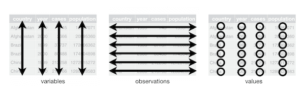
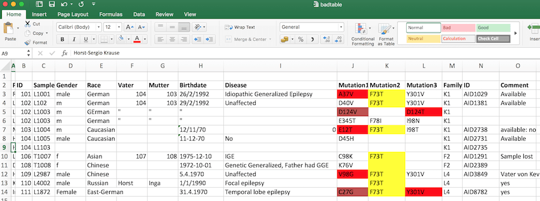
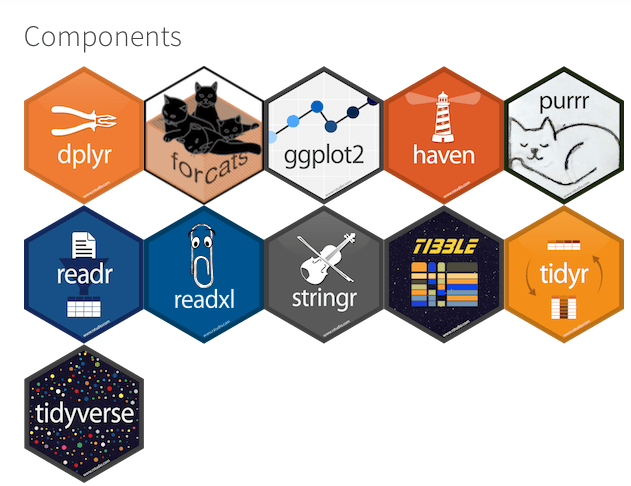
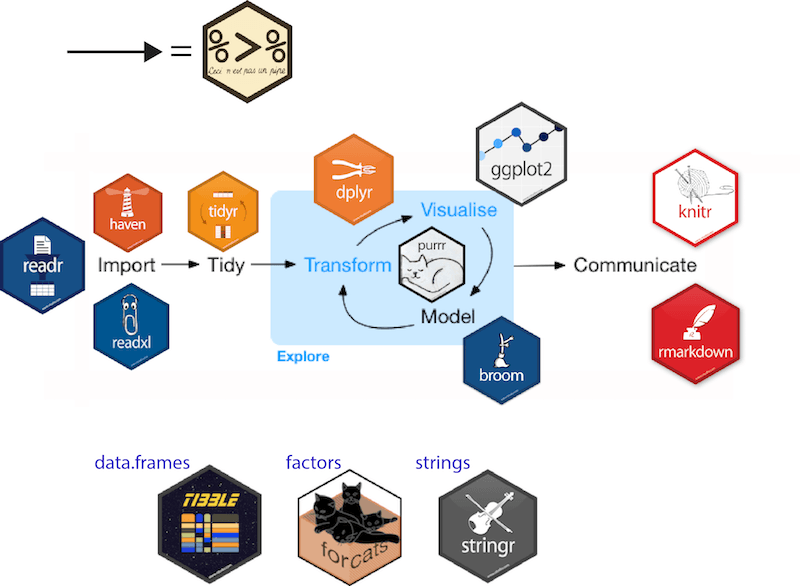
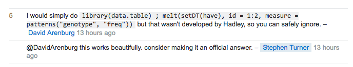

```{block, include = FALSE}
Adapted from the biostat2 tidyverse lecture https://biostat2.uni.lu/lecture02_tidyverse.html
```


```{r setup, include = FALSE}
knitr::opts_chunk$set(echo = TRUE, fig.align = "center")
library(tidyverse)
```

## Learning objectives
      
### You will learn to: {.box-10 .offset-1 .bg-red .icon}


- know principles of tidy data
- what is the tidyverse
- tidy up data using `tidyr`

## Basic: everything in the data rectangle | with header {.middle}

###{.box-6 .bg-white .offset-3}


<span class="small">[Jenny Bryan](https://speakerdeck.com/jennybc/data-rectangling) in Jeff Leek [blog post](https://simplystatistics.org/2017/05/24/toward-tidy-analysis/)</span>

## Rationale {.vs3 .build}

> tidy datasets are all alike but every messy dataset is messy in its own way | Hadley Wickham (see `vignette("tidy-data")`) {.col-8 .offset-2 .bg-yellow}

> All happy families are alike; each unhappy family is unhappy in its own way. | Leo Tolstoy, Anna Karenina{.col-8 .offset-2}

## Semantics {.vs2}

### Definitions {.box-8 .offset-2 .bg-blue}

- **Variable**: A quantity, quality, or property that you can measure.
- **Observation**: A set of values that display the relationship between variables. To be an observation, values need to be measured under similar conditions, usually measured on the same observational unit at the same time.
- **Value**: The state of a variable that you observe when you measure it.

<span class = "small">[source: Garret Grolemund](http://garrettgman.github.io/tidying/) and `vignette("tidy-data")`</span> 


## Definition {.vs2}

### Tidy data {.col-8 .offset-2 .box .bg-yellow}

1. Each variable is in its own column
2. Each observation is in its own row
3. Each value is in its own cell



## Bad data exercise {.bg-green .build}

### {.box-10 .offset-1 .bg-gray .icon}


- Open the [`badtable.xlsx` file](data/badtable.xlsx).
- The table lists missense variants in a gene in a group of patients.
- What's wrong with this sheet?
- Which problems are _tidy_ issues?

###{.col-10 .offset-1}



## Bad data exercise | Summary of problems {.bg-green .build}

### {.box-10 .offset-1 .small .bg-white}

Tidy error                    | Tidy violation | Comment
------------------------------|----------------|--------
Patient names                 | No             | Data protection violation
Identical column names        | **Yes**        | Variable error
Inconsistent variables names  | No             | Bad practice
Non-English columns names     | No             | Bad practice
Color coding                  | No             | The horror, the horror
Inconsistent dates            | No             | Use ISO8601 
Multiple columns for one item | **Yes**        | One observation per line
Redundant information         | **Yes**        | Each variable is in its own column
Repeated rows                 | **Yes**        | Each observation is in its own row
Uncoded syndromes             | **Yes**/No     | Each value in its own cell
Unnecessary information       | No             | like _birthdate_, _comments_: bad practice
Name of the table             | No             | You'll see this often


## Bad data exercise | Manual cleaning {.bg-green}

### Clean the "bad table" {.box-8 .offset-2 .bg-white}

- Bring data into shape such that it conforms to tidy data requirements
- Pay attention to details of format, less to actual data
- Do not use **R** for doing the manipulations
  
## Common tidy data violations {.vs3}

### Problems {.box-10 .bg-yellow .offset-1}

- Column headers are values, not variable names (`gather()`)
- Multiple variables stored in one column (`separate()`)
- Variables are stored in both rows and columns (`gather()`-`spread()`)
- Repeated observations (`nest()` or table)
- Multiple types in one table (`dplyr()` data transformation)
- One type in multiple tables (`dplyr()`, combine into single table)

# The tidyverse


## Tidyverse | website: [https://www.tidyverse.org/](https://www.tidyverse.org/) 

### {.box-8 .offset-2 .bg-bluew}



## Tidyverse components | Core

### Core {.box .col-6 .offset-3 .bg-blue}

- `ggplot2`, for data visualization
- `dplyr`, for data manipulation
- `tidyr`, for data tidying
- `readr`, for data import
- `purrr`, for functional programming
- `tibble`, for tibbles, a modern re-imagining of data frames


### {.col-6 .offset-3 .small}

source: http://tidyverse.tidyverse.org/. H.Wickham

## Tidyverse components | Extended

### Working with specific types of vectors {.box-6 .bg-blue}

- `hms`, for times
- `stringr`, for strings
- `lubridate`, for date/times
- `forcats`, for factors

###  Modelling {.box-6 .bg-blue}

- `modelr`, for modelling within a pipeline
- `broom`, for models -> tidy data

### Importing other types of data {.box-6 .offset-3 .bg-blue}

- `feather`, to share data
- `haven`, for SPSS, SAS and Stata files
- `httr`, for web apis
- `jsonlite` for JSON
- `readxl`, for `.xls` and `.xlsx` files
- `rvest`, for web scraping
- `xml2`, for XML files

## Tidyverse workflow

### {.box-8 .offset-2 .bg-bluew}




## Tidyverse criticisms

### It is a R dialect {.box-6 .bg-blue}

<blockquote class="twitter-tweet" data-lang="fr"><p lang="en" dir="ltr"><a href="https://twitter.com/ucfagls">@ucfagls</a> yeah. I think the tidyverse is a dialect. But its accent isn’t so thick</p>&mdash; Hadley Wickham (@hadleywickham) <a href="https://twitter.com/hadleywickham/status/819610201946984451">12 janvier 2017</a></blockquote>
<script async src="https://platform.twitter.com/widgets.js" charset="utf-8"></script>

### `tidyverse` vs `data.table`{} {.box-6 .bg-blue}

- Regularly debated on [StackOverflow](http://stackoverflow.com/questions/41880796/grouped-multicolumn-gather-with-dplyr-tidyr-purrr).



- See the popularity of the [`data.table` versus `dplyr`](http://stackoverflow.com/questions/21435339/data-table-vs-dplyr-can-one-do-something-well-the-other-cant-or-does-poorly) question.

- In summary: [`data.table`](https://github.com/Rdatatable/data.table/wiki) is faster, but for less than $10^7$ rows, negligible.


## Tidyverse criticisms

### {.box-8 .offset-2 .bg-blue}

- still young: changes quickly and drastically. Backward compatibility is not always maintained.
- `tibbles` (enhanced data frames) are nice but a lot of non-tidyverse packages require `matrices`: `rownames` are still an issue.
- Anyway, learning the _tidyverse_ does not prevent to learn _R base_, it helps to get things done early in the process.

## Pipes with magrittr{.build}

### R base {.box-6 .bg-blue .show}

Nesting function calls with a lot of parenthesis

```{r, width = 8}
set.seed(12)
round(mean(rnorm(5)), 2)
```

### The [magrittr](https://cran.r-project.org/web/packages/magrittr/vignettes/magrittr.html) pipeline {.box-6 .bg-blue .icon}


Gain in lisibility

```{r, width = 8}
set.seed(12)
rnorm(5) %>%
  mean() %>%
  round(2)
```

- developed by Stefan Milton Bache

### Of note{.box-6 .offset-3 .bg-yellow .icon-small}


`%>%` needs to be loaded using either:

```{r, eval = FALSE, width = 8}
library(magrittr)
library(dplyr)
library(tidyverse)
```

## Règles de la tuyauterie

### hrbrmstr's Rules of Piping {.box-8 .offset-2 .bg-yellow}

- The chain should be > 1
- A pipe should be designed to accomplish a unified task
- It's OK to change object class/type/mode
- Pipe operations should be "atomic"
- Be data-source aware
- Pipe (briefly) in pipes
- **Don't be reticent to create new verbs**

source: [Bob Rudis (hrbrmstr) at studio::conf17](https://www.rstudio.com/resources/videos/writing-readable-code-with-pipes/)

# `tidyr`


## `tidyr` | introduction

### Tip {.box-5 .bg-yellow .icon-small}


Use the [cheatsheet](https://www.rstudio.com/resources/cheatsheets/)

### {.box-7 .bg-bluew}


## Convert long / wide format

### {.box-10 .offset-1 .bg-yellow}

- The wide format is generally **untidy** _but_ found in the majority of datasets
- The **wide** format makes computation on columns sometimes easier

### gather {.box-6 .bg-blue-white .stretch}


### spread {.box-6 .bg-blue-white .stretch}


## Demo with the iris dataset | `gather()`

```{r, message = FALSE, warning = FALSE, title = "From **large to long** with `gather()`"}
library("tidyverse")
iris_melt <- iris %>%
  rownames_to_column(var = "observation") %>%
  as_tibble() %>%
  gather(key = "parameter", value = "value", -Species, -observation)

iris_melt
```

## Demo with the iris dataset | `spread()` {.vs2}

```{r, title = "From **long to large** with `spread()`"}
iris_melt %>%
  spread(parameter, value)
```

## `separate()` and `unite()`{} {.build}

```{r, title = "Demo tibble", row = c(8, 4)}
demo_tibble <- tibble(year  = c(2015, 2014, 2014),
                      month = c(11L, 2L, 4L), # integer vector
                      day   = c(23, 1, 30),
                      value = c("high", "low", "low"))
demo_tibble
```

```{r, title = "`unite()`", width = 6}
demo_tibble_unite <- demo_tibble %>%
  unite(date, c(year, month, day), sep = "-")
demo_tibble_unite
```

```{r, title = "`separate()`", width = 6}
# use **quotes** since we are not refering to objects
demo_tibble_unite %>%
  separate(date, c("year", "month", "day"))
```

# Basic data cleaning

## Separate rows {.build}

### Multiple values per cell {.box-6 .bg-green .stretch}

```{r}
patient_df <- tibble(
    subject_id = 1001:1003, 
    visit_id = c("1,2,3", "1,2", "1"),
    measured = c("9,0, 11", "11, 3" , "12")  )
patient_df
```

Note the incoherent white space

### Combinations of variables {.box-6 .bg-blue .stretch}

```{r}
separate_rows(patient_df,
              visit_id, measured,
              convert = TRUE) # chr -> int
```

### {.box-6 .offset-3 .bg-yellow .icon-small}


To split different variables use `separate()`

## `separate()` | splitting values {.build}

```{r, row = c(8, 4), title = "Demo dataset"}
patient <- tibble(
  subject_id = 1001:1006,
  gender_age = paste(c("m", "f"), floor(runif(6, 21, 65)),
                     sep = "-"))
patient
```

```{r, row = c(8,4), title = "splitting by key-value pairs"}
separate(patient,
         gender_age, c("sex", "age"),
         convert = TRUE)
```

## `separate()` and `unite()` | exercice {.vs1 .build .bg-green}

### create valid dates format YYYY-MM-DD {.box-12 .bg-blue}

<!-- FIXME: date is not valid!!-->

```{r, row = c(8, 4)}
dummy <- data_frame(year = c(2015, 2014, 2014),
                    month = c(11, 2, 4),
                    day = c(23, 1, 30),
                    value = c("high", "low", "low"))
dummy
```

### solution `unite()`  {.box-12 .bg-gray}

```{r, row = c(8, 4)}
dummy %>%
  unite(date,
        year, month, day,
        sep = "-") -> dummy_unite
dummy_unite
```

## `separate()` and `unite()` | exercice { .build .bg-green}


### {.box-6 .offset-3 .bg-bluew .show}

Explode YYYY-MM-DD by the hyphen (`-`).

### solution `separate()` {.box-10 .offset-1 .bg-bluew}

 - Use **quotes** since we are not refering to objects
 - Default split on non-alphanumeric characters 

```{r, row = c(8, 4)}
dummy_unite %>%
  separate(date, c("year", "month", "day"))
```

## Fill all combinations

```{r, title = "Demo dataset"}
kelpdf <- tibble(
  Year = c(1999, 2000, 2004, 1999, 2004),
  Taxon = c("Saccharina", "Saccharina", "Saccharina", "Agarum", "Agarum"),
  Abundance = c(4, 5, 2, 1, 8)
)
kelpdf
```


### {.col-4 .offset-8 .small}

example from [imachorda.com](http://www.imachordata.com/you-complete-me/)

## Fill all combinations {.build}

### {.box-6 .offset-3 .bg-green .show}

_Agarum_ was not recorded in 2000

>- how to fill out the missing info?

%end%

```{r, width = 6, class = "offset-3", title = "Use `complete()`"}
complete(kelpdf,
         Year, Taxon)
```

### {.col-4 .offset-8 .small .show}

example from [imachorda.com](http://www.imachordata.com/you-complete-me/)

## Fill all combinations {.build}

### {.box-8 .offset-2 .bg-green .show}

 _Agarum_ was recorded in 2000, but as it was  **absent** no value was reported.

>- how to fill out this info with 0?

%end%

```{r, width = 6, class = "offset-3", title = "Use `complete()` and option `fill`"}
complete(kelpdf,
         Year, Taxon,
         fill = list(Abundance = 0))
```

### {.col-4 .offset-8 .small .show}

example from [imachorda.com](http://www.imachordata.com/you-complete-me/)

## fill all combinations {.build}

### {.box-8 .offset-2 .bg-green .show}

Wait... What happened between 2000 and 2004?\ The absence of  _Agarum_ was not reported... 

>- how to fill out this info with 0s?

%end%

```{r, row = c(7, 5), class = "compact-output", title = "Use `complete()`, option `fill` and helper `full_seq()`"}
complete(kelpdf,
         # helper tidyr::full_seq
         Year = full_seq(Year, period = 1),
         Taxon,
         fill = list(Abundance = 0))
```

### {.col-4 .offset-8 .small .show}

example from [imachorda.com](http://www.imachordata.com/you-complete-me/)

## Practice time! {.bg-green}

### {.box-10 .offset-1 .bg-bluew}

Type in R console:

```{r, eval = F}
library(swirl)
install_course_github("rolandkrause", "isb101", branch = "swirl")
swirl()
```

### {.box-10 .offset-1 .bg-bluew}

Choose the "isb101" course and complete the lessons:

- **Tidying Data with tidyr part1**.
- **Tidying Data with tidyr part3**.

## Wrap up

### We covered: {.box-10 .offset-1 .bg-red .icon}


- tidyverse, introduction
- tidy data
    + <http://tidyr.tidyverse.org/>
    + `vignette("tidy-data")`
- `tidyr`
    + long / wide with `gather` / `spread`
    + data cleaning
    + present helpers: `complete`, `separate_rows` and `nest()`
- switch from `base` to `tidyverse`, [Rajesh Korde, blog' post](http://www.significantdigits.org/2017/10/switching-from-base-r-to-tidyverse/)

### Acknowledgments {.box-4 .offset-3 .bg-yellow}

* Hadley Wickham
* Roland Krause
* Jeremy Stanley


```{r, echo = FALSE}
knitr::knit_exit()

# nesting() example is useless: only a single column...
# nest() should be presented for purrr. Here it makes no sense.
```


## nesting completion | combinations of variables {.build}

### {.box-8 .offset-2 .bg-green .show}

In our previous `patient_df`, do we have all visits per patient?

```{r, class = "compact-output"}
separate_rows(patient_df,
              visit_id, measured,
              convert = TRUE)
```

%end%

```{r, row = c(7, 5), title = "Use `complete()` with the helper `nesting()`", class = "compact-output"}
separate_rows(patient_df,
              visit_id, measured,
              convert = TRUE) -> a#%>% 
  complete(a, subject_id, 
           nesting(visit_id)) #-> patient_complete
patient_complete
```


## How to keep hierachical data in a rectangle? | nesting tables {.build}

### solution: `nest()` {.box-6 .bg-blue}

```{r out.width = '50%'}
patient_complete %>% 
  nest(visit_id, measured) -> patient_nested
patient_nested
```

### Advantages {.box-6 .bg-green .stretch}

 * common data structures are hierarchical, e.g. patient-centric with repeat observations
 * **nesting** allows to store *collapsed* tibbles and simplifies data management
 * **unnesting** unfold the data

### `unnest()` {.box-12 .bg-blue .compact-output}
```{r, row = TRUE}
patient_nested %>% 
  unnest()
```


## better described as grouped data {.vs2}

### `group_by` and `nest()` {.box-12 .bg-blue}
```{r, row = TRUE}
patient_complete %>%
  group_by(subject_id) %>%
  nest(.key = "visit")
```

%end%

- nested column ([list-column](https://github.com/rstudio/cheatsheets/raw/master/old/pdfs/list-columns-cheatsheet.pdf)) is named `data` by default


