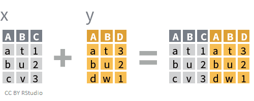
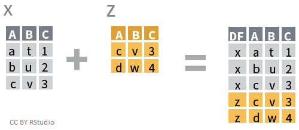
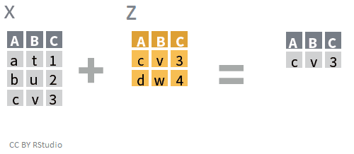

<!-- Adapted from https://biostat2.uni.lu/lecture06_dplyr.html -->

```{r setup, include=FALSE}
knitr::opts_chunk$set(echo = TRUE)
options(max.print = 500)
library(tidyverse)
library(biomaRt)
```


```{r, include = FALSE}
# Adds a `tibble_rows` chunk option to set the number of rows to show
knitr::knit_hooks$set(tibble_rows = function(before, options, envir) {
    if (before) {
        old_tib_prnt_opt <<- options(tibble.print_min = options$tibble_rows,
                                     tibble.print_max = options$tibble_rows)
    } else {
        options(old_tib_prnt_opt)
    }
})
```


## Data transformation | Introduction {.build}

###  {.box-10 .offset-1 .bg-yellow .large}

Preparing data is the most time consuming part of of data analysis

 
### `dplyr` is a tool box for working with data in tibbles/data frames {.box-10 .offset-1 .bg-blue .icon}


 * The most import data manipulation operations are covered
     + Selection and manipulation of observation, variables and values 
     + Summarizing
     + Grouping
     + Joining and intersecting tibbles
  * In a workflow typically follows reshaping operations from `tidyr`
  * Fast, by writing key pieces in C++ (using Rcpp)
  * Standard interfaces to database ([`dbplyr`](https://github.com/tidyverse/dbplyr)) or `data.table` ([`dtplyr`](https://github.com/hadley/dtplyr)).


## Learning objectives {.vs3}

### You will learn to: {.box-10 .offset-1 .bg-red .icon}


- Learn the basic vocabulary of `dplyr`
- Exercise commands
- Translating questions into data manipulation statements

## | dplyr [cheatsheets](https://www.rstudio.com/resources/cheatsheets/){} {data-background="img/04/dplyr_cheatsheet.jpg"}

## | dplyr [cheatsheets](https://www.rstudio.com/resources/cheatsheets/){} {data-background="img/04/dplyr_cheatsheet_p2.jpg"}


<!-- http://perso.ens-lyon.fr/lise.vaudor/dplyr/ -->


## Installation {.vs2}

```{r, eval = FALSE, title = "`dplyr` is in the `tidyverse` package", width = 6, class = "offset-3"}
install.packages("dplyr")
# OR
install.packages("tidyverse")
```

```{r, eval = FALSE, title = "`biomaRt` is part of bioconductor", width = 6, class = "offset-3"}
source("https://bioconductor.org/biocLite.R")
biocLite("biomaRt")
```

## Retrieving sample data {.bg-green} 

```{r biomart_library, eval = TRUE, cache = TRUE, title = "Genes from chromosome 21 using biomaRt", width = 10, class = "offset-1"}
# Load the library
library(biomaRt)
gene_mart <- useMart(biomart = "ENSEMBL_MART_ENSEMBL",
                     host = "www.ensembl.org")
gene_set <- useDataset(gene_mart , dataset = "hsapiens_gene_ensembl")

gene_by_exon <- getBM(mart = gene_set,
                      attributes = c("ensembl_gene_id",
                                     "ensembl_transcript_id",
                                     "chromosome_name",
                                     "start_position",
                                     "end_position",
                                     "hgnc_symbol",
                                     "hgnc_id",
                                     "strand",
                                     "gene_biotype"
                      ), 
                      filters = "chromosome_name",
                      values = "21"
)
```

## `as_tibble()` from the tibble package | {} {.nvs3}


```{r, width = 10, class = "offset-1", title = "Useful when dealing with large tables"}
gene_by_exon <- as_tibble(gene_by_exon)
gene_by_exon
```


## `glimpse()` | inspect data frames / tibbles {.vs2}  

- Use `glimpse()` to show some values and types per column. 
- The *Environment* tab in RStudio tab does it too

```{r, title = "column' types and glance"}
glimpse(gene_by_exon)
```

## Pipes in R | magrittr {.vs2 .build}

<!-- Didn't extend the font size formatting to chunks -->

```{css, echo = FALSE}
.x-large pre, article.smaller .x-large pre {
  font-size: 125%;
  line-height: 70px;
  text-align: center;
}
```

```{r, eval = FALSE, title = "Without pipe", class = "offset-2 x-large", width = 8}
verb(subject, complement)
```

```{r, eval = FALSE, title = "With pipe", class = "offset-2 x-large", width = 8}
subject %>% verb(complement)
```

###{.col-6 .offset-6 .small .show}

Example adapted from [Romain François](https://twitter.com/ParisRaddict/status/781267225420435461)

## `select()` | selecting specific *columns*

### Warning {.box-8 .offset-2 .bg-red .icon-small}


The `biomaRt` package also provides a `select()` function. If loaded, we need to address the `dplyr`-package using `::`!

%end%

```{r, title = "select example", class = "offset-1", width = 10}
gene_by_exon %>%
  dplyr::select(hgnc_symbol, chromosome_name, start_position, end_position)
```

## `select()` | helper functions {.vs2}

### `select()` has many helper functions {.box-10 .offset-1 .bg-blue}

- `contains()`, `starts_with()`, `ends_with()` for literal strings
- `matches()` for regular expressions
- `one_of()` variables in a character vector
- `everything()` all remaining variable
- Can be combined

## `select()` | negative selection

### Dropping columns {.box-10 .offset-1 .bg-blue}

We can drop columns by "negating" their names. Since helpers return column indices, we can negate them too.

%end%

```{r, title = "negative selection example", class = "offset-1", width = 10}
gene_by_exon %>%
  dplyr::select(-strand, -starts_with("ensembl"),
                -ends_with("id"))
```

## `filter()` | select **rows**

- Let's take a look at the amyloid precursor protein gene **_APP_** 
- Let's place the `hgnc_symbol` column first
    + use select to put it at the first place
    + combine it with the `everything()` helper to reintegrate the remaining columns

### {.col-10 .offset-1 .compact-output}

```{r}
gene_by_exon %>%
  filter(hgnc_symbol == "APP") %>% 
  dplyr::select(hgnc_symbol, everything())
```

## `filter()` | multiple conditions, AND (`&`)

### multiple conditions: AND {.box-8 .offset-2 .bg-yellow}

Comma separated conditions are combined with `&`

%end%

```{r, title = "genes in a particular range"}
gene_by_exon %>%
  filter(start_position > 1.05e7, end_position < 1.1e7) %>% 
  dplyr::select(hgnc_symbol, start_position, end_position)
```


## `filter()` | multiple conditions, OR (`|`) {.vs1}

### multiple conditions: OR {.box-8 .offset-2 .bg-yellow}

- pipe (`|`) separated conditions are combined with OR

%end%

```{r, title = "genes close to the telomers"}
gene_by_exon %>%
  filter(start_position < 5.02e6 | end_position > 46665124 )
```

<!-- 
add this example

```{r}
gene_by_exon %>%
  filter(between(start_position, 1.05e7, 1.1e7)) %>% 
  dplyr::select(hgnc_symbol, start_position, end_position)
```
--> 


## `filter()` | set operations {.vs1}

 * The two below are equivalent, for larger operations use `inner_join()` 

### {.col-12 .compact-output}

```{r, row = TRUE, title = "is.element()"}
gene_by_exon %>%
  filter(is.element(hgnc_symbol, c("AATBC", "AIRE"))) %>%
  dplyr::select(hgnc_symbol:strand)
```
### {.col-12 .compact-output}

```{r, row = TRUE, title = " infix `%in%`"}
gene_by_exon %>%
  filter(hgnc_symbol %in% c("AATBC", "AIRE")) %>%
    dplyr::select(hgnc_symbol:strand)
```


## `arrange()` 

### perform a nested sorting of all genes: {.box-12 .bg-yellow .compact-output}

1. remove empty strings in gene symbols
2. sort by `hgnc_symbol`
3. within each group of `hgnc_symbol`, sort by `ensembl_transcript`

```{r}
gene_by_exon %>%
  filter(hgnc_symbol != "") %>%
  arrange(hgnc_symbol, ensembl_transcript_id) %>% 
  dplyr::select(hgnc_symbol, ensembl_transcript_id, everything())
```

## `arrange()` | sort columns

### Reverse sort columns using `desc()` {.box-6 .offset-3 .bg-yellow}

- Find the *last* gene on chromosome 21.

```{r}
gene_by_exon %>%
  arrange(desc(end_position)) %>%
  dplyr::select(hgnc_symbol, ends_with("position"))
```

## Verbs to inspect data

### summary {.box-10 .offset-1 .bg-blue}

- `as_tibble()` converts to a tibble
- `glimpse()` gives an overview of each column's content
- `filter()` to subset
    + AND/OR conditions
- `arrange()` to sort
    + combine with `desc()` to reverse the sorting
- `select()` to pick and/or omit columns
    + helper functions

# Transforming columns

## `rename()` | renaming columns

### Usage{.box-8 .offset-2 .bg-yellow}

- rename columns with `rename(new_name = old_name)`.
    + to remember the order of appearance, consider `=` as "was".
    + rename will replace column names

%end%


```{r, title = "Example", tibble_rows = 6}
gene_by_exon %>%
  rename(stop = end_position, start = start_position)
```

## `mutate()` | add columns {.build}

```{r, row = c(7, 5), tibble_rows = 6, title = "gene length"}
gene_by_exon %>%
  mutate(length = end_position - start_position) %>% 
  dplyr::select(hgnc_symbol, length)  
```

```{r, row = c(7, 5), tibble_rows = 6, title = "new variables can be used right away"}
gene_by_exon %>%
  mutate(length = end_position - start_position,
         codons = length %% 3 == 0) %>% 
  dplyr::select(hgnc_symbol, length, codons)  
```

<!-- add filter(codons) then filter(!codon) --> 

## `mutate()` | replace columns {.vs1}

```{r, width = 8, class = "offset-2", title = "Gene coordinates in Mb"}
gene_by_exon %>%
  mutate(start_position = start_position / 1e6,
         end_position   = end_position / 1e6) %>% 
  dplyr::select(hgnc_symbol, ends_with("position"))  
```

## `distinct()` | unique rows

### Symbol and length {.box-12 .offset-0 .bg-green .build}

```{r, row = c(8, 4), tibble_rows = 6}
gene_by_exon %>%
  filter(gene_biotype == "protein_coding") %>% 
  mutate(length = end_position - start_position) %>% 
  dplyr::select(hgnc_symbol, length)
```

```{r, row = c(8, 4), tibble_rows = 6}
gene_by_exon %>%
  filter(gene_biotype == "protein_coding") %>% 
  mutate(length = end_position - start_position) %>% 
  dplyr::select(hgnc_symbol, length) %>%
  distinct()
```

## `mutate_at(), mutate_all(), mutate_if()` | change multiple columns

### Usage {.box-6 .bg-blue}

 * `select` **helpers** with `vars()` in `mutate_at()`
 * Use column **conditions** for `mutate_if()`
 * `funs()` to wrap functions

### {.box-6 .bg-yellow .icon-small .middle}


The placeholder **`.`** is the dynamic variable when using `mutate_at()`

%end% 

```{css, echo = FALSE}
.smaller_code pre:not(.lang-r) {
  font-size: 14px;
  letter-spacing: -0.5px;
}
```
 
```{r , title = "coordinate conversion", class = "compact-output smaller_code", row = c(5, 7)}
gene_by_exon %>% 
  mutate_at(vars(contains("position")),
            funs(. + 1)) %>%
  dplyr::select(-ends_with("id"))
```

## `mutate_if()` | change multiple columns {.build}

```{r, row = c(5, 7), title = "Coordinate conversion", class = "compact-output smaller_code show"}
gene_by_exon %>% 
  mutate_if(is.numeric, funs(. + 1)) %>%
  dplyr::select(-ends_with("id"))
```

### Watchout {.bg-red .offset-3 .box-6}

Now we get a chromosome **22** and look at the strands!

## `mutate_all()` | change all columns

### Replace columns {.box-6 .offset-3 .bg-yellow}

Use **unnamed** actions in `funs()` to **replace** all columns

%end%

```{r, title = "Convert iris from cm to inches", class = "compact-output"}
iris %>%
  as_tibble() %>%
  dplyr::select(-Species) %>%
  mutate_all(funs(. / 2.54))
```

## `mutate_all()` | change all columns

### Add columns {.box-6 .offset-3 .bg-yellow}

Use **named** actions in `funs()` to **add** new columns

%end%

```{r, title = "Convert iris from cm to inches", class = "compact-output"}
iris %>%
  as_tibble() %>%
  dplyr::select(-Species) %>%
  mutate_all(funs(inches = . / 2.54))
```

# Grouping and summarising

## `group_by()` and `summarise()`

### `group_by`{} {.box-6 .bg-blue}

- Not a summarising transformation but frequently used in conjunction 
- Grouping by more than one variable
- Use `ungroup()` once the grouped computing is done

### `summarise`{} {.box-6 .bg-red}

- returns 1 row per group

%end%

```{r, title = "Find out the number of transcripts by genes using `n_distinct()`", class = "compact-output offset-1", tibble_rows = 6, width = 10}
gene_by_exon %>%
  group_by(ensembl_gene_id, hgnc_symbol) %>% 
  summarise(n_trans = n_distinct(ensembl_transcript_id))
```

## Your turn {.build .bg-green}

### Exercise {.box-6 .offset-3 .bg-blue-white .show}

Identify the gene with highest number of transcripts

%end%

```{r, title = "Using `arrange()`", class = "compact-output", row = c(7, 5)}
gene_by_exon %>%
  group_by(ensembl_gene_id, hgnc_symbol) %>% 
  summarise(n_trans = n_distinct(ensembl_transcript_id)) %>%
  arrange(desc(n_trans))
```

## Your turn {.build .bg-green}

### Exercise {.box-6 .offset-3 .bg-blue-white .show}

Identify the gene with highest number of transcripts

%end%

```{r, title = "Filter the max", class = "compact-output", row = c(7, 5), tibble_rows = 6}
gene_by_exon %>%
  group_by(ensembl_gene_id, hgnc_symbol) %>% 
  summarise(n_exon = n_distinct(ensembl_transcript_id)) %>%
  filter(n_exon == max(n_exon))
```
### What happened? {.box-8 .offset-2 .bg-red .icon-small .build .x-large}

```{block, class = "show"}

```

Results were still grouped!

## Your turn {.build .bg-green}

### Exercise {.box-6 .bg-blue-white .show .stretch}

Identify the gene with highest number of transcripts

### What happened? {.box-6 .bg-red .icon-small .show}


Results were still grouped!\
Use `ungroup()`

%end%

```{r, title = "Ungroup and filter the max", class = "compact-output offset-1", width = 10}
gene_by_exon %>%
  group_by(ensembl_gene_id, hgnc_symbol) %>% 
  summarise(n_exon = n_distinct(ensembl_transcript_id)) %>%
  ungroup() %>%
  filter(n_exon == max(n_exon))
```

## `count()` {.build}

```{r, title = "Observations by group", width = 4, tibble_rows = 6, class = "show"}
gene_by_exon %>%
  count(hgnc_symbol)
```

### Replaces `base::table()` {.box-8 .bg-yellow .compact-output .stretch}

```{r}
head(as.data.frame(table(gene_by_exon$hgnc_symbol)))
```

%end%

```{r, row = c(7, 5), tibble_rows = 6, title = "Or use `summarise()` and `n()`", class = "offset-1 compact-output", width = 10}
gene_by_exon %>%
  group_by(hgnc_symbol) %>%
  summarise(n = n())
```

# Joining data frames

## Merge 2 separate tables {.build}

### UK bands: `band_members` {.bg-green .box-6 .show}

```{r, row = TRUE}
band_members
```

### UK bands: `band_instruments` {.bg-green .box-6}

```{r, row = TRUE}
band_instruments
```

%end%

<!-- FIXME: stretch still not working for chunk boxes: I need to fix the chunk rendering and create the box-body container... -->

```{r, title = "Join by common key", width = 6}
inner_join(band_instruments,
           band_members)
```

```{r, title = "Join for all left", width = 6}
left_join(band_instruments,
           band_members)
```

## Relational operations, **mutating** joins {.nvs3 .build}

### inner join {.box-6 .bg-aquamarine2 .middle}


<span class = "small">credit: [Hadley Wickham, R for data science](http://r4ds.had.co.nz/relational-data.html)</span>

### outer join {.box-6 .bg-aquamarine2}


## Relational operations, **filtering** joins {.build .vs1}


### `anti_join()` {.box-6 .bg-red .stretch}

- extract what does **not** match


<span class = "small">source: Wickam, [R for data science](http://r4ds.had.co.nz/relational-data.html#filtering-joins)</span> 

### `semi_join()` {.box-6 .bg-orange .stretch}

- filter matches in x, no duplicates


%end%

>Only the existence of a match is important; it doesn’t matter which observation is matched. This means that filtering joins never duplicate rows like mutating joins do | Hadley Wickam, R for Data Science {.bg-gray}

<!--

## `semi_join()` does not alter original {.build}

### {.compact-output .col-12}

```{r, title = "tribble for transposed tibbles", row = TRUE}
(tx <- tribble(~ x, ~val,
              "x1", 1,
              "x2", 2,
              "x3", 2,
              "x4", 3))
(ty <- tribble(~ y, ~val,
              "y1", 1,
              "y2", 2,
              "y3", 2,
              "y4", 3))
```

### filtering {.bg-cobalt .box-6 .stretch .compact-output}

```{r}
semi_join(tx, ty)
```
### mutating {.bg-yellow .box-6 .stretch .compact-output}

```{r}
inner_join(tx, ty)
```

-->

## Join by columns of different names {.build}

## Merge 2 separate tables {.build}

### UK bands: `band_members` {.bg-green .box-6 .show}

```{r, row = TRUE}
band_members
```

### UK bands: `band_instruments2` {.bg-green .box-6 .show}

```{r, row = TRUE}
band_instruments2
```

%end%

### No common key is found {.bg-red .box-6 .compact-output .stretch}

```{r, error = TRUE}
inner_join(band_instruments2,
           band_members)
```

### Use `by` to specify the common key {.bg-blue .box-6 .compact-output .stretch}

```{r}
inner_join(band_instruments2,
           band_members,
           by = c(artist = "name"))
```

# Helpers

## `pull()` | `select()` as a vector {.build}

```{r, row = c(5, 7), title = "extract column by index"}
pull(gene_by_exon, 2)[1:2]
```

```{r, row = c(5, 7), title = "using negative indexes"}
pull(gene_by_exon, -2)[1:10]
```

```{r, row = c(5, 7), title = "extract unique biotype"}
pull(gene_by_exon, gene_biotype) %>%
  unique()
```


## `near()` | addresses the rounded float number issue {.vs2 .build}

### Predict the outcome of: {.box-6 .offset-3 .bg-green .show}

Is the following `TRUE` or `FALSE`?

```{r, eval = FALSE}
sqrt(2) ^ 2 == 2
```

### FALSE! {.box-6 .bg-red}

```{r}
sqrt(2) ^ 2 == 2
```

%end%

```{r, title = "`near()` tolerates the machine's precision", width = 6}
near(sqrt(2) ^ 2, 2)

.Machine$double.eps^0.5
```

<!--

## `case_when()` | vectorized ifelse {.vs1}

```{r, title = "nested conditional tests"}
gene_by_exon %>%
  mutate(category = case_when(
    grepl("RNA", gene_biotype) ~ "RNA",
    gene_biotype == "protein_coding" & end_position - start_position > 5e5 ~ "large_size_coding",
    gene_biotype == "protein_coding" & end_position - start_position > 1e5 ~ "mid_size_coding",
    gene_biotype == "protein_coding" ~ "small_size_coding",
    TRUE ~ "other"
  )) %>%
  dplyr::select(ends_with("position"), category) %>%
  count(category)
```


## `recode()` | Vectorized switch

```{r, title = "recode using either backstick or quotes", row = c(7, 5)}
mtcars %>%
  mutate(trans = recode(am, `0` = "manual",
                            "1" = "automatic")) %>%
  dplyr::select(am, trans) %>%
  slice(1:5)
```

```{r, title = "for 2 cases, `if_else`", row = c(7, 5)}
mtcars %>%
  mutate(trans = if_else(am == 0, "manual", "automatic")) %>%
  dplyr::select(am, trans) %>%
  slice(1:5)
```

- but no **missing** element

-->
<!--

## `top_n()`


```{r, title = "first transcript per gene"}
gene_by_exon %>%
  group_by(ensembl_gene_id) %>%
  arrange(start_position) %>%
  top_n(1) %>%
  dplyr::select(ends_with("id"))
```


-->

## `slice()`

```{r, title = "first transcript per gene"}
gene_by_exon %>%
  group_by(ensembl_gene_id) %>%
  arrange(start_position) %>%
  slice(1) %>%
  dplyr::select(ends_with("id"))
```


## `lead()` and `lag()` | comparing rows above and below {.vs1}

```{r, title = "Calculate intergenic distance", tibble_rows = 6}
gene_by_exon %>%
  dplyr::select(ensembl_gene_id, start = start_position, end = end_position) %>% 
  distinct() %>% 
  arrange(start) %>% 
  mutate(lag_end = lag(end),
         intergenic_lg = start - lag(end)) 
```


### Tip{.box-6 .offset-3 .bg-yellow .icon-small}


You can rename columns within a `select()` call

## `ntile()` | breaks data into n buckets {.vs1}

```{r, title = "finding quartiles"}
tibble(x = rnorm(101)) %>% 
  mutate(x_quartile = ntile(x, 4)) %>%
  count(x_quartile)
```


<span class = "small">Nick Strayer' [gist](https://gist.github.com/nstrayer/6b57760c2d089c2d2c281e2393d405a7)</span> 

## Summary | the verbs you will use 80% of your time {.build}

### Most commonly used verbs {.box-6 .bg-blue .show}

 - `select()` - columns
 - `filter()` - rows meeting condition
 - `arrange()` - sort
 - `glimpse()` - inspect
 - `rename()` - change column name 
 - `mutate()` - copy manipulated values
 - `group_by()`, `ungroup()`
 - `summarise()` - group-wise, table-wise summaries
 - `lead()` and `lag()` - Values in other rows
 - `inner_join` and friends - Merging tables


### dplyr schema {.box-6 .bg-blue-white}


<span class = "small">source: Lise Vaudor [blog](http://perso.ens-lyon.fr/lise.vaudor/dplyr/)</span> 

## Summary | The remaining 20%

### Occasionally handy {.box-6 .bg-blue .middle .offset-3}

- Assembly: `bind_rows`, `bind_cols`
- Set operations: `intersect`, `union`, `setdiff`
- Windows function, `min_rank`, `dense_rank`, `cumsum`. See [vignette](https://cran.r-project.org/web/packages/dplyr/vignettes/window-functions.html)

<!-- add a mini example to demonstrate bind_cols(.id = "id") --> 
<!-- to be done better and adding the union.png, maybe not --> 

### Bind columns {.box-4 .bg-blue-white .stretch}



### Bind rows {.box-4 .bg-blue-white .stretch}



### Intersect {.box-4 .bg-blue-white .stretch}



## Data base access, when your RAM is not enough

### SQL mapping using `dbplyr` {.box-8 .offset-2 .bg-gray}

 - `dplyr` code can be translated into SQL to query databases online
 - different types of tabular data ([dplyr SQL backend](https://cran.r-project.org/web/packages/dplyr/vignettes/databases.html), databases.

%end%

```{r, title = "Example", message = FALSE, tibble_rows = 4, width = 10, class = "offset-1"}
library(dbplyr)

con <- DBI::dbConnect(RSQLite::SQLite(), ":memory:")
copy_to(con, mtcars)

mtcars2 <- tbl(con, "mtcars")
mtcars2
```

<!-- 
#> # Source:   table<mtcars> [?? x 11]
#> # Database: sqlite 3.19.3 [:memory:]
#>      mpg   cyl  disp    hp  drat    wt  qsec    vs    am  gear  carb
#>    <dbl> <dbl> <dbl> <dbl> <dbl> <dbl> <dbl> <dbl> <dbl> <dbl> <dbl>
#>  1  21.0     6 160.0   110  3.90 2.620 16.46     0     1     4     4
#>  2  21.0     6 160.0   110  3.90 2.875 17.02     0     1     4     4
#>  3  22.8     4 108.0    93  3.85 2.320 18.61     1     1     4     1
#>  4  21.4     6 258.0   110  3.08 3.215 19.44     1     0     3     1
#>  5  18.7     8 360.0   175  3.15 3.440 17.02     0     0     3     2
#> # ... with more rows

-->

<span class = "small">README from [dbplyr on github](https://github.com/tidyverse/dbplyr)</span> 

## Bigger data, go for `data.table`

### {.box-10 .offset-1 .bg-blue .icon}


- See this interesting [thread](http://stackoverflow.com/questions/21435339/data-table-vs-dplyr-can-one-do-something-well-the-other-cant-or-does-poorly) comparing `data.table` and `dplyr` 
- [`data.table`](https://cran.r-project.org/web/packages/data.table/index.html) is very efficient but the syntax is not so easy (see [introduction](https://github.com/Rdatatable/data.table/wiki)).
- Main advantage: inline replacement (tidyverse is frequently copying)
- As a summary:      _tl;dr   data.table for speed, dplyr for readability and convenience_ [Prashanth Sriram](https://www.quora.com/Which-is-better-to-use-for-data-manipulation-dplyr-package-or-data-table-library)
- Hadley recommends that for data > 1-2 Gb, if speed is your main matter, go for `data.table` 
- `dtplyr` is a `dplyr` interface to `data.table` but slower than native `data.table`

### Acknowledgments {.box-8 .offset-2 .vs1 .bg-yellow}

- Lise Vaudor
- Bruno Rodrigues
- Hadley Wickham
