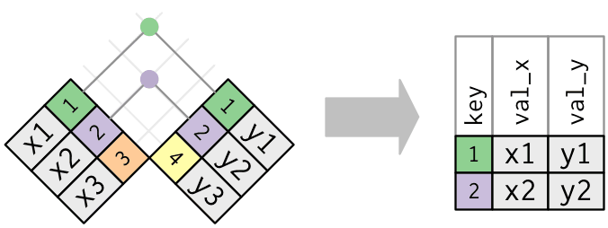
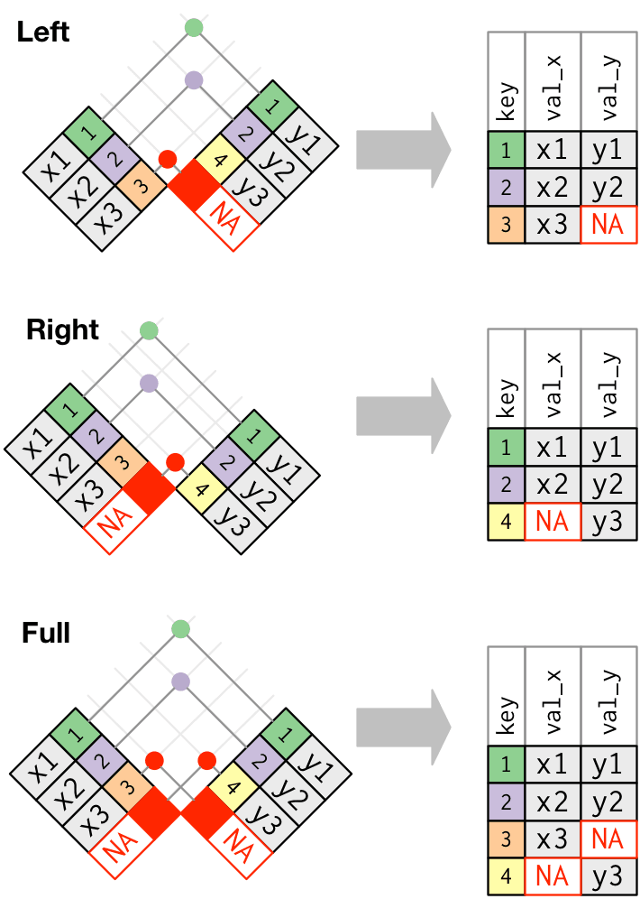
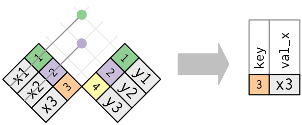
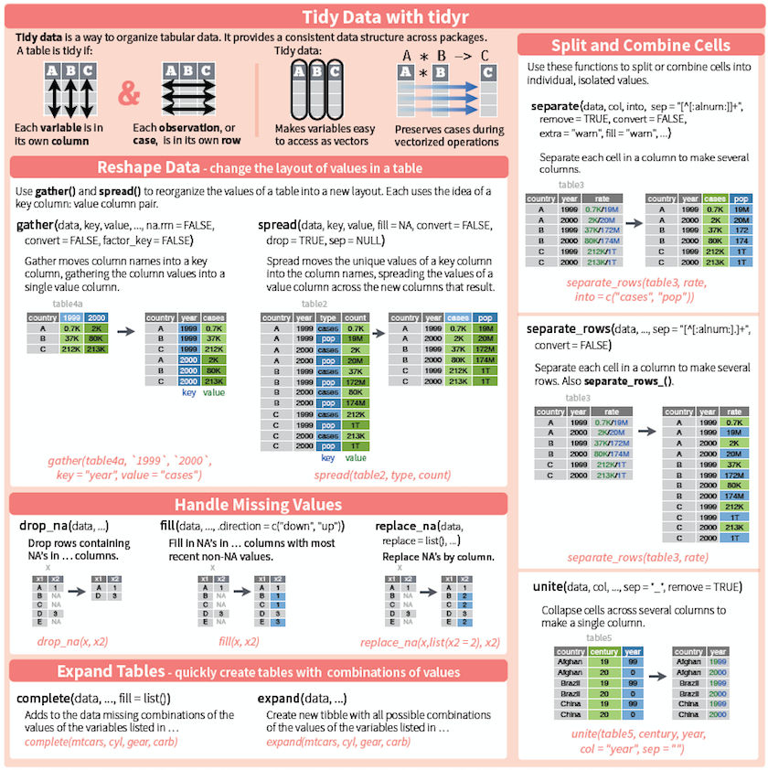
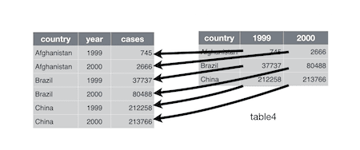
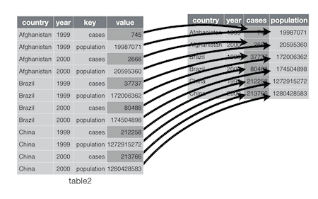

<!-- Adapted from https://biostat2.uni.lu/lecture06_dplyr.html -->

```{r setup, include=FALSE}
knitr::opts_chunk$set(echo = TRUE)
options(width = 100)
#options(max.print = 500)
options(tibble.print_max = 10)
library(tidyverse)
#library(biomaRt)
gene_by_exon <- read_csv("data/gene_by_exon.csv")
```


```{r, include = FALSE}
# Adds a `tibble_rows` chunk option to set the number of rows to show
knitr::knit_hooks$set(tibble_rows = function(before, options, envir) {
    if (before) {
        old_tib_prnt_opt <<- options(tibble.print_min = options$tibble_rows,
                                     tibble.print_max = options$tibble_rows)
    } else {
        options(old_tib_prnt_opt)
    }
})

knitr::knit_hooks$set(col_width = function(before, options, envir) {
    if (before) {
        old_col_width <<- options(width = options$col_width)
    } else {
        options(old_col_width)
    }
})
```

```{css, echo = FALSE}
.box-body > .chunk {
  margin-top: 10px;
}

.box-body > .chunk > h3 {
  font-size: 22px;
  line-height: 30px;
}
```

## Data transformation | Introduction

###  {.box-10 .offset-1 .bg-yellow .large}

 * Preparing data is the most time consuming part of of data analysis!
 * Essential part of understanding data, hard to avoid.

 
### `dplyr` is a tool box for working with data in tibbles/data frames {.box-10 .offset-1 .bg-blue .icon}


 * The most import data manipulation operations are covered
     + Selection and manipulation of observation, variables and values 
     + Summarizing
     + Grouping
     + Joining and intersecting tibbles
  * In a workflow typically in conjunction with reshaping operations from `tidyr`
  
## Learning objectives {.vs3}

### You will learn to: {.box-10 .offset-1 .bg-red .icon}


- Learn the basic vocabulary of `dplyr` and `tidyr`
- Exercise commands
- Translating questions into data manipulation statements

## | dplyr [cheatsheets](https://www.rstudio.com/resources/cheatsheets/){} {data-background="img/04/dplyr_cheatsheet.jpg"}

## | dplyr [cheatsheets](https://www.rstudio.com/resources/cheatsheets/){} {data-background="img/04/dplyr_cheatsheet_p2.jpg"}


<!-- http://perso.ens-lyon.fr/lise.vaudor/dplyr/ -->


## Outline

### {.box-6 .offset-3 .bg-green}

Here, we will use the  the `gene_by_exon` tibble to show some of the main functions (verbs) provided by `dplyr`

### Use `dplyr()` to: {.box-8 .offset-2 .bg-blue}

- Inspect your tibble (`glimpse()`)
- Select specific *columns* (`select()`)
- Filter out a subset of rows (`filter()`)
- Change or add columns (`mutate()`)
- Group observations by a grouping variable (`group_by()`)
- Get a summary (in particular per group) (`summarise()`)
- Join two distinct tibbles by a common column (`left_join()`, `right_join()` and `full_join()`)

## Graphical summary

### {.box-6 .offset-3 .bg-bluew .small}


source: Lise Vaudor [blog](http://perso.ens-lyon.fr/lise.vaudor/dplyr/)


## Inspect tibbles

### `glimpse()` {.box-10 .bg-blue .offset-1}

- Shows some values and the type of **each** column. 
- The *Environment* tab in RStudio tab does it too (for example, click on the blue button left to your object `gene_by_exon` to expand the view)
- Similar to the `base::str()` function

```{r, col_width = 80}
glimpse(gene_by_exon)
```

## Selecting *columns*

<!--
### Warning {.box-8 .offset-2 .bg-red .icon-small}


The `biomaRt` package also provides a `select()` function. If loaded, we need to address the `dplyr`-package using `::`!

%end%

-->

### `select()` {.box-10 .bg-blue .offset-1}

- Select the columns you want: `select(tibble, your_column1, ...)`

```{r, title = "select example", class = "offset-1"}
select(gene_by_exon, hgnc_symbol, start_position, end_position)
```

## Selecting *columns* using `select()` 

### helper functions {.box-6 .bg-blue}

To select columns with names that:

- `contains()` (a character sequence)
- `starts_with()` (a character sequence)
- `ends_with()` (a character sequence)
- `one_of()` names in a character **vector**
<!-- - `matches()` (using regular expressions)-->
- `everything()` all **remaining** columns

### Tip {.box-5 .offset-1 .bg-yellow .icon-small}


You can combine different helpers

%end%

```{r, width = 6, class = "offset-3 compact-output"}
select(gene_by_exon, ends_with("position"))
```

## Selecting *columns* using `select()` 

### Dropping columns (negative selection) {.box-10 .offset-1 .bg-blue}

- We can drop columns by "negating" their names.
- Works also with the helper functions

%end%

```{r, title = "negative selection example", class = "offset-1", width = 10}
select(gene_by_exon, -strand, -starts_with("ensembl"), -ends_with("id"))
```

## Filtering out rows

### `filter()` {.box-10 .offset-1 .bg-blue}

- Suppose you would like to take a look at the amyloid precursor protein gene **_APP_** 

```{r, col_width = 80}
filter(gene_by_exon, hgnc_symbol == "APP") 
```

## Filtering out rows

### `filter()` {.box-10 .offset-1 .bg-blue}

- Suppose you would like to take a look at the amyloid precursor protein gene **_APP_** 
- **and** let's place the `hgnc_symbol` column first using `select()`
    + use select to put it at the first place
    + combine it with the `everything()` helper to reintegrate the remaining columns
```{r, tibble_rows = 6, col_width = 80}
filter(gene_by_exon, hgnc_symbol == "APP") %>% 
  select(hgnc_symbol, everything())
```

## Filtering out rows | multiple conditions, AND (`&`)

### multiple conditions: AND {.box-10 .offset-1 .bg-blue}

- **comma** separated conditions are combined with `&`
- For example, suppose you would like to filter genes located in a particular range:

```{r, col_width = 80}
filter(gene_by_exon, start_position > 1.05e7, end_position < 1.1e7)
```


## Filtering rows | multiple conditions, OR (`|`) {.vs1}

### multiple conditions: OR {.box-10 .offset-1 .bg-blue}

- **pipe (`|`)** separated conditions are combined with OR
- For example, suppose you would like to filter out genes that are close the telomers:

```{r, col_width = 80}
filter(gene_by_exon, start_position < 5.02e6 | end_position > 46665124 )
```

## Filtering rows | Ranges {.vs1}

### `between()` {.box-10 .offset-1 .code .bg-blue}

```{r}
gene_by_exon %>%
  filter(between(start_position, 1.05e7, 1.1e7)) %>% 
  select(hgnc_symbol, start_position, end_position)
```

## `filter()` | set operations {.vs1}

 * The two below are equivalent, for larger operations use `inner_join()` 

### {.col-12 .compact-output}

```{r, row = TRUE, title = "is.element()"}
gene_by_exon %>%
  filter(is.element(hgnc_symbol, c("AATBC", "AIRE"))) %>%
  select(hgnc_symbol:strand)
```
### {.col-12 .compact-output}

```{r, row = TRUE, title = " infix `%in%`"}
gene_by_exon %>%
  filter(hgnc_symbol %in% c("AATBC", "AIRE")) %>%
    select(hgnc_symbol:strand)
```


## Sort columns 

### `arrange()` {.box-12 .bg-blue .compact-output}

Can even perform a nested sorting, for example:

1. sort by `hgnc_symbol`
2. within each group of `hgnc_symbol`, sort by `ensembl_transcript`

```{r}
arrange(gene_by_exon, hgnc_symbol, ensembl_transcript_id)
```

## Sort columns

### Reverse sort columns using{.box-12 .bg-blue}

- Use `arrange()` together with the helper function `desc()`
- For example, to put the *last* gene on chromosome 21 on top of the tibble:

```{r}
arrange(gene_by_exon, desc(end_position)) 
```

## Verbs to inspect data

### summary {.box-10 .offset-1 .bg-red}

- `glimpse()` to get an overview of each column's content
- `select()` to pick and/or omit columns
    + helper functions
- `filter()` to subset
    + AND/OR conditions (`,`, `|`)
- `arrange()` to sort
    + combine with `desc()` to reverse the sorting

# Transforming columns {.bg-bluew}

## Renaming columns 

### `rename()` {.box-8 .offset-2 .bg-blue}

Rename columns with:\
`rename(tibble, new_name = old_name)`.

_to remember the order of appearance, consider `=` as "was"._

%end%

```{r, tibble_rows = 6}
rename(gene_by_exon, stop = end_position, start = start_position)
```

## Adding columns

### `mutate()` {.box-10 .offset-1 .bg-blue}

- To add columns, use `mutate()`
- For example, to create a new column `length` containing the length of a gene (calculated using the columns `end_position` and `start_position`) do:

```{r, col_width = 80}
gene_by_exon %>%
  mutate(length = end_position - start_position) %>% 
  glimpse() 
```

## Adding columns

### New variables can be used right away in `mutate()` {.box-10 .offset-1 .bg-blue}

For example:

- Let's create a `length` column (calculated as before)
- Add a second column `codons` in which we test whether the length is a multiple of 3

```{r, col_width = 80}
gene_by_exon %>%
  mutate(length = end_position - start_position,
         codons = length %% 3 == 0) %>% 
  glimpse() 
```

<!-- add filter(codons) then filter(!codon) --> 


## Replace columns

### `mutate()` existing columns {.box-10 .offset-1 .bg-blue}

- Use existing column names to change their content
- For example, let's convert the gene coordinates (positions) in Mb:

```{r}
gene_by_exon %>%
  mutate(start_position = start_position / 1e6,
         end_position   = end_position / 1e6) %>% 
  select(hgnc_symbol, ends_with("position"))  
```

## Filter out rows that are unique

### `distinct()` {.box-12 .offset-0 .bg-blue .build}

For example suppose we select only the gene's symbol and length of protein coding sequences:

```{r, row = c(8, 4), tibble_rows = 4}
gene_by_exon %>%
  filter(gene_biotype == "protein_coding") %>% 
  mutate(length = end_position - start_position) %>% 
  select(hgnc_symbol, length)
```

- We obtain mutiple identical rows.
- Use `distinct()` to remove duplicated rows:

```{r, row = c(8, 4), tibble_rows = 4}
gene_by_exon %>%
  filter(gene_biotype == "protein_coding") %>% 
  mutate(length = end_position - start_position) %>% 
  select(hgnc_symbol, length) %>%
  distinct()
```


## `mutate_at(), mutate_all(), mutate_if()` | change multiple columns

### Usage {.box-6 .bg-blue}

 * `select` **helpers** with `vars()` in `mutate_at()`
 * Use column **conditions** for `mutate_if()`
 * ~.  to interface the data transformation
 

### {.box-6 .bg-yellow .icon-small .middle}


The placeholder **`~.`** is the dynamic variable when using `mutate_at()`

%end% 

```{css, echo = FALSE}
.smaller_code pre:not(.lang-r) {
  font-size: 14px;
  letter-spacing: -0.5px;
}
```
 
```{r , title = "coordinate conversion", class = "compact-output smaller_code"}
gene_by_exon %>% 
  mutate_at(vars(contains("position")), ~. + 1) %>%
  select(-ends_with("id"))
```

## `mutate_if()` | change multiple columns {.build}

```{r, row = c(5, 7), title = "Coordinate conversion", class = "compact-output smaller_code show"}
gene_by_exon %>% 
  mutate_if(is.numeric, ~. + 1) %>%
  select(-ends_with("id"))
```

### Watchout {.bg-red .offset-3 .box-6}

Now we get a chromosome **22** and look at the strands!

## `mutate_all()` | change all columns

### Replace columns {.box-6 .offset-3 .bg-yellow}

Use **unnamed** actions in through the formula interface `~.` to **replace** all columns

%end%

```{r, title = "Convert iris from cm to inches", class = "compact-output"}
iris %>%
  as_tibble() %>%
  select(-Species) %>%
  mutate_all(~. / 2.54)
```

## `mutate_all()` | change all columns

### Add columns {.box-6 .offset-3 .bg-yellow}

Use **named** actions by providing a list of names and functions to **add** new columns.

%end%

```{r, title = "Convert iris from cm to inches", class = "compact-output"}
#iris %>%
#  as_tibble() %>%
#  select(-Species) %>%
#  mutate_all(funs(inches = . / 2.54))

iris %>%
  as_tibble() %>%
  select(-Species) %>%
  mutate_all(list(inches = ~. / 2.54))

```


# Grouping and summarising {.bg-bluew}

## `group_by()` and `summarise()`

### `group_by`{} {.box-6 .bg-blue}

- It is frequently used in conjunction with a summarising transformation
- You can group by more than one variable
- Use `ungroup()` to remove the grouping once your computing is done

### `summarise`{} {.box-6 .bg-blue}

Returns a single row for each group

%end%

### {.box-12 .bg-green}

For example, suppose you would like to identify the smallest starting position in each group of `gene_biotype`:

```{r, row = TRUE,tibble_rows = 6}
gene_by_exon %>% 
  group_by(gene_biotype) %>%
  summarise(min_pos = min(start_position))
```

## Groupwise summary

### Useful helper function: {.box-10 .bg-blue .offset-1}

- `n()` : to get the number of elements within each group
- `n_distinct()`: to get the number of **unique** elements within each group

For example, we would like to find out the number of unique transcripts for each gene:

```{r, class = "compact-output offset-1", tibble_rows = 6, width = 10}
gene_by_exon %>%
  group_by(ensembl_gene_id, hgnc_symbol) %>%
  summarise(group_size = n(),
            n_transcript = n_distinct(ensembl_transcript_id))
```


# Combining data frames {.bg-bluew}

## `Join`, `merge` 

### Relational data  {.bg-blue .box-9}
 * Tidy tables are great but cannot store all information. 

 * Integrate data from two tables by a common variables called **keys**.
  + A **primary key** uniquely identifies an observation in its table. 
  + A **foreign key** uniquely identifies an observation in another table. 
  + Some tables do not have a single unique variable that can serve as a key.
  + Composite keys using multiple variables are required.

 * Relational databases commonly use a SQL (Structured Query Language). 
    + `dplyr` is making use of the concepts 
    + Some statements are identical, e.g. `select`
    
### Example {.box-3}  


## Merge 2 separate tables {.build}

### UK bands: `band_members` {.bg-green .box-6 .show}

```{r, row = TRUE}
band_members
```

### UK bands: `band_instruments` {.bg-green .box-6}

```{r, row = TRUE}
band_instruments
```

%end%

<!-- FIXME: stretch still not working for chunk boxes: I need to fix the chunk rendering and create the box-body container... -->

```{r, title = "Join by common key", width = 6}
inner_join(band_instruments,
           band_members)
```

```{r, title = "Join for all left", width = 6}
left_join(band_instruments,
           band_members)
```

## Relational operations, **mutating** joins {.nvs3 .build}

### inner join {.box-6 .bg-aquamarine2 .middle}



<span class = "small">credit: [Hadley Wickham, R for data science](http://r4ds.had.co.nz/relational-data.html)</span>

### outer join {.box-6 .bg-aquamarine2}



<!--

## Relational operations, **filtering** joins {.build .vs1}


### `anti_join()` {.box-6 .bg-red .stretch}

- extract what does **not** match



<span class = "small">source: Wickam, [R for data science](http://r4ds.had.co.nz/relational-data.html#filtering-joins)</span> 

### `semi_join()` {.box-6 .bg-orange .stretch}

- filter matches in x, no duplicates


%end%

>Only the existence of a match is important; it doesn’t matter which observation is matched. This means that filtering joins never duplicate rows like mutating joins do | Hadley Wickam, R for Data Science {.bg-gray}
-->
<!--

## `semi_join()` does not alter original {.build}

### {.compact-output .col-12}

```{r, title = "tribble for transposed tibbles", row = TRUE}
(tx <- tribble(~ x, ~val,
              "x1", 1,
              "x2", 2,
              "x3", 2,
              "x4", 3))
(ty <- tribble(~ y, ~val,
              "y1", 1,
              "y2", 2,
              "y3", 2,
              "y4", 3))
```

### filtering {.bg-cobalt .box-6 .stretch .compact-output}

```{r}
semi_join(tx, ty)
```
### mutating {.bg-yellow .box-6 .stretch .compact-output}

```{r}
inner_join(tx, ty)
```

-->

## Join tables by different column names {.build}

### UK bands: `band_members` {.bg-green .box-6 .show}

```{r, row = TRUE}
band_members
```

### UK bands: `band_instruments2` {.bg-green .box-6 .show}

```{r, row = TRUE}
band_instruments2
```

%end%

### No common key is found {.bg-red .box-6 .compact-output .stretch}

```{r, error = TRUE}
inner_join(band_members,
           band_instruments2)
```

### Use `by` to specify the common key {.bg-blue .box-6 .compact-output .stretch}

```{r}
inner_join(band_members,
           band_instruments2,
           by = c(name = "artist"))
```

# Helpers {.bg-bluew}

## `pull()` | `select()` as a vector {.build}

```{r, row = c(5, 7), title = "extract column by index"}
pull(gene_by_exon, 2)[1:2]
```

```{r, row = c(5, 7), title = "using negative indexes"}
pull(gene_by_exon, -2)[1:10]
```

```{r, row = c(5, 7), title = "extract unique biotype"}
pull(gene_by_exon, gene_biotype) %>%
  unique()
```


## `near()` | addresses the rounded float number issue {.vs2 .build}

### Predict the outcome of: {.box-6 .bg-green .show}

Is the following `TRUE` or `FALSE`?

```{r, eval = FALSE}
sqrt(2) ^ 2 == 2
```

### FALSE! {.box-6 .bg-red}

```{r}
sqrt(2) ^ 2 == 2
```

%end%


### Tolerates the machine's precision using `near()` {.box-8 .offset-2 .bg-blue}

```{r}
near(sqrt(2) ^ 2, 2)
```

- Uses by default a tolerance `tol = .Machine$double.eps^0.5`
- `.Machine$double.eps` is the smallest possible double greater than zero
- Look at `?.Machine`

<!--

## `case_when()` | vectorized ifelse {.vs1}

```{r, title = "nested conditional tests"}
gene_by_exon %>%
  mutate(category = case_when(
    grepl("RNA", gene_biotype) ~ "RNA",
    gene_biotype == "protein_coding" & end_position - start_position > 5e5 ~ "large_size_coding",
    gene_biotype == "protein_coding" & end_position - start_position > 1e5 ~ "mid_size_coding",
    gene_biotype == "protein_coding" ~ "small_size_coding",
    TRUE ~ "other"
  )) %>%
  select(ends_with("position"), category) %>%
  count(category)
```


## `recode()` | Vectorized switch

```{r, title = "recode using either backstick or quotes", row = c(7, 5)}
mtcars %>%
  mutate(trans = recode(am, `0` = "manual",
                            "1" = "automatic")) %>%
  select(am, trans) %>%
  slice(1:5)
```

```{r, title = "for 2 cases, `if_else`", row = c(7, 5)}
mtcars %>%
  mutate(trans = if_else(am == 0, "manual", "automatic")) %>%
  select(am, trans) %>%
  slice(1:5)
```

- but no **missing** element

-->
<!--
i
## `top_n()`


```{r, title = "first transcript per gene"}
gene_by_exon %>%
  group_by(ensembl_gene_id) %>%
  arrange(start_position) %>%
  top_n(1) %>%
  select(ends_with("id"))
```


-->
<!--
## `slice()`

```{r, title = "first transcript per gene"}
gene_by_exon %>%
  group_by(ensembl_gene_id) %>%
  arrange(start_position) %>%
  slice(1) %>%
  select(ends_with("id"))
```
-->

<!--

## `ntile()` | breaks data into n buckets {.vs1}

```{r, title = "finding quartiles"}
tibble(x = rnorm(101)) %>% 
  mutate(x_quartile = ntile(x, 4)) %>%
  count(x_quartile)
```


<span class = "small">Nick Strayer' [gist](https://gist.github.com/nstrayer/6b57760c2d089c2d2c281e2393d405a7)</span> 
-->


## Summary

### Most commonly used verbs {.box-8 .offset-2 .bg-blue}

 - `glimpse()` - inspect
 - `rename()` - change column names (variable names)
 - `select()` - columns
 - `filter()` - rows meeting condition
 - `arrange()` - sort
 - `mutate()` - manipulated values to modify or create new columns
 - `group_by()`, `ungroup()`
 - `summarise()` - group-wise summaries
 - `inner_join` and friends - Merging tables


### {.box-8 .offset-2 .bg-yellow .icon-small}


Represent the verbs you will use 80% of your time.\
Go to the website to see additional functions.


## Practice time! {.bg-assign}

### {.box-10 .offset-1 .bg-green}

Download the `swc` file from [Moodle](https://moodle.uni.lu/) and, to install the course, run the following commands in R (select the file when asked).

```{r, eval = FALSE}
library(swirl)
install_course()
# Choose the file you just downloaded when asked
```

### {.box-10 .offset-1 .bg-bluew}

Type in R console:

```{r, eval = FALSE}
library(swirl)
swirl()
```

Choose the "isb101" course and complete the lessons:

- **Manipulating Data with dplyr**.
- **Grouping and Chaining with dplyr**.

# `tidyr` {.bg-bluew}


## `tidyr` | introduction

### Tip {.box-5 .bg-yellow .icon-small}


Use the [cheatsheet](https://www.rstudio.com/resources/cheatsheets/)

### {.box-7 .bg-bluew}



## Convert long / wide format

### {.box-10 .offset-1 .bg-yellow}

- The wide format is generally **untidy** _but_ found in the majority of datasets
- The **wide** format makes computation on columns sometimes easier

### gather {.box-6 .bg-blue-white .stretch}



### spread {.box-6 .bg-blue-white .stretch}




## Demo with the iris dataset | `gather()`

```{r, message = FALSE, warning = FALSE, title = "From **large to long** with `gather()`"}
library("tidyverse")
iris_melt <- iris %>%
  rownames_to_column(var = "observation") %>%
  as_tibble() %>%
  gather(key = "parameter", value = "value", -Species, -observation)

iris_melt
```

## Demo with the iris dataset | `spread()` {.vs2}

```{r, title = "From **long to large** with `spread()`"}
iris_melt %>%
  spread(parameter, value)
```

## `separate()` and `unite()`{} {.build}

```{r, title = "Demo tibble", row = c(8, 4)}
demo_tibble <- tibble(year  = c(2015, 2014, 2014),
                      month = c(11L, 2L, 4L), # integer vector
                      day   = c(23, 1, 30),
                      value = c("high", "low", "low"))
demo_tibble
```

```{r, title = "`unite()`", width = 6}
demo_tibble_unite <- demo_tibble %>%
  unite(date, c(year, month, day), sep = "-")
demo_tibble_unite
```

```{r, title = "`separate()`", width = 6}
# use **quotes** since we are not refering to objects
demo_tibble_unite %>%
  separate(date, c("year", "month", "day"))
```

# Basic data cleaning

## Separate rows {.build}

### Multiple values per cell {.box-6 .bg-green .stretch}

```{r}
patient_df <- tibble(
    subject_id = 1001:1003, 
    visit_id = c("1,2,3", "1,2", "1"),
    measured = c("9,0, 11", "11, 3" , "12")  )
patient_df
```

Note the incoherent white space

### Combinations of variables {.box-6 .bg-blue .stretch}

```{r}
separate_rows(patient_df,
              visit_id, measured,
              convert = TRUE) # chr -> int
```

### {.box-6 .offset-3 .bg-yellow .icon-small}


To split different variables use `separate()`

## `separate()` | splitting values {.build}

```{r, row = c(8, 4), title = "Demo dataset"}
patient <- tibble(
  subject_id = 1001:1006,
  gender_age = paste(c("m", "f"), floor(runif(6, 21, 65)),
                     sep = "-"))
patient
```

```{r, row = c(8,4), title = "splitting by key-value pairs"}
separate(patient,
         gender_age, c("sex", "age"),
         convert = TRUE)
```

## `separate()` and `unite()` | exercise {.vs1 .build .bg-green}

### create valid dates format YYYY-MM-DD {.box-12 .bg-blue}

<!-- FIXME: date is not valid!!-->

```{r, row = c(8, 4)}
dummy <- data_frame(year = c(2015, 2014, 2014),
                    month = c(11, 2, 4),
                    day = c(23, 1, 30),
                    value = c("high", "low", "low"))
dummy
```

### solution `unite()`  {.box-12 .bg-gray}

```{r, row = c(8, 4)}
dummy %>%
  unite(date,
        year, month, day,
        sep = "-") -> dummy_unite
dummy_unite
```

## `separate()` and `unite()` | exercise { .build .bg-green}


### {.box-6 .offset-3 .bg-bluew .show}

Explode YYYY-MM-DD by the hyphen (`-`).

### solution `separate()` {.box-10 .offset-1 .bg-bluew}

 - Use **quotes** since we are not refering to objects
 - Default split on non-alphanumeric characters 

```{r, row = c(8, 4)}
dummy_unite %>%
  separate(date, c("year", "month", "day"))
```

## Practice time! {.bg-assign}

### {.box-10 .offset-1 .bg-bluew}

Type in R console:

```{r, eval = F, echo = FALSE}
library(swirl)
install_course_github("rolandkrause", "isb101", branch = "swirl")
swirl()
```

### {.box-10 .offset-1 .bg-bluew}

Download the `swc` file from [Moodle](https://moodle.uni.lu/) and, to install the course, run the following commands in R (select the file when asked).

```{r, eval = FALSE}
library(swirl)
install_course()
# Choose the file you just downloaded when asked
```

Choose the "isb101" course and complete the lesson:

- **Tidying Data with tidyr**.

## Wrap up

### We covered: {.box-10 .offset-1 .bg-red .icon}


- tidyverse, introduction
- tidy data
    + <http://tidyr.tidyverse.org/>
    + `vignette("tidy-data")`
- `tidyr`
    + long / wide with `gather()` / `spread()`
    + data cleaning with `separate()` / `unite()`
- switch from `base` to `tidyverse`, [Rajesh Korde, blog' post](http://www.significantdigits.org/2017/10/switching-from-base-r-to-tidyverse/)


## Fill all combinations

```{r, title = "Demo dataset"}
kelpdf <- tibble(
  Year = c(1999, 2000, 2004, 1999, 2004),
  Taxon = c("Saccharina", "Saccharina", "Saccharina", "Agarum", "Agarum"),
  Abundance = c(4, 5, 2, 1, 8)
)
kelpdf
```


### {.col-4 .offset-8 .small}

example from [imachorda.com](http://www.imachordata.com/you-complete-me/)

## Fill all combinations {.build}

### {.box-6 .offset-3 .bg-green .show}

_Agarum_ was not recorded in 2000

>- how to fill out the missing info?

%end%

```{r, width = 6, class = "offset-3", title = "Use `complete()`"}
complete(kelpdf,
         Year, Taxon)
```

### {.col-4 .offset-8 .small .show}

example from [imachorda.com](http://www.imachordata.com/you-complete-me/)

## Fill all combinations {.build}

### {.box-8 .offset-2 .bg-green .show}

 _Agarum_ was recorded in 2000, but as it was  **absent** no value was reported.

>- how to fill out this info with 0?

%end%

```{r, width = 6, class = "offset-3", title = "Use `complete()` and option `fill`"}
complete(kelpdf,
         Year, Taxon,
         fill = list(Abundance = 0))
```

### {.col-4 .offset-8 .small .show}

example from [imachorda.com](http://www.imachordata.com/you-complete-me/)

## fill all combinations {.build}

### {.box-8 .offset-2 .bg-green .show}

Wait... What happened between 2000 and 2004?\ The absence of  _Agarum_ was not reported... 

>- how to fill out this info with 0s?

%end%

```{r, row = c(7, 5), class = "compact-output", title = "Use `complete()`, option `fill` and helper `full_seq()`"}
complete(kelpdf,
         # helper tidyr::full_seq
         Year = full_seq(Year, period = 1),
         Taxon,
         fill = list(Abundance = 0))
```

### {.col-4 .offset-8 .small .show}

example from [imachorda.com](http://www.imachordata.com/you-complete-me/)


```{r, echo = FALSE}
knitr::knit_exit()

# nesting() example is useless: only a single column...
# nest() should be presented for purrr. Here it makes no sense.
```
## Acknowledgments {.bg-assign}


### Thank you for your attention! {.box-8 .offset-2 .vs1 .bg-yellow}


###  {.box-8 .offset-2 .vs1 .bg-yellow}

- Lise Vaudor
- Bruno Rodrigues
- Hadley Wickham


