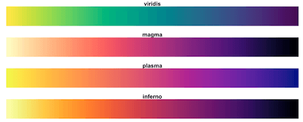
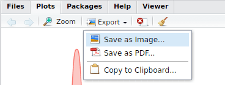
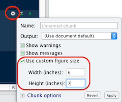
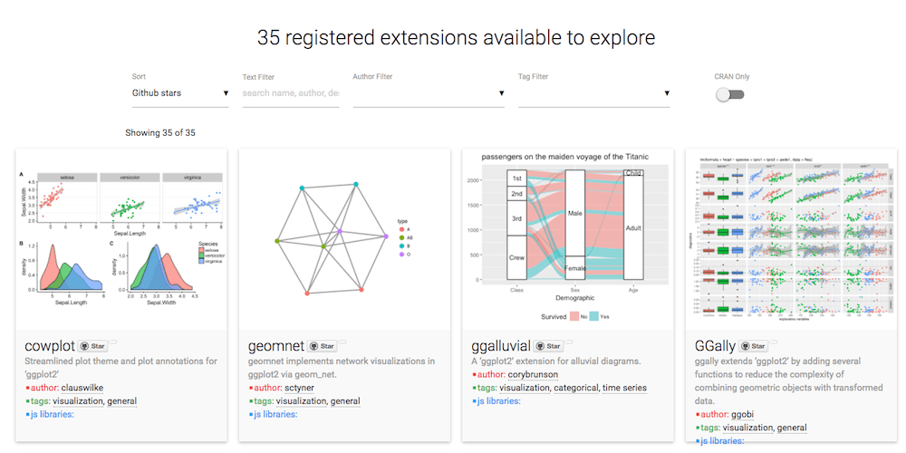

```{r setup, include = FALSE}
library(tidyverse)
library(knitr)
```

```{css, echo = FALSE}
.box-body > .chunk {
  margin-top: 10px;
}

.box-body > .chunk > h3 {
  font-size: 22px;
  line-height: 30px;
}
```

# ggplot2 {data-background="img/05/ggplot2_overview.jpg"}

## Learning objectives

### You will learn to: {.box-10 .offset-1 .bg-red .icon}


- Discuss basic ideas about data visualization, notably **data to ink**.
- Understand the basic grammar of ggplot2 (data, geoms, aesthetics, facets).
- Make quick exploratory plots of your multidimensional data.
- Know how to find help on `ggplot2` when you run into problems.

# Visualization principles

## Data-ink ratio | Definitions

### Definition Data-ink {.offset-2 .box-8 .bg-blue }

Data-ink: the non-erasable core of a graphic.


### Defintion Data-ink ratio {.offset-2 .box-8 .bg-green }
One of the following"

 1. data-ink divided by the total ink used to print the graphic.  
 2. the proportion of a graphic’s ink devoted to the non-redundant display of data information.  
 3. One minus the proportion of a graphic that can be erased without loss of data information.  

## Data to ink ratio | Edward Tufte

### Five Laws of Data-Ink {.offset-2 .box-8 .bg-yellow .icon}

 * Above all else show the data.
 * Maximize the data-ink ratio.
 * Erase non-data ink.
 * Erase redundant data-ink.
 * Revise and edit.

## Examples 

### {.center}

```{r, echo = FALSE, width=8}

my_dat <- tribble(~gene, ~length, 
                  "SCN1A",  312,
                  "SCN2A",  542,
                  "SLC1A3", 501,
                  "ACT1"  , 421,
                  "IRG1" ,  387)
                  
ggplot(my_dat) +
  aes(gene, length, fill=gene) +
   geom_col() +
  labs(title = "Length of genes by gene length", caption = "Gene length in residues") +
  theme(plot.background = element_rect(fill = "lightblue"))
  #scale_fill_gradientn(colours = terrain.colors(10))

```

Source: https://medium.com/@plotlygraphs/maximizing-the-data-ink-ratio-in-dashboards-and-slide-deck-7887f7c1fab


## Remove redundant information | Legend

```{r, echo = FALSE, width = 8}

ggplot(my_dat, aes(gene, length, width = .6)) +
   geom_col(fill = "white", colour="grey") +
   theme_bw()+
   guides(fill=FALSE) +
    labs(title = "Gene length in residues")+
   theme(
         legend.text = element_blank(),
         axis.title.x=element_blank(),
         axis.ticks.x=element_blank()) 

```


## {.center}
```{r, echo = FALSE, width = 8}

ggplot(my_dat, aes(gene, length, width = .6)) +
   geom_col(fill = "white", colour="grey") +
   theme_minimal()+
   guides(fill=FALSE) +
    labs(title = "Gene length in residues")+
   theme(
         strip.background = element_blank(),
         legend.text = element_blank(),
         axis.title.x=element_blank(),
         axis.title.y=element_blank(),
         axis.text.y=element_blank(),
         axis.ticks.x=element_blank()) +
     geom_text(aes(label = length), vjust = 3)

```


## But you know ...

```{r, echo = FALSE}
kable(my_dat, col.names = c("Gene", "Length"))
```

## Introduction {.build}

### `ggplot2`{} {.box-6 .bg-red}

- stands for **g**rammar of **graphics** plot version 2
- Inspired by Leland Wilkinsons work on the [grammar of graphics](https://www.amazon.com/Grammar-Graphics-Statistics-Computing/dp/0387245448) in 2005.

### Idea {.box-6 .bg-yellow}

- split a graph into layers: _e.g._ axis, curve(s), labels.
- **3** main elements are required: **data**, **aesthetics** and at least one **geometry**

### {.box-8 .bg-gray .small}


[Wickham H. 2007. _J. Comp. Graph. Stat._ **19**:3–28](http://www.tandfonline.com/doi/abs/10.1198/jcgs.2009.07098)

### {.box-4 .bg-gray .stretch}


<span class = "small">source: [thinkR](http://www.thinkr.fr/guide-survie-ggplot2-datajournalistes/)</span>

%end%


## Simple example | Wickham 2007 {.build}

### dataset {.box-4 .bg-green .offset-1}

------------------
x     y    shape
----  ---- -------
25    11   circle

0     0    circle

75    53   square

200   300  square

------------------

### {.box-4 .bg-bluew .offset-2}


### aesthetics {.box-4 .offset-2 .bg-blue}

_x_ = x, _y_ = y, _shape_ = shape

### **geometric** object {.box-4 .bg-red}

dot / point

### {.box-6 .offset-3 .bg-yellow}

What if we want to split _circles_ and _squares_?

## Faceting | _aka_ trellis or lattice plots {.build}

### Split by the **shape** {.box-8 .offset-2 .bg-bluew}


%end%


### Redundancy {.box-10 .offset-1 .bg-yellow .icon-small}


Now, **dot shapes** and **facets** provide the same information.\
We could use the shape for another meaningful variable...


## Layers

### {.box-8 .bg-bluew}


### Data {.box-4 .bg-green}

------------------
x     y    shape
----  ---- -------
25    11   circle

0     0    circle

75    53   square

200   300  square

------------------

## Motivation for this layered system {.middle}

### {.col-10 .offset-1}

> *Data visualisation* is not meant just to be seen but to be read, like written text | Alberto Cairo {.bg-yellow}

## Geometric objects | geoms define the type of plot which will be drawn {.build .nvs1}

### `geom_point()` {.box-4 .bg-cobalt}

```{r, echo = FALSE}
iris %>%
  ggplot() +
  geom_point(aes(x = Petal.Width, y = Petal.Length))
```

### `geom_line()` {.box-4 .bg-cobalt}

```{r, echo = FALSE}
  ggplot(mtcars, aes(wt, mpg)) +
  geom_line()
```

### `geom_bar()` {.box-4 .bg-cobalt}

```{r, echo = FALSE}
ggplot(mtcars, aes(am, mpg, 
             fill = factor(cyl))) +
  geom_col(position = "dodge")
```

### `geom_boxplot()` {.box-4 .bg-cobalt}

```{r, echo = FALSE}
ggplot(mtcars) +
  geom_boxplot(aes(x = factor(cyl), y = mpg))
```

### `geom_histogram()` {.box-4 .bg-cobalt}

```{r, echo = FALSE}
ggplot(iris) +
  geom_histogram(aes(x = Sepal.Width), bins = 20)
```

### `geom_density()` {.box-4 .bg-cobalt}

```{r, echo = FALSE}
ggplot(iris) +
  geom_density(aes(x = Sepal.Width, fill = Species, colour = Species), alpha = 0.6)
```

```{css, echo = FALSE}
.shift-up {
  margin-top: -500px;
}
```


### Cheatsheet {.box-8 .offset-2 .bg-yellow .shift-up .icon-small}


Have a look at the [cheatsheet](https://www.rstudio.org/links/data_visualization_cheat_sheet) or the ggplot2 online [documentation](http://ggplot2.tidyverse.org/) to list more possibilities.

## The dataset {.bg-green}

```{r, title = "Convert iris as a `tibble`", width = 8, class = "offset-2 compact-output"}
iris <- as_tibble(iris)
iris
```

###  Tip {.box-6 .offset-3 .bg-yellow .icon-small}


saving the data frame as a `tibble` enables the smart tibble printing and avoids to list all 150 rows

## Your first plot {.bg-green}

```{r first_plot, title = "Draw your first plot", width = 10, class = "offset-1", eval = FALSE}
ggplot(data = iris) +
  aes(x = Petal.Width) +
  aes(y = Petal.Length) +
  geom_point()
```

### {.box-8 .offset-2 .bg-bluew}

```{r first_plot, echo = FALSE, fig.height = 4}
```

## Layers and pipes {.build}

### Warning {.box-6 .bg-red .icon-small}


`ggplot2` introduces a break in the workflow from ` %>% ` to `+`!

> If the pipe ( %>% in 2014) had been invented before, ggplot2 would have never existed | Hadley Wickham

### ggplot2 {.box-6 .bg-blue}
```{r, eval = FALSE, title = "`ggplot2`"}
mtcars %>% 
  ggplot() +
  aes(x = mpg) +
  aes( y = wt) + 
  geom_point() +
  aes(colour = as.factor(gear)) +
  scale_color_brewer("gear", type = "qual")
```


## Mapping aesthetics

### definitions {.box-12 .bg-yellow}

- **aesthetics** map the columns of a `tibble` to the variable each ggplot2 `geom` is expecting.
- `geom_point()` for example requires **at least** the _**x**_ and _**y**_ coordinates to draw each point.

%end%

### {.box-8 .offset-2 .bg-blue}

In our example we need to tell `geom_point()` which columns should be used as `x` and `y`

```{r, fig.height = 4, eval = FALSE}
ggplot(iris) +
  geom_point(aes(x = Petal.Width, y = Petal.Length))
```

## Unmapped parameters{.build}

<!-- FIXME: image is not rendered as it should in firefox in column mode... Browser bug? -->

### {.box-10 .offset-1 .bg-blue .show}

- `geom_point()` accepts additional arguments such as the `colour`, the transparency (`alpha`) or the `size` (see `?geom_point`).
- It is possible to define them to a fixed value wihout mapping them to a variable.

%end%

```{r iris_fixed_colour, width = 8, class = "offset-2", eval = FALSE}
ggplot(iris) +
  geom_point(aes(x = Petal.Width, y = Petal.Length),
             colour = "blue", alpha = 0.6, size = 3)
```

###{.box-6 .bg-bluew}

```{r iris_fixed_colour, echo = FALSE, fig.height = 3.5}
```

### important {.box-6 .bg-red .icon-small}


Note that parameters defined **outside** the aesthetics `aes()` are applied to **all** data.

%end%

## Mapping aesthetics | colour{.build}

### {.box-10 .offset-1 .bg-blue .show}

- `colour`, `alpha` or `size` can also be mapped to a column in the data frame.
- We can for example attribute a different colour to each species.

%end%

```{r iris_map_colour, fig.height = 3.5, width = 8, class = "offset-2", eval = FALSE}
ggplot(iris) +
  geom_point(aes(x = Petal.Width, y = Petal.Length,
                 colour = Species), alpha = 0.6, size = 3)
```

###{.box-6 .bg-bluew}

```{r iris_map_colour, echo = FALSE, fig.height = 3.5}
```

### important {.box-6 .bg-red .icon-small}


Note that the `colour` argument is now **inside** `aes()` and **must** refer to a column in the dataframe.

%end%

## Mapping aesthetics | shape

```{r iris_shape, title = "Mapping `shape` and `colour` to `Species`", fig.height = 4, eval = FALSE}
ggplot(iris) +
  geom_point(aes(x = Petal.Width, y = Petal.Length, shape = Species, colour = Species),
             alpha = 0.6, size = 3)
```

###{.box-8 .offset-2 .bg-bluew}

```{r iris_shape, echo = FALSE, fig.height = 3.5}
```

## Labels

```{r iris_labels, title = "It is easy to adjust axis labels and the title using the `labs()` function", eval = FALSE}
ggplot(iris) +
  geom_point(aes(x = Petal.Width, y = Petal.Length, colour = Species), alpha = 0.6, size = 3) +
  labs(x = "Width",
       y = "Length",
       colour = "flower",
       title = "Iris",
       subtitle = "petal measures",
       caption = "Fisher, R. A. (1936)")
```

###{.box-8 .offset-2 .bg-bluew}

```{r iris_labels, fig.height = 3, echo = FALSE}
```

## Histograms

```{r iris_histo, eval = FALSE, width = 8, class = "offset-2"}
ggplot(iris) +
  geom_histogram(aes(x = Petal.Length, fill = Species),
                 alpha = 0.8, bins = 30)
```

###{.box-6 .bg-bluew}

```{r iris_histo, fig.height = 4, echo = FALSE}
```

### Tip {.box-6 .bg-yellow .icon-small}


The default bin value is 30 and will be printed out as a warning.\
Specify your own to avoid the warning.

## Density plot

The density is the count divided by the total number of occurences.

```{r density, eval = FALSE, width = 8, class = "offset-2"}
ggplot(iris) +
  geom_density(aes(x = Petal.Length, fill = Species),
               alpha = 0.6)
```

### {.box-8 .bg-bluew .offset-2}

```{r density, fig.height = 3.5, eval = TRUE, echo = FALSE}
```

## Overlaying plots | Density plot and histogram

```{r dens_hist, eval = FALSE}
ggplot(iris) +
  geom_histogram(aes(x = Petal.Length, y = ..density..), fill = "darkgrey", binwidth = 0.1) +
  geom_density(aes(x = Petal.Length, fill = Species, colour = Species), alpha = 0.4) +
  theme_classic()
```

### {.box-8 .bg-bluew .offset-2}

```{r dens_hist, eval = TRUE, echo = FALSE, fig.height = 3.5}
```

## Stat functions

### transform data {.bg-bluew .box-12 .icon}


- variables surrounded by two pair of dots (`..variable..`) 
are intermediate values calculated by `ggplot2` using stat functions
- `geom` uses a `stat` function to transform the data:
    + `geom_histogram()` uses `stat_bin()`.
    + `stat_bin()` divides the values into _bins_ and counts the number of observations.
    + `stat_bin()` computes: `..count..`, `..density..`, `..ncount..` and `..ndensity..` (see `?stat_bin()`).
    + stat variable used in density plots: `..density..`.
    + `stat_identity` is used for scatter plots or `geom_col()` (no transformation).

## Barcharts | categorical variables

### `geom_bar()`{} {.box-6 .offset-3 .bg-yellow}

- `geom_bar()` counts the number of values in each category
- `geom_bar()` uses `stat_count()` (creates a new `count` column).

%end%

```{r geom_bar, eval = FALSE, width = 6}
ggplot(iris) +
  geom_bar(aes(x = Species))
# or: geom_bar(aes(x = Species, y = ..count..))
```

### {.box-6 .bg-bluew}

```{r geom_bar, fig.height = 3.5, width = 6, echo = FALSE}
```

## Barcharts | categorical variables

### `geom_col()`{} {.box-8 .bg-yellow .offset-2}

- `geom_col()` uses `stat_identity()` leaving the data as is.
- The `y` aesthetic is **mandatory** for `geom_col()`
- Using `geom_bar()` with `stat = "identity"` will let `geom_bar()` to behave like `geom_col()`

%end%

```{r geom_col, eval = FALSE, width = 6}
ggplot(iris) +
  geom_col(aes(x = Species,
               y = Petal.Length))
#ggplot(iris) +
#  geom_bar(aes(x = Species, y = Petal.Length),
#           stat = "identity")
```

### {.box-6 .bg-bluew}

```{r geom_col, width = 6, echo = FALSE, fig.height = 3.5}
```

## Stacked barchart | categorical variables

### {.box-5 .bg-yellow .icon-small}


Let's use the `mtcars` dataset now.

%end%

```{r con_dis, title = "force factor to convert continuous -> discrete", fig.height=3.5, eval = FALSE, width = 7}
mtcars %>%
  ggplot() +
  geom_bar(aes(x = factor(cyl),
               fill = factor(gear)))
```

### {.box-8 .offset-2 .bg-bluew}

```{r con_dis, fig.height = 3.5, echo = FALSE}
```

## Dodged barchart (side by side) | categorical variables

### {.box-6 .bg-blue .offset-3}

Do not stack the barcharts but adjust the horizontal position.

%end%

```{r dodge, eval = FALSE}
mtcars %>%
  mutate(cyl = factor(cyl), gear = factor(gear)) %>%
  ggplot() +
  geom_bar(aes(x = cyl, fill = gear), position = "dodge")
```

### {.box-8 .offset-2 .bg-bluew}

```{r dodge, echo = FALSE, fig.height = 3}
```

## Stacked barchart for proportions | categorical variables

### {.box-8 .bg-blue .offset-2}

Let's stack the barcharts but show proportions.

%end%

```{r iris_stack, eval = FALSE}
mtcars %>%
  mutate(cyl = factor(cyl), gear = factor(gear)) %>%
  ggplot() +
  geom_bar(aes(x = cyl, fill = gear), position = "fill")
```

### {.box-8 .offset-2 .bg-bluew}

```{r iris_stack, echo = FALSE, fig.height = 3}
```

## Stacked barchart for proportions | pie charts

### {.box-8 .bg-blue .offset-2}

We can easily switch to polar coordinates:

%end%

```{r polar, eval = FALSE}
mtcars %>%
  mutate(cyl = factor(cyl), gear = factor(gear)) %>%
  ggplot() +
  geom_bar(aes(x = cyl, fill = gear), position = "fill") +
  coord_polar()
```

### {.box-8 .offset-2 .bg-bluew}

```{r polar, echo = FALSE, fig.height = 3}
```

## Boxplot | IQR, median {.vs1}

```{r boxplot, eval = FALSE, width = 8, class = "offset-2"}
ggplot(mtcars) +
  geom_boxplot(aes(x = factor(cyl), y = mpg))
```

### {.box-8 .bg-bluew .offset-2}

```{r boxplot, echo = FALSE, fig.height = 3.5}
```

## Boxplot | dodges by default {.vs1}

```{r boxplot2, eval = FALSE, width = 8, class = "offset-2"}
ggplot(mtcars) +
  geom_boxplot(aes(x = factor(cyl),
                   y = mpg,
                   fill = factor(am)))
```

### {.box-8 .bg-bluew .offset-2}

```{r boxplot2, echo = FALSE, fig.height = 3.5}
```

## Customising the colours {.nvs1}

### manual definition {.box-8 .offset-2 .bg-blue}

- using `scale_fill_manual()` and `scale_color_manual()`
- not handy as you **must** provide as much colours as they are groups

%end%

```{r colour_man, eval = FALSE}
ggplot(mtcars) +
  geom_boxplot(aes(x = factor(cyl), y = mpg, fill = factor(am), color = factor(am))) +
  scale_fill_manual(values = c("red", "lightblue")) +
  scale_color_manual(values = c("purple", "blue"))
```

### {.box-8 .bg-bluew .offset-2}

```{r colour_man, fig.height = 2.5, echo = FALSE}
```

## Predefined colour palettes

```{r brewer, echo = c(1, 3), eval = FALSE, width = 4}
library(RColorBrewer)
par(mar = c(0, 4, 0, 0))
display.brewer.all()
```

### {.box-8 .bg-bluew}

```{r brewer, fig.height = 5.5, echo = FALSE}
```

## Custom colours | using brewer

```{r brewer2, eval = FALSE, width = 8, class = "offset-2"}
ggplot(mtcars) +
  geom_boxplot(aes(x = factor(cyl), y = mpg,
                   fill = factor(am), colour = factor(am))) +
  scale_fill_brewer(palette = "Pastel2") +
  scale_colour_brewer(palette = "Set1")
```

### {.box-8 .bg-bluew .offset-2}

```{r brewer2, fig.height = 4, echo = FALSE}
```

## Colour gradient

### {.bg-yellow .box-8 .offset-2 .icon-small}


The default gradient generated by ggplot2 is not very good...

%end%

```{r grad_default, eval = FALSE, width = 8, class = "offset-2"}
ggplot(mtcars, aes(x = wt, y = mpg, colour = hp)) +
  geom_point(size = 3)
```

### {.box-8 .bg-bluew .offset-2}

```{r grad_default, echo = FALSE, fig.height = 3}
```


## Colour gradient

### {.bg-yellow .box-8 .offset-2 .icon-small}


Use the `viridis` package instead...

%end%

```{r viridis, eval = FALSE}
ggplot(mtcars, aes(x = wt, y = mpg, colour = hp)) +
  geom_point(size = 3) +
  viridis::scale_colour_viridis()
```

### {.box-8 .bg-bluew .offset-2}

```{r viridis, echo = FALSE, fig.height = 3}
```

## Colour gradient


### viridis {.box-8 .offset-2 .bg-bluew}



- 4 different scales
- [viridis](https://cran.r-project.org/web/packages/viridis/vignettes/intro-to-viridis.html) is color blind friendly and nice in b&w
- Is now the default in the `ggplot2` dev version

## Facets | facet_wrap()

### {.box-8 .offset-2 .bg-blue}

- To create facets, the easiest way is to use `facet_wrap()`
- Requires a one sided formula (in R formulas are composed using `~`: `lhs ~ rhs`)

%end%

```{r facet_1, eval = FALSE}
ggplot(mtcars) +
  geom_point(aes(x = wt, y = mpg)) +
  facet_wrap(~ cyl)
```

### {.box-8 .bg-bluew .offset-2}

```{r facet_1, fig.height = 2.8, echo = FALSE}
```

## Facets | facet_wrap()

### {.box-8 .offset-2 .bg-yellow .icon-small}


You can specify the number of columns

%end%


```{r facet_2, eval = FALSE}
ggplot(mtcars) +
  geom_point(aes(x = wt, y = mpg)) +
  facet_wrap(~ cyl, ncol = 2)
```

### {.box-8 .bg-bluew .offset-2}

```{r facet_2, fig.height = 2.8, echo = FALSE}
```

## Facets | free scales

```{r, row = c(5, 7), fig.height = 2.5}
ggplot(mtcars) +
  geom_point(aes(x = wt, y = mpg)) +
  facet_wrap(~ cyl, scales = "free_x")
```

```{r, row = c(5, 7), fig.height = 2.5}
ggplot(mtcars) +
  geom_point(aes(x = wt, y = mpg)) +
  facet_wrap(~ cyl, scales = "free")
```


## Facets | `facet_grid()` to lay out panels in a grid

### Specify a **formula** {.box-6 .bg-blue}

the rows on the left and columns on the right separated by a tilde `~` (_i.e_ **by**)

%end% 

```{r, row = c(4, 8), fig.height = 4}
ggplot(mtcars) +
  geom_point(aes(x = wt, y = mpg)) +
  facet_grid(am ~ cyl)
```

## Facets | `facet_grid()` cont.

### Specify one row/column {.box-6 .bg-blue} 

A dot (`.`) means no faceting for this axis. Mimic `facet_wrap()`

%end%

```{r, row = c(4, 8), fig.height = 4}
ggplot(mtcars) +
  geom_point(aes(x = wt, y = mpg)) +
  facet_grid(. ~ cyl)
```


## Exporting | interactive or passive mode {.nvs1 .build}

### right panel {.box-6 .bg-blue}

- Using the Export button in the _Plots_ panel


### {.col-6}



### Rmarkdown reports {.box-6 .bg-blue}

- If needed, adjust the chunk options: 
  + size: `fig.height`, `fig.width`
  + ratio: `fig.asp`... 
  + [others](https://yihui.name/knitr/options/?version=1.1.214&mode=desktop)
      
### {.col-6}




### ggsave {.box-10 .offset-1 .bg-blue}

- save the `ggplot` **object**, 2nd argument
- guesses the type of graphics by the extension

```{r eval = FALSE}
ggsave("my_name.png", p, width = 60, height = 30, units = "mm")
ggsave("my_name.pdf", p, width = 50, height = 50, units = "mm")
```


## Extensions

### {.box-12 .bg-bluew}

`ggplot2` introduced the possibility for the community to contribute and [create **extensions**](http://ggplot2.tidyverse.org/articles/extending-ggplot2.html). 

They are referenced on a [dedicated site](https://www.ggplot2-exts.org/)





## plot your data! | [Anscombe](https://d2f99xq7vri1nk.cloudfront.net/Anscombe_1_0_0.png) ** 10 {.vs2}

> never trust summary statistics alone; always visualize your data | Alberto Cairo {.bg-grgold}


<span class = "small">source: Justin Matejka, George Fitzmaurice [Same Stats, Different Graphs...](https://www.autodeskresearch.com/publications/samestats)</span>


```{r, echo = FALSE}
knitr::knit_exit()
```


## Art | by Marcus Volz

<blockquote class="twitter-tweet"><p lang="en" dir="ltr">A compilation of some of my gifs created with <a href="https://twitter.com/hashtag/rstats?src=hash">#rstats</a> <a href="https://twitter.com/hashtag/ggplot2?src=hash">#ggplot2</a> <a href="https://twitter.com/hashtag/gganimate?src=hash">#gganimate</a> <a href="https://twitter.com/hashtag/tweenr?src=hash">#tweenr</a> <a href="https://t.co/nCppSOZv4W">https://t.co/nCppSOZv4W</a></p>&mdash; Marcus Volz (@mgvolz) <a href="https://twitter.com/mgvolz/status/849375922297991168">4 avril 2017</a></blockquote>

```{css, echo = FALSE}
.vembedr {
  border-radius: 25px; /* adjust it to your needs */
  overflow: hidden;
}

.vembedr iframe {
  display: block;
  border: none;
}
```


```{r, echo = FALSE}
vembedr::embed_youtube("DQiKHlpy70Q") %>% htmltools::div(class = "vembedr")
```


## Missing features {.nvs1 .build}

### geoms list [here](http://ggplot2.tidyverse.org/reference/index.html#section-layer-geoms) {.box-6 .bg-yellow}

- `geom_tile()` heatmap
- `geom_bind2d()` 2D binning
- `geom_abline()` slope

### stats list [here](http://ggplot2.tidyverse.org/reference/index.html#section-layer-stats) {.box-6 .bg-yellow .stretch}


- `stat_ellipse()` 
- `stat_summary()` easy mean 95CI etc.
- `geom_smooth()` linear/splines/non linear

### plot on multi-pages {.box-6 .bg-grgold .stretch}

- `ggforce::facet_grid_paginate()` facets
- `gridExtra::marrangeGrob()` plots

### positions list [here](http://ggplot2.tidyverse.org/reference/index.html#section-layer-position-adjustment) {.box-6 .bg-grgold .stretch}

- `position_jitter()` random shift 
- `quasirandom()` is better

### coordinate / transform {.box-6 .bg-blue .stretch}

- `coord_cartesian()` for zooming in
- `coord_flip()` exchanges _x_ & _y_
- `scale_x_log10()` and _y_
- `scale_x_sqrt()` and _y_

### customise [_theme_](http://ggplot2.tidyverse.org/reference/index.html#section-themes) elements {.box-6 .bg-blue .stretch .col-list .c2}

- legend & guide tweaks
- major/minor grids
- font, faces
- margins
- labels & ticks
- strip positions


## programming {.build}

### `Sepal.Length` is not exposed {.box-6 .bg-red}

```{r, error = TRUE, fig.height=3}
iris_plot <- function(flower) {
  ggplot(iris, aes(x = Species, y = flower)) +
  geom_violin() +
  ggbeeswarm::geom_quasirandom()
}
iris_plot(flower = Sepal.Length)
```

### strings does not help {.box-6 .bg-red}

```{r, error = TRUE, fig.height=3}
iris_plot <- function(flower) {
  ggplot(iris, aes(x = Species, y = flower)) +
  geom_violin() +
  ggbeeswarm::geom_quasirandom()
}
iris_plot(flower = "Sepal.Length")
```

##

### `aes_string()` expects strings {.box-6 .bg-grgold}

```{r, fig.height=3}
iris_plot <- function(flower) {
  ggplot(iris, aes_string(x = "Species", y = flower)) +
  geom_violin() +
  ggbeeswarm::geom_quasirandom()
}
iris_plot(flower = "Sepal.Length")
```

### `aes_string()` expects strings {.box-6 .bg-grgold}

```{r, fig.height=3}
iris_plot <- function(flower) {
  ggplot(iris, aes_string(x = "Species", y = flower)) +
  geom_violin() +
  ggbeeswarm::geom_quasirandom()
}
iris_plot(flower = "Petal.Length")
```
