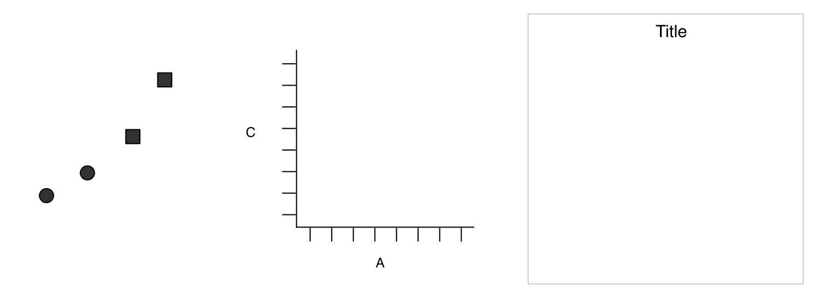
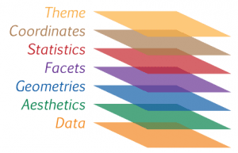
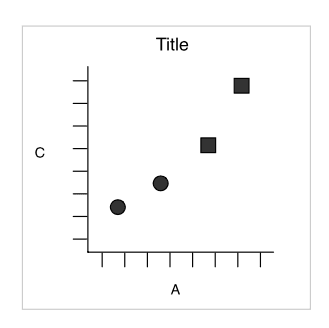
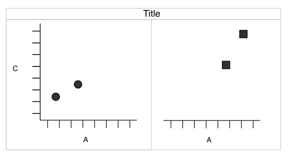
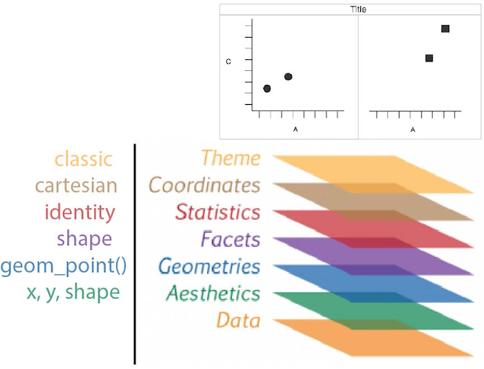
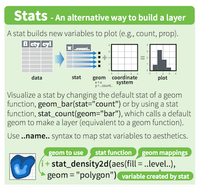

```{r setup, include = FALSE}
library(tidyverse)
```

# ggplot2 {data-background="img/05/ggplot2_overview.jpg"}

## Learning objectives

### You will learn to: {.box-10 .offset-1 .bg-red .icon}


- Understand the basic grammar of ggplot2 (data, geoms, aesthetics, facets).
- Make quick exploratory plots of your multidimensional data.
- Know how to find help on `ggplot2` when you run into problems.

## Introduction {.build}

### `ggplot2`{} {.box-6 .bg-red}

- stands for **g**rammar of **graphics** plot version 2
- Inspired by Leland Wilkinsons work on the [grammar of graphics](https://www.amazon.com/Grammar-Graphics-Statistics-Computing/dp/0387245448) in 2005.

### Idea {.box-6 .bg-yellow}

- split a graph into layers: _e.g._ axis, curve(s), labels.
- **3** main elements are required: **data**, **aesthetics** and at least one **geometry**

### {.box-8 .bg-gray .small}



[Wickham H. 2007. _J. Comp. Graph. Stat._ **19**:3–28](http://www.tandfonline.com/doi/abs/10.1198/jcgs.2009.07098)

### {.box-4 .bg-gray .stretch}



<span class = "small">source: [thinkR](http://www.thinkr.fr/guide-survie-ggplot2-datajournalistes/)</span>

%end%


## Simple example | Wickham 2007 {.build}

### dataset {.box-4 .bg-green .offset-1}

------------------
x     y    shape
----  ---- -------
25    11   circle

0     0    circle

75    53   square

200   300  square

------------------

### {.box-4 .bg-bluew .offset-2}



### aesthetics {.box-4 .offset-2 .bg-blue}

_x_ = x, _y_ = y, _shape_ = shape

### **geometric** object {.box-4 .bg-red}

dot / point

### {.box-6 .offset-3 .bg-yellow}

What if we want to split _circles_ and _squares_?

## Faceting | _aka_ trellis or lattice plots {.build}

### Split by the **shape** {.box-8 .offset-2 .bg-bluew}



%end%


### Redundancy {.box-10 .offset-1 .bg-yellow .icon-small}


Now, **dot shapes** and **facets** provide the same information.\
We could use the shape for another meaningful variable...


## Layers

### {.box-8 .bg-bluew}



### Data {.box-4 .bg-green}

------------------
x     y    shape
----  ---- -------
25    11   circle

0     0    circle

75    53   square

200   300  square

------------------

## Motivation for this layered system | football example {.vs1}

> *Data visualisation* is not meant just to be seen but to be read, like written text | Alberto Cairo {.bg-yellow}

```{r, echo = FALSE}
# https://github.com/johnburnmurdoch/johnburnmurdoch.github.io/blob/master/slides/r-ggplot/r-scripts.R
#allSeasons <- read_csv("https://raw.githubusercontent.com/johnburnmurdoch/johnburnmurdoch.github.io/master/slides/r-ggplot/changing-tides-of-football.csv")
#write_rds(allSeasons, "data/allseasons.rds")
```


```{r, echo = FALSE, title = "Using the [Euro Club Index](http://www.euroclubindex.com/asp/Methodology.asp) dataset", class = "compact-output"}
library(tidyverse)
allSeasons <- read_rds("data/allseasons.rds")
oneSeason <- allSeasons %>% filter(year == 2016)
allSeasons
```

<span class = "small">source [John Burn-Murdoch](http://johnburnmurdoch.github.io/slides/r-ggplot/) working at the Financial Times</span> 

## questions & solutions {.build}

### Questions {.box-5 .bg-yellow .compact-output}

1. which countries have the best teams?
2. which leagues are the most/least balanced?
3. what is the 'quality gap' between a given pair of leagues?
4. how does the nth best team in league x today compare to its predecessors?
5. how have all of the above changed over time?

### Stat solutions  {.box-4 .bg-green .stretch}

1. linear comparison
2. distribution of parts within the whole
3. difference in area between two curves
4. value in context
5. evolution of an already detailed pattern over time
  
### Visual solutions  {.box-3 .bg-blue .stretch}

1. points
2. points on a line
3. ribbon
4. shaded range
5. faceted plots

%end%

<span class = "small">source [John Burn-Murdoch](http://johnburnmurdoch.github.io/slides/r-ggplot/) working at the Financial Times</span> 

## 1. which countries had the best teams in 2016?  {.build}

### {.col-12}

```{r, row = c(8, 4), fig.height=3, fig.width=3}
oneSeason %>%
  ggplot(aes(x = year, y = score, colour = country)) + 
  geom_point(size = 3) +
  scale_x_discrete() +
  theme_bw(base_size = 18)
```


### comments {.box-8 .bg-yellow .icon-small}


- `size = 3` increases the size of *all* dots (is not mapped in `aes()`).
- `scale_x_discrete` forces the x axis to be discrete.
- `theme_bw()` is a pre-defined *black/white* theme.

### Issue {.box-4 .bg-red}

we can't see much: Improve the **x** mapping

## 1. which countries had the best teams in 2016? | with rank {.build}

```{r, row = c(5, 7), fig.height = 3.5, fig.width = 5}
oneSeason %>%
  ggplot(aes(x = rank, y = score,
             colour = country)) + 
  geom_point(size = 3) +
  theme_bw(18)
```

### comments {.box-8 .bg-yellow .icon-small}


- `scale_x_discrete` was removed: rank is a **continuous** variable.
- omit `base_size =` in `theme_bw()` (1st argument)

### Spain {.box-4 .bg-red .stretch}

Now, it's obvious that Spain has good teams including lower ranked clubs.


## 2. which leagues are most/least balanced in 2016? {.build}

### {.col-12}

```{r, row = c(5, 7), fig.height = 3.5, fig.width = 5}
oneSeason %>%
  ggplot(aes(rank, score, 
             colour = country)) +
   geom_line() + 
   geom_point(size = 3) + 
   theme_bw(18)
```

### comments {.box-8 .bg-yellow .stretch}

- `aes()` defined in the `ggplot()` main function are passed to **all** subsequent `geom`
- Here we omitted to explicitely name `x` and `y`: It's better to specify these arguments.


### Issue {.box-4 .bg-red}

Hard to see differences, ENG seems more coherent

## 2. which leagues are most/least balanced in 2016? | with range {.vs2 .build}

### {.col-12}

```{r, row = c(8, 4), fig.height=4, fig.width=5}
oneSeason %>%
  group_by(country) %>%
  summarise(min = min(score),
            max = max(score),
            range = max - min) %>%
  mutate(country = forcats::fct_reorder(country, range)) %>%
  ggplot(aes(x = "2016", y = range, fill = country)) +
  geom_col(position = "dodge") +
  theme_classic(18)
```


### Tips  {.box-10 .offset-1 .bg-yellow .stretch .icon-small}


- force the **x-axis** tp be discrete using `"2016"` as character
- **position**: use dodging to get all bars on the same x index
- reorder levels based on a numeric variable using `fct_reorder`


## 3. _Quality gap_ between England and Spain in 2016? | score diff at each rank  {.build}

### {.col-12}

```{r, row = c(7, 5), fig.height=4, fig.width=5}
oneSeason %>%
  select(score, rank, country) %>%
  filter(country %in% c("ENG", "ESP")) %>%
  spread(country, score) %>%
  rowwise() %>%
  mutate(gap = ESP - ENG,
         min = min(ESP, ENG),
         max = max(ESP, ENG)) %>%
  ggplot(aes(x = rank, fill = gap > 0)) + 
  geom_rect(aes(xmin = rank - 0.5, 
                xmax = rank + 0.5, 
                ymin = min, ymax = max), alpha = 0.8) + 
  theme_classic(18) +
  scale_fill_manual(name = "gap", labels = c("ENG", "ESP"), 
                    values = c("royalblue", "red3")) +
  labs(title = "quality gap",
       subtitle = "between England and Spain",
       caption = "by John Burn-Murdoch")
```

### comments {.box-8 .bg-yellow .stretch .icon-small}


- Using `spread()` computing a difference between two columns is easy
- `rowwise()` is mandatory to get the right min and max

### Spain clubs { .box-4 .bg-red}

are performing better at every rank except #11

## 4.How does the _nth_ best English team in 2016 compare to its predecessors? {.build .vs2}

### {.col-12}

```{r, row = c(7, 5), fig.height=5, fig.width=5}
oneSeason %>%
  filter(country == "ENG") %>%
  ggplot(aes(x = rank, y = score)) + 
  geom_ribbon(aes(ymin = atw, ymax = atb),
              fill = "royalblue", alpha = 0.5) + 
  geom_line(size = 1.5, colour = "royalblue") + 
  geom_point(size = 3, colour = "royalblue") + 
  theme_bw(18) + 
  scale_fill_manual(name = "gap", labels = c("ENG", "ESP"), 
                    values = c("royalblue", "red3")) +
  labs(title = "Comparison of the nth best \nteam to its predecessors",
       subtitle = "in England in 2016",
       caption = "by John Burn-Murdoch")
```

## 5. How to visualise over time? | facet: best country {.build}

### {.col-12}

```{r, fig.height = 4, fig.width = 10}
allSeasons %>%
  ggplot(aes(rank, score, colour = country)) +
  geom_line() + 
  theme_classic(18) +
  facet_wrap(~ year, ncol = 8)
```

## 5. How to visualise over time? | facet {.build}

### {.col-12}

```{r, eval = FALSE, fig.height=6, fig.width=6, title = "gap code"}
allSeasons %>%
  select(score, year, rank, country) %>%
  filter(country %in% c("ENG", "ESP")) %>%
  spread(country, score) %>%
  rowwise() %>%
  mutate(gap = ESP - ENG,
         min = min(ESP, ENG),
         max = max(ESP, ENG)) %>%
  ggplot(aes(x = rank, fill = gap > 0)) + 
  geom_rect(aes(xmin = rank - 0.5, 
                xmax = rank + 0.5, 
                ymin = min, ymax = max), alpha = 0.8) + 
  theme_classic(18) +
  scale_fill_manual(name = "gap", labels = c("ENG", "ESP"), 
                    values = c("royalblue", "red3")) +
  labs(title = "quality gap",
       subtitle = "between England and Spain",
       caption = "by John Burn-Murdoch") +
  facet_wrap(~ year)
```

### Using tidy data {.box-8 .offset-2 .bg-red}

Split into mutliple panels by only adding the `facet` layer.

## 5. How to visualise over time? | facet: gap plot 

```{r, echo = FALSE, fig.height = 5, fig.width = 10}
allSeasons %>%
  select(score, year, rank, country) %>%
  filter(country %in% c("ENG", "ESP")) %>%
  spread(country, score) %>%
  rowwise() %>%
  mutate(gap = ESP - ENG,
         min = min(ESP, ENG),
         max = max(ESP, ENG)) %>%
  ggplot(aes(x = rank, fill = gap > 0)) + 
  geom_rect(aes(xmin = rank - 0.5, 
                xmax = rank + 0.5, 
                ymin = min, ymax = max), alpha = 0.8) + 
  theme_classic(18) +
  scale_fill_manual(name = "gap", labels = c("ENG", "ESP"), 
                    values = c("royalblue", "red3")) +
  labs(title = "quality gap",
       subtitle = "between England and Spain",
       caption = "by John Burn-Murdoch") +
  facet_wrap(~ year, ncol = 8)
```


## Your turn {.bg-green}

<!-- rstudio [cheatsheet](https://www.rstudio.org/links/data_visualization_cheat_sheet) -->

```{r, title = "save iris as a `tibble`", width = 8, class = "offset-2 compact-output"}
iris <- as_tibble(iris)
iris
```

###  Tip {.box-6 .offset-3 .bg-yellow .icon-small}


saving the data frame as a `tibble` enables the smart tibble printing and avoids to list all 150 rows

<!--

### change default theme {.box-6 .bg-aquamarine2}

I set for this course the following to avoid the grey background and print bigger text
```{r}
ggplot2::theme_set(ggplot2::theme_bw(18))
```
-->

## Your turn {.bg-green}

```{r, fig.height = 4, title = "Draw your first plot", width = 10, class = "offset-1"}
iris %>%
  ggplot() +
  geom_point(aes(x = Petal.Width, y = Petal.Length))
```


## Geometric objects | geoms define the type of plot which will be drawn {.build .nvs1}

### `geom_point()` {.box-4 .bg-cobalt}

```{r, echo = FALSE}
iris %>%
  ggplot() +
  geom_point(aes(x = Petal.Width, y = Petal.Length))
```

### `geom_line()` {.box-4 .bg-cobalt}

```{r, echo = FALSE}
oneSeason %>%
  ggplot(aes(rank, score, 
             colour = country)) +
  geom_line()
```

### `geom_bar()` {.box-4 .bg-cobalt}

```{r, echo = FALSE}
oneSeason %>%
  ggplot(aes(rank, score, 
             fill = country)) +
  geom_col(position = "dodge")
```


### `geom_boxplot()` {.box-4 .bg-cobalt}

```{r, echo = FALSE}
ggplot(mtcars) +
  geom_boxplot(aes(x = factor(cyl), y = mpg))
```

### `geom_histogram()` {.box-4 .bg-cobalt}

```{r, echo = FALSE}
ggplot(iris) +
  geom_histogram(aes(x = Sepal.Width), bins = 20)
```

### `geom_density()` {.box-4 .bg-cobalt}

```{r, echo = FALSE}
ggplot(iris) +
  geom_density(aes(x = Sepal.Width, fill = Species, colour = Species), alpha = 0.6)
```

```{css, echo = FALSE}
.shift-up {
  margin-top: -500px;
}
```


### Cheatsheet {.box-8 .offset-2 .bg-yellow .shift-up .icon-small}


Have a look at the [cheatsheet](https://www.rstudio.org/links/data_visualization_cheat_sheet) or the ggplot2 online [documentation](http://ggplot2.tidyverse.org/) to list more possibilities.

## Mapping aesthetics

### definitions {.box-12 .bg-yellow}

- **aesthetics** map the columns of a `data.frame`/`tibble` to the variable each ggplot2 `geom` is expecting.
- `geom_point()` for example requires **at least** the _**x**_ and _**y**_ coordinates to draw each point.

%end%

```{r, fig.height = 4, eval = FALSE, width = 5}
ggplot(iris) +
  geom_point(aes(x = Petal.Width,
                 y = Petal.Length))
```

### {.box-7 .x-small .bg-bluew}

```{r, echo = FALSE}
head(iris, 5) %>% 
  knitr::kable()
```

## Unmapped parameters{.column .build}

<!-- FIXME: image is not rendered as it should in firefox in column mode... Browser bug? -->

### {.box-6 .bg-blue .show}

- `geom_point()` accepts additional arguments such as the `colour`, the transparency (`alpha`) or the `size` (see `?geom_point`).
- It is possible to define them to a fixed value wihout mapping them to a variable.

### important {.box-6 .bg-red .icon-small}


Note that parameters are defined **outside** the aesthetics `aes()` are applied to **all** data.

%end%

```{r, fig.height = 4, width = 6, class = "show"}
ggplot(iris) +
  geom_point(aes(x = Petal.Width,
                 y = Petal.Length),
             colour = "blue",
             alpha = 0.6,
             size = 3)
```

## Mapping aesthetics | colour{.column .build}

### {.box-6 .bg-blue .show}

- `colour`, `alpha` or `size` can also be mapped to a column in the data frame.
- We can for example attribute a different colour to each species.

### important {.box-6 .bg-red .icon-small}


Note that the `colour` argument is now **inside** `aes()` and **must** refer to a column in the dataframe.

%end%

```{r, fig.height = 4, width = 6, class = "show"}
ggplot(iris) +
  geom_point(aes(x = Petal.Width,
                 y = Petal.Length,
                 colour = Species),
             alpha = 0.6, size = 3)
```

## Mapping aesthetics | shape

```{r, title = "Mapping `shape` and `colour` to `Species`", fig.height = 4}
ggplot(iris) +
  geom_point(aes(x = Petal.Width, y = Petal.Length, shape = Species, colour = Species),
             alpha = 0.6, size = 3)
```

## Mapping aesthetics | group {.build}

```{r, title = "Example of data causing \"trouble\"", width = 6}
# Sample data
set.seed(12)
d <- data.frame(expand.grid(x = letters[1:4],
                        g = factor(1:2)),
                        y = rnorm(8))
d
```

### problem, plot data {.box-6 .bg-red .stretch}

```{r}
ggplot(d, aes(x, y, colour = g)) +
  geom_line() + 
  geom_point()
```

## Mapping aesthetics | group {.build}

### solution: grouping {.box-6 .bg-grgold .stretch}

```{r}
ggplot(d, aes(x, y, colour = g, group = g)) +
  geom_line() +
  geom_point()
```

### force grouping {.box-6 .bg-blue .stretch}

```{r}
ggplot(d, aes(x, y, colour = g, group = 1)) +
  geom_line() +
  geom_point()
```

## Labels

It is easy to adjust axis labels and the title

```{r, row = TRUE, fig.height = 4}
ggplot(iris) +
  geom_point(aes(x = Petal.Width,
                 y = Petal.Length,
                 colour = Species), 
             alpha = 0.6, size = 3) +
  labs(x = "Width",
       y = "Length",
       colour = "flower",
       title = "Iris",
       subtitle = "petal measures",
       caption = "Fisher, R. A. (1936)")
```

## Histograms

```{r, fig.height = 4, row = TRUE}
ggplot(iris) +
  geom_histogram(aes(x = Petal.Length,
                     fill = Species),
                 alpha = 0.8,
                 bins = 30)

# default #' bin is 30
# to avoid warnings
```

## Density plot

The density is the count divided by the total number of occurences.

```{r, row = TRUE}
ggplot(iris) +
  geom_density(aes(x = Petal.Length,
                   fill = Species),
               alpha = 0.6)
```

## Overlaying plots | Density plot and histogram

```{r}
ggplot(iris) +
  geom_histogram(aes(x = Petal.Length, y = ..density..), fill = "darkgrey", binwidth = 0.1) +
  geom_density(aes(x = Petal.Length, fill = Species, colour = Species), alpha = 0.4) +
  theme_classic()
```

## Stat functions

### transform data {.bg-bluew .box-12 .icon}



- variables surrounded by two pair of dots (`..variable..`) 
are intermediate values calculated by `ggplot2` using stat functions
- `geom` uses a `stat` function to transform the data:
    + `geom_histogram()` uses `stat_bin()`.
    + `stat_bin()` divides the values into _bins_ and counts the number of observations.
    + `stat_bin()` computes: `..count..`, `..density..`, `..ncount..` and `..ndensity..` (see `?stat_bin()`).
    + stat variable used in density plots: `..density..`.
    + `stat_identity` is used for scatter plots or `geom_col()` (no transformation).


## Stat functions{.middle}
  
### 1D {.box-4 .bg-yellow .stretch}

- `stat_count()`
- `stat_bin()`
- `stat_density()`

### 2D {.box-4 .bg-yellow .stretch}

- `stat_density_2d()`
- `stat_bin_2d()`
- `stat_ellipse()`

### 3D {.box-4 .bg-yellow .stretch}

- `stat_contour()`
- `stat_summary_hex()`

### {.col-12 .small}

source: ggplot2 cheatsheet by Rstudio
    
## Barcharts | categorical variables

### `geom_bar()`{} {.box-6 .bg-yellow}

- `geom_bar()` counts the number of values in each categories.
- `geom_bar()` uses `stat_count()` (creates a new `count` column).

%end%

```{r, fig.height = 3.5, width = 6}
ggplot(iris) +
  geom_bar(aes(x = Species))
# or: geom_bar(aes(x = Species, y = ..count..))
```
## Barcharts | categorical variables

### `geom_col()`{} {.box-6 .bg-yellow}

- `geom_col()` uses `stat_identity()` leaving the data as is.
- The `y` aesthetic is **mandatory** for `geom_col()`
- Using `geom_bar()` with `stat = "identity"` will let `geom_bar()` to behave like `geom_col()`

%end%

```{r, width = 6}
ggplot(iris) +
  geom_col(aes(x = Species,
               y = Petal.Length))
#ggplot(iris) +
#  geom_bar(aes(x = Species, y = Petal.Length),
#           stat = "identity")
```

## Stacked barchart | categorical variables

```{r, title = "force factor to convert continuous -> discrete", fig.height=3.5}
mtcars %>%
  ggplot() +
  geom_bar(aes(x = factor(cyl),
               fill = factor(gear)))
```

## Dodged barchart (side by side) | categorical variables {.build}

```{r, row = TRUE}
mtcars %>%
  mutate(cyl = factor(cyl),
         gear = factor(gear)) %>%
  complete(cyl, gear) %>%
  ggplot() +
  geom_bar(aes(x = cyl, 
               fill = gear),
           position = "dodge", na.rm = FALSE)
```

### Complete {.box-8 .bg-grgold .offset-2}

the combination `gear` 4 / `cyl` 8 is missing. Using `tidyr::complete()` to avoid bars with different widths.

## Stacked barchart for proportions | categorical variables

```{r, row = TRUE}
mtcars %>%
  mutate(cyl = factor(cyl),
         gear = factor(gear)) %>%
  complete(cyl, gear) %>%
  ggplot() +
  geom_bar(aes(x = cyl, 
               fill = gear),
           position = "fill")
```

## Stacked barchart for proportions | pie charts

We can easily switch to polar coordinates:

```{r, row = TRUE}
mtcars %>%
  mutate(cyl = factor(cyl),
         gear = factor(gear)) %>%
  complete(cyl, gear) %>%
  ggplot() +
  geom_bar(aes(x = cyl, 
               fill = gear),
           position = "fill") +
  coord_polar()
```

## Boxplot | IQR, median {.vs1}

```{r, row = TRUE}
ggplot(mtcars) +
  geom_boxplot(aes(x = factor(cyl),
                   y = mpg))
```

## Boxplot | dodge by default {.vs1}

```{r, row = TRUE}
ggplot(mtcars) +
  geom_boxplot(aes(x = factor(cyl),
                   y = mpg,
                   fill = factor(am)))
```

## Boxplots are unreliable | n = 2!


```{r, row = TRUE, title = "ggbeeswarm", fig.height=3.5}
ggplot(mtcars) +
  ggbeeswarm::geom_quasirandom(aes(x = factor(cyl),
                   y = mpg,
                   colour = factor(am)))
```

```{r, row = TRUE, fig.height=3.5}
ggplot(iris, aes(x = Species, y = Petal.Length)) +
  geom_violin() +
  ggbeeswarm::geom_quasirandom()
```


## Custom colors {.nvs1}

### manual entry {.box-12 .bg-gray}
- using `scale_fill_manual()` and `scale_color_manual()`
- not handy as you **must** provide as much colours as groups

```{r, fig.height = 3.5}
ggplot(mtcars) +
  geom_boxplot(aes(x = factor(cyl), y = mpg,
                   fill = factor(am), color = factor(am))) +
  scale_fill_manual(values = c("red", "lightblue")) +
  scale_color_manual(values = c("purple", "blue"))
```

## Predefined color palettes

```{r, echo = c(1, 3), fig.height = 5.5}
library(RColorBrewer)
par(mar = c(0, 4, 0, 0))
display.brewer.all()
```

## Custom colors | using brewer

```{r, fig.height = 4}
ggplot(mtcars) +
  geom_boxplot(aes(x = factor(cyl), y = mpg,
                   fill = factor(am), colour = factor(am))) +
  scale_fill_brewer(palette = "Pastel2") +
  scale_colour_brewer(palette = "Set1")
```

## colour gradient | ggplot2 default is ugly {.build}


### default {.bg-blue .box-6}

```{r, row = TRUE}
mtcars %>%
  ggplot(aes(x = wt,
             y = mpg,
             colour = hp)) +
  geom_point(size = 3)
```

### viridis {.bg-grgold .box-6}

```{r, row = TRUE}
mtcars %>%
  ggplot(aes(x = wt,
             y = mpg,
             colour = hp)) +
  geom_point(size = 3) +
  viridis::scale_colour_viridis()
```


### viridis {.box-12 .bg-pink2 .icon}


- 4 different scales
- [viridis](https://cran.r-project.org/web/packages/viridis/vignettes/intro-to-viridis.html) is color blind friendly and nice in b&w
- default in `ggplot2` dev version


## aesthetic trick

### using strings {.box-12 .bg-aquamarine2}

- use a plain character inside `aes()`
- goes into the legend.
- only for few layers when lazy enough to create the variable in the dataframe.

```{r, row = c(6, 6), fig.height=5}
set.seed(123)
dens <- tibble(x = c(rnorm(500), 
                     rnorm(200, 3, 3)))
ggplot(dens) +
  geom_line(aes(x), stat = "density") +
  geom_vline(aes(xintercept = mean(x),
                 colour = "mean"),
             size = 1.1) +
  geom_vline(aes(xintercept = median(x),
                 colour = "median"),
             size = 1.1) -> p
p
```

## the data argument | each layer can get its own 


```{r, fig.height=4.5}
dens_mode <- tibble(mode = density(dens$x)$x[which.max(density(dens$x)$y)])
p + geom_vline(data = dens_mode,
               aes(xintercept = mode, colour = "mode"), size = 1.1) +
  theme(legend.position = "top") +
  scale_colour_hue(name = NULL) # could be: labs(colour = NULL)
```


## Facets | facet_wrap()


```{r, row = c(5, 7), fig.height = 2.8, title = "easiest way to create facet with a column name"}
ggplot(mtcars) +
  geom_point(aes(x = wt, y = mpg)) +
  facet_wrap(~ cyl)
```

```{r, row = c(5, 7), fig.height = 2.5}
ggplot(mtcars) +
  geom_point(aes(x = wt, y = mpg)) +
  facet_wrap(~ cyl, ncol = 2)
```


## Facets | free scales


```{r, row = c(5, 7), fig.height = 2.8}
ggplot(mtcars) +
  geom_point(aes(x = wt, y = mpg)) +
  facet_wrap(~ cyl, scales = "free_x")
```

```{r, row = c(5, 7), fig.height = 2.8}
ggplot(mtcars) +
  geom_point(aes(x = wt, y = mpg)) +
  facet_wrap(~ cyl, scales = "free")
```


## Facets | `facet_grid()` to lay out panels in a grid

### Specify a **formula** {.box-6 .bg-grgold}

the rows on the left and columns on the right separated by a tilde `~` (_i.e_ **by**)

%end% 

```{r, row = c(4, 8), fig.height = 4}
ggplot(mtcars) +
  geom_point(aes(x = wt, y = mpg)) +
  facet_grid(am ~ cyl)
```

## Facets | `facet_grid()` cont.

### Specify one row/column {.box-6 .bg-grgold} 

A dot (`.`) means no faceting for this axis. Mimic `facet_wrap()`

%end%

```{r, row = c(4, 8), fig.height = 4}
ggplot(mtcars) +
  geom_point(aes(x = wt, y = mpg)) +
  facet_grid(. ~ cyl)
```


## Facets | labeller {.vs1}

Add the column names with `labeller`

```{r, row = c(5, 7), fig.height = 4.5}
ggplot(mtcars) +
  geom_point(aes(x = wt, y = mpg)) +
  facet_grid(am ~ cyl,
             labeller = label_both)
```


## Exporting | interactive or passive mode {.nvs1 .build}

### right panel {.box-6 .bg-grgold}

- Using the Export button in the _Plots_ panel


### {.col-6}


### Rmarkdown reports {.box-6 .bg-grgold}

- If needed, adjust the chunk options: 
  + size: `fig.height`, `fig.width`
  + ratio: `fig.asp`... 
  + [others](https://yihui.name/knitr/options/?version=1.1.214&mode=desktop)
      
### {.col-6}


### ggsave {.box-6 .bg-grgold}

- save the `ggplot` object, 2nd argument
- guess the type of graphics by the extension

```{r eval = FALSE}
ggsave("aes_trick.png", p,
       width = 60, height = 30, units = "mm")
ggsave("aes_trick.pdf", p,
       width = 50, height = 50, units = "mm")
```

### {.col-6 }


## Extensions

`ggplot2` introduced the possibility for the community to contribute and [create **extensions**](http://ggplot2.tidyverse.org/articles/extending-ggplot2.html). 

They are referenced on a [dedicated site](https://www.ggplot2-exts.org/)


## plot your data! | [Anscombe](https://d2f99xq7vri1nk.cloudfront.net/Anscombe_1_0_0.png) ** 10 {.vs2}

> never trust summary statistics alone; always visualize your data | Alberto Cairo {.bg-grgold}


<span class = "small">source: Justin Matejka, George Fitzmaurice [Same Stats, Different Graphs...](https://www.autodeskresearch.com/publications/samestats)</span>


```{r, echo = FALSE}
knitr::knit_exit()
```


## Art | by Marcus Volz

<blockquote class="twitter-tweet"><p lang="en" dir="ltr">A compilation of some of my gifs created with <a href="https://twitter.com/hashtag/rstats?src=hash">#rstats</a> <a href="https://twitter.com/hashtag/ggplot2?src=hash">#ggplot2</a> <a href="https://twitter.com/hashtag/gganimate?src=hash">#gganimate</a> <a href="https://twitter.com/hashtag/tweenr?src=hash">#tweenr</a> <a href="https://t.co/nCppSOZv4W">https://t.co/nCppSOZv4W</a></p>&mdash; Marcus Volz (@mgvolz) <a href="https://twitter.com/mgvolz/status/849375922297991168">4 avril 2017</a></blockquote>

```{css, echo = FALSE}
.vembedr {
  border-radius: 25px; /* adjust it to your needs */
  overflow: hidden;
}

.vembedr iframe {
  display: block;
  border: none;
}
```


```{r, echo = FALSE}
vembedr::embed_youtube("DQiKHlpy70Q") %>% htmltools::div(class = "vembedr")
```


## Missing features {.nvs1 .build}

### geoms list [here](http://ggplot2.tidyverse.org/reference/index.html#section-layer-geoms) {.box-6 .bg-yellow}

- `geom_tile()` heatmap
- `geom_bind2d()` 2D binning
- `geom_abline()` slope

### stats list [here](http://ggplot2.tidyverse.org/reference/index.html#section-layer-stats) {.box-6 .bg-yellow .stretch}


- `stat_ellipse()` 
- `stat_summary()` easy mean 95CI etc.
- `geom_smooth()` linear/splines/non linear

### plot on multi-pages {.box-6 .bg-grgold .stretch}

- `ggforce::facet_grid_paginate()` facets
- `gridExtra::marrangeGrob()` plots

### positions list [here](http://ggplot2.tidyverse.org/reference/index.html#section-layer-position-adjustment) {.box-6 .bg-grgold .stretch}

- `position_jitter()` random shift 
- `quasirandom()` is better

### coordinate / transform {.box-6 .bg-blue .stretch}

- `coord_cartesian()` for zooming in
- `coord_flip()` exchanges _x_ & _y_
- `scale_x_log10()` and _y_
- `scale_x_sqrt()` and _y_

### customise [_theme_](http://ggplot2.tidyverse.org/reference/index.html#section-themes) elements {.box-6 .bg-blue .stretch .col-list .c2}

- legend & guide tweaks
- major/minor grids
- font, faces
- margins
- labels & ticks
- strip positions


## programming {.build}

### `Sepal.Length` is not exposed {.box-6 .bg-red}

```{r, error = TRUE, fig.height=3}
iris_plot <- function(flower) {
  ggplot(iris, aes(x = Species, y = flower)) +
  geom_violin() +
  ggbeeswarm::geom_quasirandom()
}
iris_plot(flower = Sepal.Length)
```

### strings does not help {.box-6 .bg-red}

```{r, error = TRUE, fig.height=3}
iris_plot <- function(flower) {
  ggplot(iris, aes(x = Species, y = flower)) +
  geom_violin() +
  ggbeeswarm::geom_quasirandom()
}
iris_plot(flower = "Sepal.Length")
```

##

### `aes_string()` expects strings {.box-6 .bg-grgold}

```{r, fig.height=3}
iris_plot <- function(flower) {
  ggplot(iris, aes_string(x = "Species", y = flower)) +
  geom_violin() +
  ggbeeswarm::geom_quasirandom()
}
iris_plot(flower = "Sepal.Length")
```

### `aes_string()` expects strings {.box-6 .bg-grgold}

```{r, fig.height=3}
iris_plot <- function(flower) {
  ggplot(iris, aes_string(x = "Species", y = flower)) +
  geom_violin() +
  ggbeeswarm::geom_quasirandom()
}
iris_plot(flower = "Petal.Length")
```
