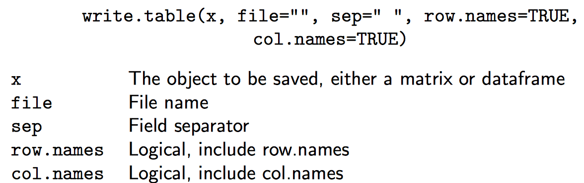
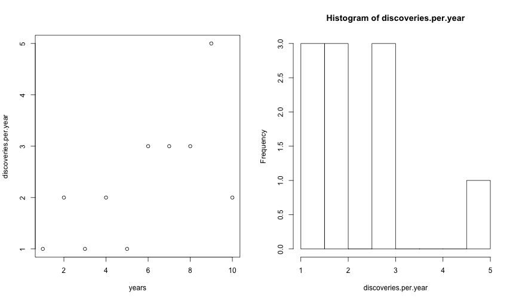
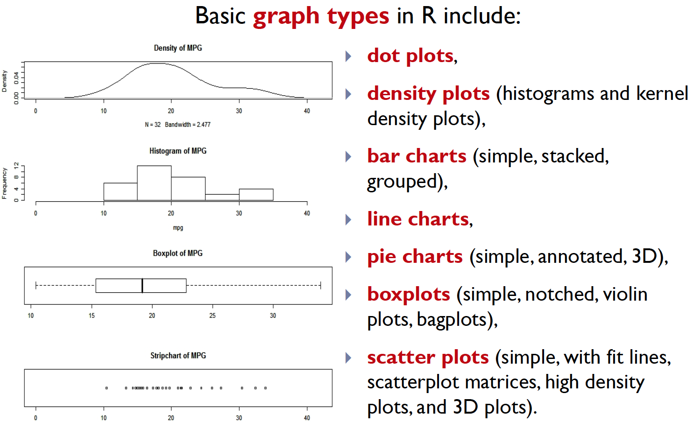
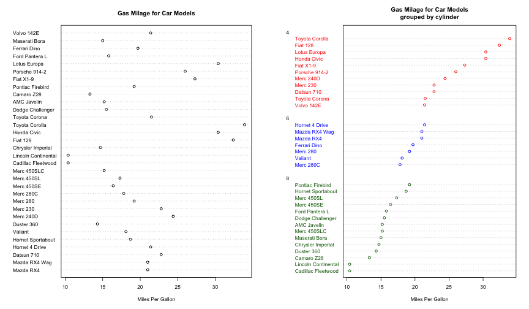
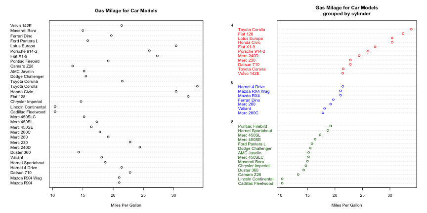
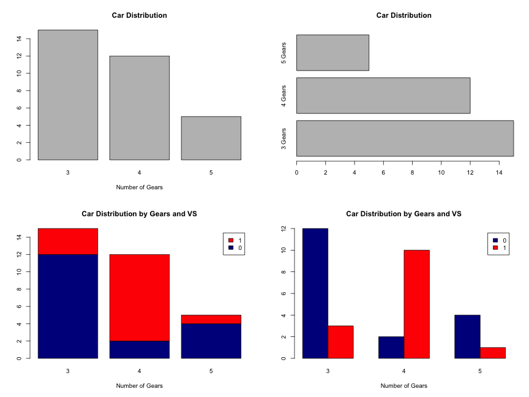
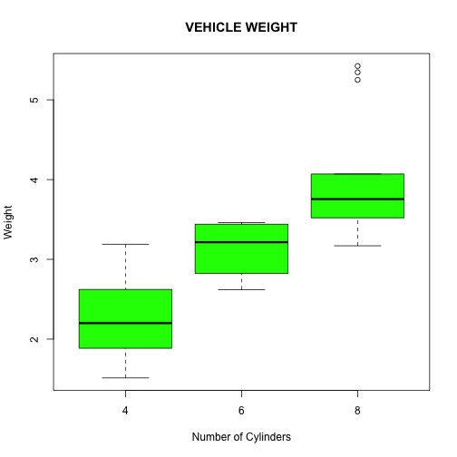
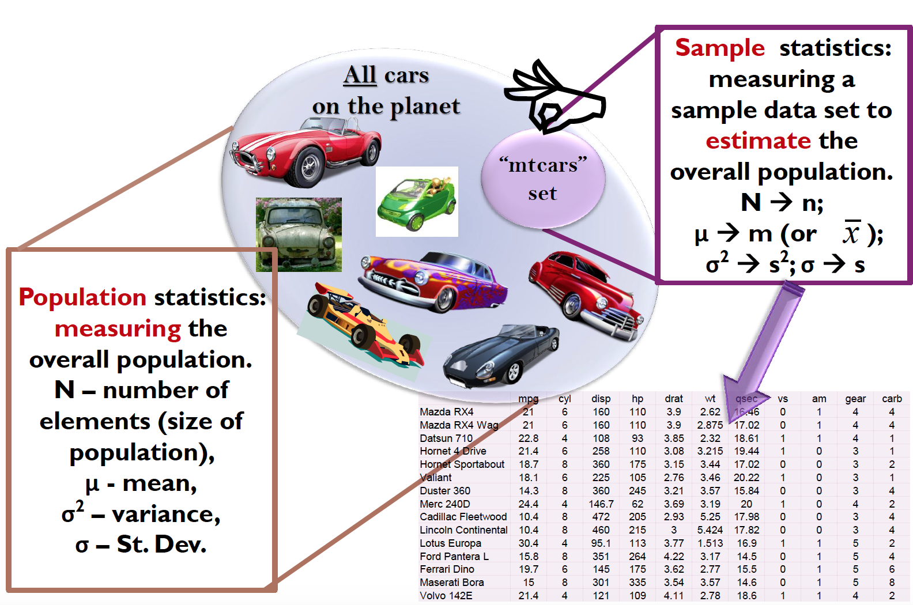
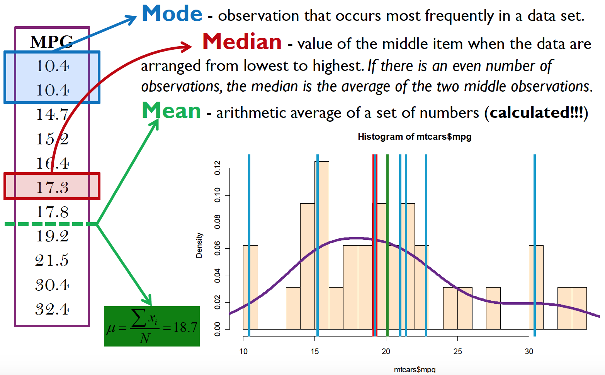
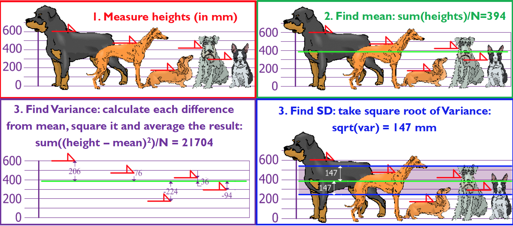

<style>
.reveal code .r{
    width:120%
    font:0.8em}
.section .reveal .state-background {
    background: white;}
.section .reveal h1,
.section .reveal p {
    color: black;
    position: relative;
    top: 4%;}
.reveal h1, .reveal h2, .reveal h3 {
  word-wrap: normal;
  -moz-hyphens: none;
}
.small-code pre code {
  font-size: 1em;
}
</style>

Advanced introduction to R
========================================================
author: Ganna Androsova
date: 2015-01-06
font-family: 'Arial'
transition: fade
<br>
<br>
<br>
<br>
<br>
<div style = "font-size:60%">Slides are adapted from presentation "Practicals in Bioinformatics" by Dr. Tatiana R. Baumuratova</div>

Working Directory
========================================================
class:small-code
- When we load/save datasets, load source files or save graphs we will need to specify the file path. To avoid typing the path every time we can specify a working directory.

- To set the working directory click File > Change dir... or type setwd(file path)

```r
getwd()
```

```
[1] "/Users/ganna.androsova/isb101/R/Advanced_R_intro"
```

If files are in different directory please indicate it with

```r
setwd("/Users/ganna.androsova/isb101/R")
```

Data import
========================================================
class:small-code
You can directly read your data table from a file located either on your computer: 


```r
taxon = read.table('taxon.txt')
```

or elsewhere in the web: 

```r
# url of taxon data
taxon_url = "http://www.bio.ic.ac.uk/research/mjcraw/therbook/data/taxon.txt"

# import data in R
taxon = read.table(taxon_url)

head(taxon)
```

```
    Petals Internode    Sepal    Bract  Petiole     Leaf    Fruit
1 5.621498  29.48060 2.462107 18.20341 11.27910 1.128033 7.876151
2 4.994617  28.36025 2.429321 17.65205 11.04084 1.197617 7.025416
3 4.767505  27.25432 2.570497 19.40838 10.49072 1.003808 7.817479
4 6.299446  25.92424 2.066051 18.37915 11.80182 1.614052 7.672492
5 6.489375  25.21131 2.901583 17.31305 10.12159 1.813333 7.758443
6 5.785868  25.52433 2.655643 17.07216 10.55816 1.955524 7.880880
```

Data import
========================================================
It’s important to remember of possibility to extend the power of the functions used - by playing with their arguments: 

**myDF = read.table(‘fileName.txt’, header = T, as.is = T)**

Data comes in different formats: txt, csv, xls, tab...
Not all data types are supported in R. 

To extend R capabilities install a required **package**.

                        TASK

We would like to work with excel file: import its content into R, analyse it, visualize results and write the file with results. 

Installation of R packages
========================================================

- List of the existing R packages is available at **Packages** tab at https://cran.r-project.org

To add packages type in console:
- install.packages("**PackageName**")

OR
- source("https://bioconductor.org/biocLite.R")
biocLite("**PackageName**")
- you may also download any package as a .zip and install it then by choosing in the R menu: **Packages** -> **Install package(s) from local .zip file** -> choosing the name of the file

Installation of R packages
========================================================
class:small-code
For working with excel file, we need package **"xlsReadWrite"**.


```r
source("https://bioconductor.org/biocLite.R")
biocLite("xlsx")
```
After you run these lines -> package is installed but not started.

```r
library(xlsx)
taxon = read.xlsx("taxon.xlsx", sheetIndex = 1)
head(taxon[, 1:6])
```

```
      Petals  Internode      Sepal      Bract    Petiole       Leaf
1 5621498349 2948059578 2462106579  182034091 1127909704 1128032999
2 4994616997 2836024706 2429320759 1765204912  110408378 1197616585
3 4767504884 2725431792 2570497375  194083846 1049072184 1003808444
4 6299445616  259242382 2066051345 1837915478 1180182252 1614051727
5 6489375001 2521130805 2901582763 1731304737 1012159001 1813333082
6   57858682 2552433147 2655642742 1707215724  105581605 1955524186
```

Functions
========================================================
class:small-code

```r
myfun = function(x){ 
  return(x*x)
}

myfun(2)
```

```
[1] 4
```
If no return() is given, the object last created is returned.

Functions
========================================================
class:small-code

```r
myfun = function(x, a){ 
  r = a*sin(x) 
  return(r)
} 

#Short version
myfun = function(x, a){ a*sin(x) }

result = myfun(pi/2,2)
result
```

```
[1] 2
```

Functions
========================================================
class:small-code
Multiple return values have to be returned as a single list.

```r
# a is optional parameter with default=1
myfun4 = function(x, a=1){
  result1 = a*sin(x)
  result2 = a*cos(x)
  return(list(result1,result2)) # one list as result
} 
myfun4(pi/2)
```

```
[[1]]
[1] 1

[[2]]
[1] 6.123234e-17
```
R doesn't handle return(result1,result2)

Global and local scope
========================================================


Global and local scope
========================================================
class:small-code

```r
global.var = 1

new.fun = function(x){
  print(global.var)
  
  local.variable = sin(x)
  print(local.variable)
  
  return(local.variable)
}

sin.var = new.fun(global.var)
```

```
[1] 1
[1] 0.841471
```


```r
print(local.variable)
```
Gives error in print(local.variable) : object 'local.variable' not found

Control statements: conditions
========================================================
To check whether your data satisfy some particular condition, R has a structure:
**if (expression1) {  expression2 } else { expression3 }**

Here **expression1** must include logical operators and be evaluated to a single logical value (**TRUE** or **FALSE**).

If TRUE, then the **expression2** is executed.

If FALSE, then **expression3** is executed. The **expression3** may be either a single command, or a sequence of commands, or again a control statement, like if … else operator or a loop.

Control statements: conditions
========================================================
class:small-code


```r
x = c(2,3,4,5)

if (all(x) == 0) { 
  x[length(x)+1] = 5
  print(x) 
} else { 
  x[length(x)+1] = 16 
  print(x) 
}
```

```
[1]  2  3  4  5 16
```

Repetitive execution: for loop
========================================================
If there’s a need in multiple execution of the same command or a sequence of commands, use statement:

**for (xxx in expression1) { expression2 }**

Here **xxx** is a loop variable; **expression1** is the sequence of instances, which **xxx** should run on and **expression2** is the (group of) command(s) to be executed.

**expression2** is repeatedly evaluated as xxx ranges through the values in the vector result of expression1.

For loop (example 1)
========================================================
class:small-code

```r
mymat = matrix(nrow=30, ncol=30) # create a 30 x 30 matrix

for(i in 1:dim(mymat)[1]){   # for each row
  for(j in 1:dim(mymat)[2]){ # for each column
    mymat[i,j] = i*j         # assign a product of two indexes
  }
}  
mymat[1:10, 1:10]
```

```
      [,1] [,2] [,3] [,4] [,5] [,6] [,7] [,8] [,9] [,10]
 [1,]    1    2    3    4    5    6    7    8    9    10
 [2,]    2    4    6    8   10   12   14   16   18    20
 [3,]    3    6    9   12   15   18   21   24   27    30
 [4,]    4    8   12   16   20   24   28   32   36    40
 [5,]    5   10   15   20   25   30   35   40   45    50
 [6,]    6   12   18   24   30   36   42   48   54    60
 [7,]    7   14   21   28   35   42   49   56   63    70
 [8,]    8   16   24   32   40   48   56   64   72    80
 [9,]    9   18   27   36   45   54   63   72   81    90
[10,]   10   20   30   40   50   60   70   80   90   100
```

For loop (example 2)
========================================================
class:small-code

The Fibonacci numbers have many mathematical relationships and have been discovered repeatedly in nature. They are constructed as the sum of the previous two values, initialized with the values 1 and 1.

```r
#Let's calculate 10 Fibonacci numbers
fibvals = rep(0, 10) #Create vector which will contain 10 values
fibvals[1] = 1 #Assign 1 to first and second variable
fibvals[2] = 1
for (i in 3:10) {
   fibvals[i] = fibvals[i-1]+fibvals[i-2]
} 
fibvals
```

```
 [1]  1  1  2  3  5  8 13 21 34 55
```

Other loops: repeat and while
========================================================
There exist other statements for repeated expressions: **repeat** expression and **while** (condition) expression.

The **break** statement can be used to terminate any loop, possibly abnormally. This is the only way to terminate **repeat** loops, usually by using **if…else…** statement to check if the desired condition is satisfied.

The **next** statement can be used to discontinue one particular cycle and skip to the “next” (this is more likely to be used in **for** and **while** loops)

While loop
========================================================
class:small-code
**while()** loop will execute a block of commands until the condition is no longer satisfied.

```r
x = 1 
while (x < 4) { 
  x = x + 1
  print(x) 
}
```

```
[1] 2
[1] 3
[1] 4
```

**next** can skip one step of the loop; **break** will end the loop abruptly.

```r
x = 1 
while (x < 4) { 
  x = x + 1
  if (x == 3){
    next
  }
  print(x) 
}
```

```
[1] 2
[1] 4
```

Repeat loop
========================================================
class:small-code
**repeat** is similar to while and for loop, it will execute a block of commands repeatly till break.

```r
x = 0 
repeat { 
  x = x + 1
  print(x)
  if (x > 5) {
    break
  }
}
```

```
[1] 1
[1] 2
[1] 3
[1] 4
[1] 5
[1] 6
```
If no **break** is given, loop runs forever!

The apply() commands
========================================================
these commands allow functions to be run on matrices.

**apply()** function used on matrix
 
**tapply()** table grouped by factors

**lapply()** on lists and vectors; returns a list

**sapply()** like lapply(); returns vector/matrix

**mapply()** multivariate sapply()

apply()
========================================================
class:small-code
**apply(data, margin, function)**

```r
a = matrix(1:10,nrow=2)
apply(a,1,mean) # 1 = by rows
```

```
[1] 5 6
```

```r
apply(a,2,mean) # 2 = by columns
```

```
[1] 1.5 3.5 5.5 7.5 9.5
```

```r
# the function can also be anonymous
apply(a, 2, function(x){x[[sample.int(length(x),1)]]})
```

```
[1]  1  3  6  7 10
```

lapply() and sapply()
========================================================
class:small-code
**lapply(list, function)**

**sapply(list or vector, function)**

```r
a = matrix(2:11,nrow=2)
b = matrix(1:10,nrow=2)
c = list(a,b)

lapply(c,mean)
```

```
[[1]]
[1] 6.5

[[2]]
[1] 5.5
```

```r
sapply(c,mean)
```

```
[1] 6.5 5.5
```

mapply()
========================================================
class:small-code
Like sapply() but applies over the first elements of each argument

**mapply(FUNCTION, list, list, list...)**

```r
mapply(rep, pi, 3:1)
```

```
[[1]]
[1] 3.141593 3.141593 3.141593

[[2]]
[1] 3.141593 3.141593

[[3]]
[1] 3.141593
```

```r
# equivalent to: 
rep(pi, 3) 
```

```
[1] 3.141593 3.141593 3.141593
```

```r
rep(pi, 2) 
```

```
[1] 3.141593 3.141593
```

```r
rep(pi, 1)
```

```
[1] 3.141593
```

Vectorization
========================================================
A "vectorized" function **f()** takes a vector [x1, x2, ... , xn] as input and returns the vector [f(x1), f(x2), f(x3), ... , f(xn)].

**Why is vectorization important?**
Vectorized functions usually involve a behind-the-scenes loop in a low-level language (C or Fortran), which runs way faster than a pure R loop.

Vectorization
========================================================
class:small-code
Here's an example using the vectorized log() function that illustrates the speedup you can get:

```r
# Create a vector of 1 million random numbers between 1 and 10
nums = sample(1:10, size=1000000, replace=TRUE) 

# Loop to call log on each vector element separately:
system.time(
  for (x in seq_along(nums)){
    nums[i] = log(nums[i])
  }
)
```

```
   user  system elapsed 
  1.134   0.013   1.152 
```

```r
system.time(log(nums))
```

```
   user  system elapsed 
  0.010   0.002   0.011 
```
So in conclusion: vectorization is important because it allows you to operate on vectors quickly (unlike looping).

Vectorised functions
========================================================
class:small-code
R has **ifelse( )** function that works with vectors:

```r
x = c(6:-4)
sqrt(x)  # gives warning
```

```
Warning in sqrt(x): NaNs produced
```

```
 [1] 2.449490 2.236068 2.000000 1.732051 1.414214 1.000000 0.000000
 [8]      NaN      NaN      NaN      NaN
```

```r
sqrt(ifelse(x >= 0, x, NA))  # no warning
```

```
 [1] 2.449490 2.236068 2.000000 1.732051 1.414214 1.000000 0.000000
 [8]       NA       NA       NA       NA
```

```r
## Note: the following also gives the warning !
ifelse(x >= 0, sqrt(x), NA)
```

```
Warning in sqrt(x): NaNs produced
```

```
 [1] 2.449490 2.236068 2.000000 1.732051 1.414214 1.000000 0.000000
 [8]       NA       NA       NA       NA
```

Vectorised functions
========================================================
Default vectorized matrix functions: 
- **rowSums(), colSums(), rowMeans(), colMeans()**

Vectorized matrix functions in package genefilter:
- **rowSds(), colSds(), rowVars(), colVars(), rowttests(), rowFtests()**

Vectorized matrix functions in package matrixStats:
- **colMedians(), rowMedians()**

Working with file
========================================================
class:small-code

```r
#taxon
mean.values = c(1:ncol(taxon))
for(i in c(1:ncol(taxon))){
  mean.values[i] = log(mean(taxon[,i]))
}
plot(mean.values, ylab = "Log-transformed mean values", xlab = "Taxons")
lines(mean.values)
axis(1, at=c(1:ncol(taxon)), labels=colnames(taxon))
```


Writing the results
========================================================
class:small-code


```r
write.table(mean.values, file = "Log-transformed mean taxon.txt", quote = FALSE, sep = "\t")
```

How to write good programs?
========================================================
- Think **algorithmically**
- Remember that your **PC doesn’t have brains**
- IDEALLY: try to optimize your programs and make it **universal** (independent on current inputs (numbers, letters, etc.)

Frequency distribution
========================================================
In statistics, a **frequency distribution** is a table that displays the frequency of various outcomes in a sample. Each entry in the table contains the frequency or count of the occurrences of values within a particular group or interval, and in this way, the table summarizes the distribution of values in the sample.

Let’s take an example of “**discoveries**” data set (type ?discoveries in your R console).

These are the **raw data** on the number of important inventions or discoveries made yearly from 1860 to 1959.

Frequency distribution
========================================================
class:small-code
Extract data on years 1869 to 1878:

```r
discoveries.per.year = discoveries[10:19]
discoveries.per.year
```

```
 [1] 1 2 1 2 1 3 3 3 5 2
```
During the mentioned 10 years there were 26 important discoveries; that having 5 discoveries per year happened only once and that one, two or three discoveries per year are much more frequent (3 times each).

Frequency distribution
========================================================
class:small-code
In R you can create the frequency distribution table using just one command: **table( )**.

This creates so-called **contingency table** which is the analog of the frequency distribution table:

```r
table(discoveries.per.year)
```

```
discoveries.per.year
1 2 3 5 
3 3 3 1 
```

Data visualization
========================================================
A plot is a visualization (graphical representation) of data, in which the data are coded by **symbols**, such as **dots**, **bars** in a bar chart, **lines** in a line chart, or **slices** in a pie chart.


R has strong graphic capabilities!

How to create a graph in R?
========================================================
class:small-code
The basic function for plotting in R is **plot( )**. It opens a graph window and plots a graph there. Its results can be varied by changing the parameters (arguments) of the **plot( )** function:

```r
years = c(1:10)
discoveries_df = data.frame(years, discoveries.per.year)
plot(discoveries_df)
```


How to create a graph in R?
========================================================
class:small-code


```r
par(mfrow=c(1,2))
plot(discoveries_df)
hist(discoveries.per.year, breaks = 10)
```



How to create a graph in R?
========================================================
Let's improve the figure! (Check ?plot and ?hist)

Use the **pch=** option to specify symbols to use when plotting points. For symbols 21 through 25, specify border color (**col=**) and fill color (**bg=**).


How to create a graph in R?
========================================================
class:small-code

```r
par(mfrow=c(1,2))
plot(discoveries_df, col = "blue", pch = 19, main = "Discoveries per year", xlab = "Years", ylab = "Number of discoveries")
hist(discoveries.per.year, breaks = 10, col = "green", main = "Frequency distribution of discoveries", xlab = "Discoveries per year")
```


Plotting in R
========================================================


Dot plots
========================================================
class:small-code
- **Dot plots** are created with function **dotchart(x, labels=)**, where x is a numeric vector and labels is a vector of labels for each point.
- You can add a **groups=** option to designate a factor specifying how the elements of x are grouped.
- Option **gcolor=** controls the color of the groups label.


```r
par(mfrow=c(1,2))
# Simple Dotplot
dotchart(mtcars$mpg,labels=row.names(mtcars),cex=.7,main="Gas Milage for Car Models",xlab="Miles Per Gallon")

# Dotplot: Grouped Sorted and Colored
x <- mtcars[order(mtcars$mpg),] # sort by mpg
x$cyl <- factor(x$cyl) # it must be a factor
x$color[x$cyl==4] <- "red"
x$color[x$cyl==6] <- "blue"
x$color[x$cyl==8] <- "darkgreen"  
dotchart(x$mpg,labels=row.names(x),cex=.7,groups= x$cyl,main="Gas Milage for Car Models\ngrouped by cylinder",xlab="Miles Per Gallon", gcolor="black", color=x$color)
```



Dot plots
========================================================
class:small-code

```r
par(mfrow=c(1,2))
# Simple Dotplot
dotchart(mtcars$mpg,labels=row.names(mtcars),cex=.7,main="Gas Milage for Car Models",xlab="Miles Per Gallon")

# Dotplot: Grouped Sorted and Colored 
dotchart(x$mpg,labels=row.names(x),cex=.7,groups= x$cyl,main="Gas Milage for Car Models\ngrouped by cylinder",xlab="Miles Per Gallon", gcolor="black", color=x$color)
```



Bar charts
========================================================
Create bar plots with the **barplot(x)**, where x is a vector or matrix. If **x is a vector**, the values determine the heights of the bars in the plot.

Use the option **horiz = T** to create a horizontal bar plot.

If **x is a matrix** and the option **beside = FALSE** used, then each bar of the plot corresponds to a column of x, with the values in the column giving the heights of stacked “sub-bars”.

If** x is a matrix** and **beside = TRUE**, then the values in each column are juxtaposed rather than stacked.

Include option **names.arg = (character vector)** to label the bars.

Bar charts
========================================================
class:small-code

```r
par(mfrow=c(2,2))
# Simple Bar Plot 
counts <- table(mtcars$gear)
barplot(counts, main="Car Distribution", xlab="Number of Gears")

# Simple Horizontal Bar Plot with Added Labels 
counts <- table(mtcars$gear)
barplot(counts, main="Car Distribution", horiz=TRUE,names.arg=c("3 Gears", "4 Gears", "5 Gears"))

# Stacked Bar Plot with Colors and Legend
counts <- table(mtcars$vs, mtcars$gear)
barplot(counts, main="Car Distribution by Gears and VS",xlab="Number of Gears", col=c("darkblue","red"),legend = rownames(counts))

# Grouped Bar Plot
counts <- table(mtcars$vs, mtcars$gear)
barplot(counts, main="Car Distribution by Gears and VS",xlab="Number of Gears", col=c("darkblue","red"),legend = rownames(counts), beside=TRUE)
```

Bar charts
========================================================
class:small-code


Line charts
========================================================
Line charts are created with the function **lines(x, y, type=)**,
where **x** and **y** are numeric vectors of (x,y) points to connect. 

**type=** indicates types of symbols to be used in the plot.

The **lines()** function adds information to an existing graph.

It **can not produce a graph** on its own. Usually **it follows a plot(x, y)** command that produces a graph.

Line charts
========================================================
class:small-code

```r
x <- c(1:5) #create some data
y <- x 

par(pch=22, col="blue") # plotting symbol and color 
par(mfrow=c(2,4)) # all plots on one page 
opts = c("p","l","o","b","c","s","S","h") 

for(i in 1:length(opts)){ 
  heading = paste("type=",opts[i]) 
  plot(x, y, main=heading) 
  lines(x, y, type=opts[i]) 
}
```

Line charts
========================================================
class:small-code


Boxplots
========================================================
Boxplots can be created for individual variables or for variables by group with **boxplot(x, data=)**, where **x** is a formula and **data=** is data frame with your data. An example of a formula is **y~group** where a separate box plot for numeric variable y is generated for each value of group. 

**varwidth = T** makes box plot widths proportional to the
square root of the samples sizes; 

**horizontal = T** reverses the axis orientation.

Boxplots
========================================================
class:small-code

```r
# Boxplot of MPG by Car Cylinders 
boxplot(wt~cyl, data=mtcars, main=toupper("Vehicle Weight"), font.main=3, cex.main=1.2, xlab="Number of Cylinders", ylab="Weight", font.lab=3, col="green")
```



Population vs. sample
========================================================


Measures of central tendency
========================================================


Quantile, quartile, percentile
========================================================
In R, a very useful function for calculating statistics for your data is **sapply( )**. Possible functions used in **sapply()** include: **mean**, **sd**, **var**, **min**, **max**, **range**, **fivenum** and **quantile**. 

If the members of the total set are **sorted by increasing order**, the set can be divided progressively, beginning at the smallest and ending at the largest, into subsets of equal or nearly equal counts of members, called **quantiles**. 

If the division is into **four** bands or groups, the quantile is a **quartile**, if into **ten** it is a **decile**, if into **100** it is a **percentile**.

The demarcation between the second and third quartile and the 50th and 51st percentiles, is the **median**.

Quantile, quartile, percentile
========================================================
Box plot is a nice way to represent **five-number statistics** of your data set. 

Q1 = The lower quartile = The 0.25 quantile = The 25% percentile

Q2 = The median = The 0.50 quantile = The 50% percentile

Q3 = The upper quartile = The 0.75 quantile = The 75% percentile


Quantile, quartile, percentile
========================================================
class:small-code

```r
boxplot(x, range = 0, col = "red", main = "Basic boxplot")
text(1.3, quantile(x), c("Minimum","Q1","Median","Q3","Maximum"), col="blue")
```


Measures of variability
========================================================


Variance vs. standard deviation 
========================================================


By using the SD we have a "standard" way of knowing what is normal, and what is extra large or extra small.  Here, rottweillers are tall dogs,  and dachsunds are a bit short ... but don't tell them! 

Individual task
========================================================
Use R dataset **PlantGrowth**. Write a new R script that will answer the following questions.
- What are the population and the samples for this dataset?
- Find mean, median and mode
- Find quartiles
- Find statistical characteristics: variance, SD, IQR
- Build a box plot and explain the 5-number statistics
- Make a frequency distribution table and build a histogram with added lines for each of the above statistical characteristics

**Please send the R code for this task to ganna.androsova@uni.lu**
