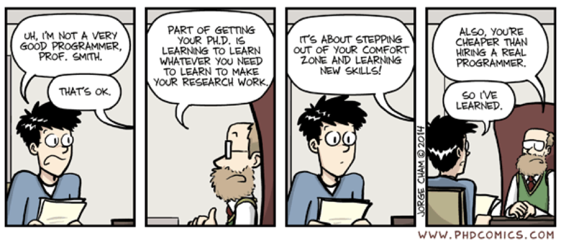
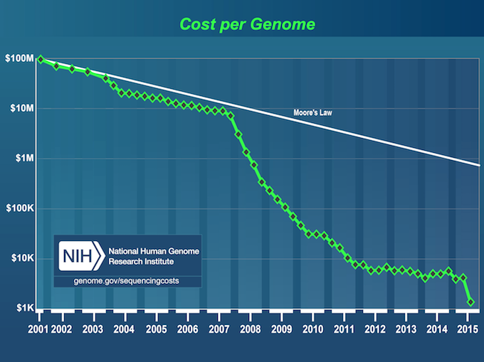
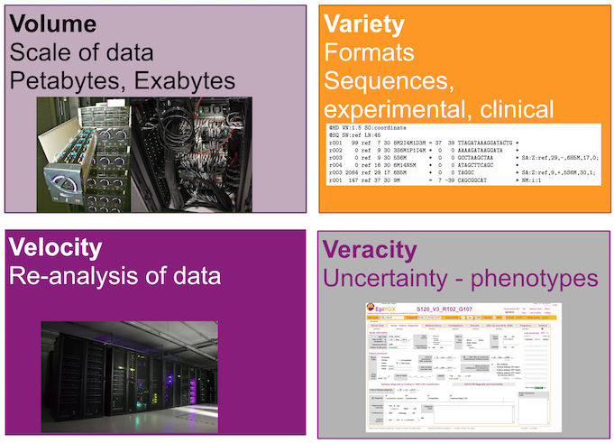
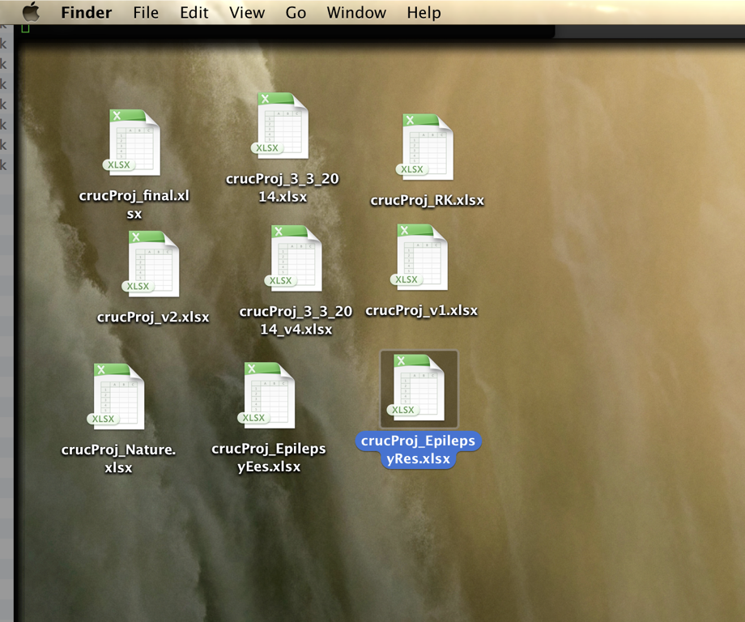

## Learning objectives
 * Good and data structures -- building your own data frames
 * Reproducible data using RMarkdown
 * Access to databases using R

# Coding remarks

## Preamble
 * You are about as forgetful as the average programmer
 * The average programmer achieves 10 lines of code per day
 * You need to find out how to help yourself
 
## Standard tactics

 
 
 
## Note from the internet

<!---->

# Introduction to reproducible data analysis

## Cost of Genome 

## Big data

## Real data management

<!---->

## How bad is Excel
All your analysis will be required to be made available eventually

Examples where things went bad

 * Reinhart-Rogoff “Growth in a time of debt”
 * Potti et al., “Genomic signatures to guide the use of chemotherapeutics”
 * CLCN2 variants in IGE

Excel manipulations are inherently non-tractable 

## Why is computational research not reproducible?
 - Copy & paste
 - Manual text entry
 - Data from downloaded from "some website" 
 - Code version not tractable

## Levels of reproducibility

 * Rerun - Robust to variations in expirement and set-up (days, operators)
 * Replicate - Defend - Same lab, same set up, same experiment
 * Repeat - Certify - Independent lab
 * Reproduce - Compare - Variants in independent labs
 * Reuse - Transfer - Different experiments

## Structuring data analysis
(WB)

# Data analysis as one computation

 
## General set up
Separate 

 - Data collection - “raw data”!
    - Experimental data - omics and small scale!
    - Electronic data collection, clinical support!
    - Web-scraped resources, data downloads!
 - Processed
    - Computed results
 - Analysis
     - R scripts, Markdown documents, Manuscripts

# Tidy data

## Analysis ready data
 - All data in tractable structures
 - Load data into memory

## Let's take a look at bad data

## Bad elements
 1. Patient names
 2. Identical column names
 1. Inconsistent variables
 2. Non-English columns names
 3. Color coding
 1. Inconsistent dates (ISO8601)
 1. “Disease”
 1. Multiple columns for one item
 1. Redundant information
 1. Repeated rows
 1. Comment field
 1. Uncoded syndromes
 1. Unnecessary information (birthdate, comments)

## Tidy data
 -	One variable per column
 -  One observation per row
 -  Tables hold elements of only one kind

## Even tidier data
 - Column names are easy to use and informative
 - Row names are easy to use and informative
 - Obvious mistakes in the data have been removed
 - Variable values are internally consistent
 - Appropriate transformed variables have been added
 
# RMarkdown | Reproducible data analysis

## My requirements
 - Document before you write code
 - Repositories as sources for data (incl. versions)
 - All files are text files or in an appropiate standard format
 - All steps are coded
 - No manual intervention
 - Manual input audited
 - Code versioning
 
 
## What this means to you
 1. Obtain basic coding capacity 

 1.  Just because you are not typing your code when compiling an analysis in
Excel, you are still coding
 1. Prepare to share your data with
    - your colleagues
    - your consortium
    - everyone

## Literate programming
 - An article is a stream of text and code 
 - Analysis code is divided into text and code “chunks”
 - Presentaiton codeformats results (tables, figures, etc.)
 - Article text explains what is going on
 - Literate programs are weaved to produce (human-readable documents and tangled to produce machine-readable documents

 
## RMarkdown
(Demo)

## Pros and cons

**Strong points**
 * Short/medium-length technical documents 
 * Tutorials and manuals
 * Reports
 * Home work
 * Data preprocessing documents/summaries

**Weaker areas**
 - Larger papers with technical requirements
 - Fixed image placements

# Thank you for your attention
