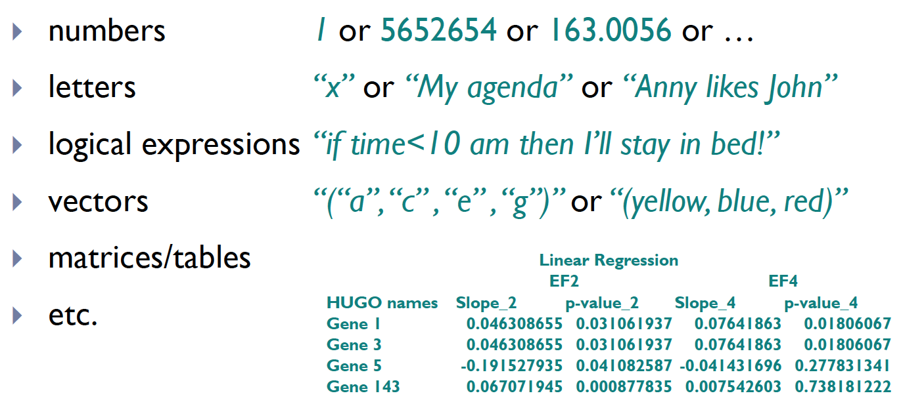
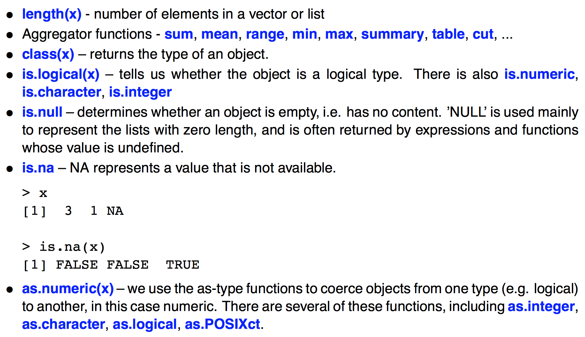

```{r, include = FALSE}
library(tidyverse)
```


## What is R?

### {.box-8 .offset-2 .bg-yellow}

R is a language and environment for **statistical** computing and **graphics**.

### Advantages of R {.box-8 .offset-2 .bg-blue}

- FREE software
- easy to download/install/update
- easy to process big files and analyze huge amounts of data
- integrated data visualization tools
- programs can be integrated in the text (for instance, `.pdf` file will contain the results of calculations, figures, etc. - __**RMarkdown**__)

More details on https://www.r-project.org/about.html

## What can I do with R?{.build}

### {.box-4 .bg-blue .large}

Data input/import

### {.box-4 .bg-blue .large}

Data output/export

### {.box-4 .bg-blue .large}

Basic operations (arithmetical, etc)

### {.box-4 .bg-blue .large}

Data visualization

### {.box-4 .bg-blue .large}

Data analysis

### {.box-4 .bg-blue .large}

much more...

## How to install R on my PC?

### R{.box-8 .offset-2 .bg-green}

- go to http://cran.r-project.org
- choose your system
- choose **base**
- download R
- run the downloaded file

### Rstudio {.box-8 .offset-2 .bg-blue}

- go to https://www.rstudio.com/
- choose the **free RStudio Desktop** version
- choose your system
- download
- run the downloaded file

## How to start coding?

Create a new script with:

### {.box-10 .bg-white .offset-1}


## What are "inputs"?

###{.box-10 .offset-1 .bg-yellow}

Inputs are your data, something you will work with further in your program.

### Inputs may be {.box-10 .offset-1 .bg-white}



## Data types in R

### Inputs may be {.box-10 .offset-1 .bg-red .small}

```{r, echo = FALSE}
tribble(~`Your data`, ~`R data type`,
"Number(s)", "Numeric: Integer; Double; Complex",
"Letter(s)", "Character",
"Logical expression", "Logical, TRUE and FALSE are the logical constants",
"Vector", "Vector (with elements of numeric, character, logical, etc. type)",
"Matrix", "Matrix or Array (elemetns of the above types)",
"Table", "Data frame, List",
"", "Factors"
) %>%
  knitr::kable()
```

<!--  -->

### {.box-10 .bg-yellow}

Call the command **`class()`** to see what data you are working with.

## Variables in R

- Let's say your cases are Bob, Fred, Barb, Sue, and Jeff. 
- Age, height, weight, race, year in school, and SAT score are called **variables**. 
- You would ordinarily put this information into a data frame as follows:

### {.box-8 .offset-2 .bg-red}

name   |  age | hgt | wgt | race |gender|SAT 
-------|------|-----|-----|------|------|----
Bob    |   21 |  70 | 180 | Cauc |  M   |1080
Fred   |   18 |  67 | 156 |Af.Am |  M   |1210
Barbara|   18 |  64 | 128 |Af.Am |  F   | 840
Sue    |   24 |  66 | 118 | Cauc |  F   |1340

## Variables in R

Numbers, like age and weight, are called **numerical variables**. 

The names of categories that the subject falls into, for example race ad gender, are called <b>categorical variables</b>.

Categorical variables are often called **factors** in R.

### {.box-8 .offset-2 .bg-white}

name   |  age | hgt | wgt | race |gender|SAT 
-------|------|-----|-----|------|------|----
Bob    |   21 |  70 | 180 | Cauc |  M   |1080
Fred   |   18 |  67 | 156 |Af.Am |  M   |1210
Barbara|   18 |  64 | 128 |Af.Am |  F   | 840
Sue    |   24 |  66 | 118 | Cauc |  F   |1340

## Variables in R

When we think of categorical variables or factors, we are thinking of variables that have relatively few possible values. These values are called **levels**. The levels of gender, for example, are F and M.

When a variable has a different value for everyone, like the subject's name or address for example, it's often called a **character variable**.

## Assignment

In R you create things, called "objects", by a process called **assignment**.

To assign data to an object name in R:
```{r}
x <- 7
```

Here is another way to do assignment:
```{r}
x = 7
```

This SHOULD NOT be read as "x equals 7", which will result in confusion later. Instead, the single equals sign means "takes the value" or "is assigned the value."

## Workspace

There are several ways to check content of variable:

- Select the variable and press Ctrl+Enter (cmd + Enter for Mac)

- run command

```{r}
print(x)
```

- In R Console type **x** to see it's value.

## Workspace

As you work in R and create new vectors it can be easy to lose track of what variables you have defined.

### Listing variables {.box-6 .offset-3 .bg-red}

- To get a list of all of the variables that have been defined use the `ls()` command:
    ```{r}
    ls()
    ```
- Check "Environment" tab in RStudio

## Workspace and Files

```{r, title = "Find out your working directory", width = 8, class = "offset-2"}
getwd()
```

```{r, title = "List its files" , width = 8, class = "offset-2"}
list.files()
```

## Numeric variables

### Numeric data in R {.box-8 .offset-2 .bg-red}

- double
- integer

In practice, numeric computations always produce `double` results thus `numeric` name is used as a synonym. 

### Integers {.box-6 .bg-red}

Integers are a little more than 2 billion.

```{r}
.Machine$integer.max

```

### Double{.box-6 .bg-red}

Doubles can be bigger because they are stored as **double precision floating point numbers**, which have two pieces:

```{r, echo = FALSE}
# Using R for the double example
#round(.Machine$double.xmax), options()[["digits"]]
double_precision <- as.character(.Machine$double.xmax) %>%
  str_split("e\\+") %>%
  flatten_chr() %>%
  parse_number()
```

- the exponent (like `r double_precision[2]` below)
- the "significant" (like  `r round(double_precision[1], options()[["digits"]] - 1)`  below).

```{r}
.Machine$double.xmax
```

## Numeric variables

R will automatically convert (coerce) between the numeric classes when needed.

### `double` is the default {.box-6 .bg-red .stretch}

- Most math is done using double precision
- Thus it is the default storage.

```{r}
is.numeric(1)
is.integer(1)
```

### `integer` must be forced {.box-6 .bg-red .stretch}

- Sometimes you may want to specifically store a vector as integers
    + if you know that they will never be converted to doubles (used as ID values or indexing)
    + since integers require less storage space.

```{r}
is.numeric(1L)
is.integer(1L) #Putting capital 'L' after an integer forces it to be stored as an integer.
```

## Create variable in R

- create a new variable based on <b>a</b>
```{r}
a <- 2
c <- (a^5 - a)
c
```

## Practice time!{.bg-green}

### Using `swirl`{} {.box-10 .offset-1 .bg-white}

Type in R console:
```{r, eval = FALSE}
library(swirl)
swirl()
#Lesson 1, 2, 3
```

- Choose the "R Programming E" course.
- Complete lessons **1, 2**  and **3**.
- In the end of the lesson send the email to ganna.androsova@uni.lu\
  The email subject should be generated automaticly by swirl, in the email body place your last command used in the lesson.

## Naming of variables{.middle}

### **Be consistent with naming!** {.box-6 .bg-yellow}

- Use [naming conventions](https://journal.r-project.org/archive/2012-2/RJournal_2012-2_Baaaath.pdf):
    + alllowercase
    + period.separated
    + **underscore_separated** (_recommended by [Hadley Wickham](http://adv-r.had.co.nz/Style.html)_)
    + lowerCamelCase
    + UpperCamelCase
<!-- - _e.g._ `new_plot`, `my_list`, `new_function`, `transition_matrix` ... -->

### Use **MEANINGFUL** names {.box-6 .bg-yellow}

**matrix_multiplication** is better than **mult**


## Naming of variables

> **The World's Worst Variable Name** to be: data\
Of course it's data! That's what variables contain! That's all they ever can contain. It's like you're packing up your belongings to move to a new house, and on the side of the box you write, in big black marker, "things".| [Andy Lester](http://archive.oreilly.com/pub/post/the_worlds_two_worst_variable.html) {.bg-red}

### Guess {.box-6 .bg-blue .build}

- What is the **second** worst variable name?
- data2

```{r, eval = FALSE}
total <- price * qty
total2 <- total - discount
total2 <- total2 + total * taxrate
total3 <- purchase_order_value + available_credit

if ( total2 < total3 ) {
    print "You can't afford this order.";
}
```

If you're faced with naming something total2, change the existing name to something more specific.

## Create a vector in R

- create a vector with several elements by command **c(object, object, ...)**, which combines objects into a vector

```{r}
a <- c(1, 2, 3)
a
a <- c(1:3)
a
a + 5
```

## Basic R operations

```{r}
a * 4
sqrt(a)
exp(a)
log(a)
```

## Basic R operations

We can save the results in another vector called **b** and use parentheses for more complicated expressions:
```{r}
b <- (a + sqrt(a))/(exp(2)+1)
print(b)
a / b
```

## Basic R operations

While performing operations on vectors, all of the vectors in an expression must be the same length. If the lengths of the vectors differ then you may get an error message, or worse, a warning message and unpredictable results:
```{r, warning = TRUE}
a <- c(1, 2, 3, 4, 5, 6)
#or
a <- 1:6

b <- c(10,11,12) 
a + b
```
R has tendency to recycle data.

## Operations with vectors


## Operations with vectors

```{r}
help(sort)
```

<b>help</b> will return a full description of the query command: what it does, what it needs as input, what will be produced in output
```{r}
sort(a, decreasing = FALSE)
sort(a, decreasing = TRUE)
```

## Logical

Logical binary, two possible values represented by <b>TRUE</b> and <b>FALSE</b>.

```{r}
a <- c(3, 7, 1, 2, 4)
a > 2
a == 2
!(a <= 3)
```

## Find which element is...

```{r}
a
which(a > 2)
a[which(a > 2)]
```

## Functions to Provide Information about Vectors



## Logical Operators


## Practice time!

Type in R console:
```{r, eval = F}
swirl()
#Lesson 4, 8
```

Choose the "R Programming E" course.
Complete lessons <b>4</b>  and <b>8</b>. In the end of the lesson send the email to ganna.androsova@uni.lu

The email subject should be generated automaticly by swirl, in the email body place your last command used in the lesson.

## Missing Data

```{r}
v <- c(1:3, NA, NA, 5:8, NA)
v
is.na(v)
which(is.na(v))
v[!is.na(v)]
```

## Subsetting Vectors 

R has a few built in vectors. One of these is <b>LETTERS</b>.

```{r}
LETTERS
```

How do extract the first element from this (the letter A). Here is how to do it:
```{r}
LETTERS[1]
```
Use the square brakets to subset vectors.

## How to get folliwing outputs?

```{r}
## [1] "B" "C" "D" "E"
```
```{r}
## [1] "B" "C" "D" "E" "G"
```
```{r}
## [1] "A" "B" "C" "D" "E" "Y"
```

## How to get folliwing outputs?

```{r}
LETTERS[2:5]
LETTERS[c(2:5, 7)]
LETTERS[c(1:5, length(LETTERS) - 1)]
```

## Named vectors

We can assign names to vector members.

For example, the following variable v is a character string vector with two members.
```{r}
v = c("Mary", "Sue")
names(v) = c("First", "Last")
v
v = c(First = "Mary", Last = "Sue")
v
```

## Named vectors

Then we can retrieve the first member by its name.
```{r}
v["First"] 
```
Or reverse the order with a character string index vector.
```{r}
v[c("Last", "First")] 
```

## Practice time!

Type in R console:
```{r, eval = F}
swirl()
#Lesson 5, 6
```

Choose the "R Programming E" course.
Complete lessons <b>5</b>  and <b>6</b>. In the end of the lesson send the email to ganna.androsova@uni.lu

The email subject should be generated automaticly by swirl, in the email body place your last command used in the lesson.

## From vectors to matrices

```{r}
a <- c(1,2)
b <- c(3,4)
```

- You may bind two vectors columnwise or rowwise: 
```{r}
cbind(a, b)
c <- rbind(a, b)
```
- But vectors must be of the same length!

## From vectors to matrices

To create a x-by-y matrix of 0s :
```{r}
matrix(0, nrow = 2, ncol = 3)
```
To create any matrix:
```{r}
matrix(c(1,2,3,4,5,6), nrow = 2, ncol = 3)
```

## What is matrix?

- All the elements of a matrix must be of the <b>same type</b> (numeric, logical, character, complex).
- It is useful for such data type as gene expression, proteomics data, etc.


## Row and column naming

Give a vector with names, the length of which corresponds to dimentions of matrix:

```{r}
c <- matrix(c(1,2,3,4,5,6,7,8,9), nrow = 3, ncol = 3)
names <- c("first_row", "second_row", "third_row")
length(names)
rownames(c) <- names
colnames(c) <- c("A", "B", "C")
print(c)
```

## Addressing elements

To access an element in matrix, specify row index (or row name) and then column index (or name) as <b>[row_index, col_index]</b>
```{r}
c
c[1, 2]
c[2, "B"]
```

## Addressing elements in matrix

Within the brackets you may specify various arguments, including not only numbers, but also conditions to which the desired elements must satisfy:
```{r}
c[1,]
c[c>3]
```

## Operations with matrix

Other operations like <b>transpose</b>, <b>matrix multiplication</b> can be performed:
```{r}
d <- t(c)
d
c %*% d
```

## Operations with matrix

Be careful with the * operator: it does not perform matrix multiplication, but rather an entry-wise multiplication:
```{r}
c
d
c * d
```

## Data frames

A data frame is used for storing data tables. It is a list of vectors of equal length. For example, the following variable df is a data frame containing three vectors n, s, b.
```{r}
numbers <- c(2, 3, 5)
letters <- c("aa", "bb", "cc")
logicals <- c(TRUE, FALSE, TRUE)
df <- data.frame(numbers, letters, logicals)
df
```

## What is the difference between matrices and data frames?

- Rows and columns of a matrix must have the same class (numeric, character, etc).  
- In a dataframe, you can have mixture of every class.
- You can convert from one to the other using <b>as.data.frame()</b> or <b>as.matrix()</b>.

WARNING: if you convert a dataframe with different classes of columns, then your matrix will just be all character.

## Matrix vs. data frame?

R has a built-in data frame called mtcars. Let's take first 5 rows and 5 columns:
```{r}
mtcars[1:5,1:5]
```

## Matrix vs. data frame?

Now convert it into matrix:
```{r}
as.matrix(mtcars[1:5,1:5])
```
-> nothing changed

## Matrix vs. data frame?

Change it's first element:
```{r}
mtcars[1,1] <- "text"
```
Now convert it into matrix:
```{r}
as.matrix(mtcars[1:5,1:5])
```
-> all matrix is composed of characters (text)

-> numbers are not recognized as numbers (for algebraic operations) but as text

## Data frames

We can use the row and column names instead of the numeric coordinates.
```{r}
mtcars["Mazda RX4", "cyl"]
```
The number of data rows in the data frame is given by:
```{r}
nrow(mtcars)
ncol(mtcars) #for number of columns
```

## Data frames

Access the specific column by <b>$column_name</b> (this only works for data frames)
```{r}
mtcars$cyl
mean(mtcars$cyl)
median(mtcars$cyl)
```

## Working with data frames

```{r}
quantile(mtcars$cyl)
min(mtcars$cyl)
sd(mtcars$cyl)
```

## Working with data frames

```{r}
summary(mtcars[,1:4]) #prints min, max, mean, median, and quantiles
```

## Working with data frames

Change the column names of data frame with function <b>names( )</b>
```{r}
names(mtcars)[1] <- "new_name"
```
To see first n elements of your data frame use <b>head(data_frame, n)</b>
```{r}
head(mtcars) #Gives first 6 rows if n is not specified
```

## Practice time!

Type in R console:
```{r, eval = F}
swirl()
#Lesson 7
```

Choose the "R Programming E" course.
Complete lesson <b>7</b>. In the end of the lesson send the email to ganna.androsova@uni.lu

The email subject should be generated automaticly by swirl, in the email body place your last command used in the lesson.

## Factors

A <b>factor</b>-type vector contains a set of numeric codes with character-valued levels. Example, a family of two girls (1) and four boys (0):
```{r}
kids <- factor(c(1,0,1,0,0,0), levels = c(0, 1), labels = c("boy", "girl"))
kids
class(kids)
mode(kids)
```

## Factors

- great for statistical analysis and exploring the data

However:

- when reading, cleaning, troubleshooting, merging and generally manipulating the data, factors are a total pain

- factors stick around even if you remove some data such that no examples of a particular level still exist

## Factors

```{r}
levels(kids)
kids <- kids[kids!="boy"]
levels(kids) # still the same levels
table(kids) # even though one level has 0 entries!
```

## Lists

An ordered collection of objects (components). A list allows you to gather a variety of (possibly unrelated) objects under one name.
```{r}
# example of a list with 4 components - a string, a numeric vector, a matrix, and a scaler 
mylist <- list(name="Fred", mynumbers=a, mymatrix=c, age=5.3)

# example of a list containing two lists 
two_lists <- list(mylist, list("first_elelment", "second_element"))
```

## Lists

Identify elements of a list using the [[]] convention
```{r}
mylist[[1]] # 1st component of the list
mylist[["mynumbers"]] # component named mynumbers in list
```

## Lists

If you have nested lists: indicate with [[]] number of list followed by [] number of element of that list
```{r}
two_lists[[1]][3]
two_lists[[2]][1]
```

## Functions

```{r}
myfun <- function(x){ 
  return(x*x)
}

myfun(2)
```
If no return() is given, the object last created is returned.

## Functions

```{r}
myfun <- function(x, a){ 
  r <- a*sin(x) 
  return(r)
} 

#Short version
myfun <- function(x, a){ a*sin(x) }

result <- myfun(pi/2,2)
result
```

## Functions

Multiple return values have to be returned as a single list.
```{r}
# a is optional parameter with default=1
myfun4 <- function(x, a=1){
  result1 <- a*sin(x)
  result2 <- a*cos(x)
  return(list(result1,result2)) # one list as result
} 
myfun4(pi/2)
```
R doesn't handle return(result1,result2)

## Global and local scope


## Global and local scope

```{r}
global.var <- 10

new.fun <- function(x){
  print(paste("Global variable", global.var))
  
  local.variable <- x-3
  print(paste("Local variable", local.variable))
  
  return(local.variable)
}

new.var <- new.fun(global.var)
```

If you print local variable, it is not kept outside of the sunction environment -> error in print(local.variable) : object 'local.variable' not found

```{r, eval=FALSE}
print(local.variable)
```

## Practice time!

Type in R console:
```{r, eval = F}
swirl()
#Lesson 9
```

Choose the "R Programming E" course.
Complete lesson <b>9</b>. In the end of the lesson send the email to ganna.androsova@uni.lu

The email subject should be generated automaticly by swirl, in the email body place your last command used in the lesson.

## Control statements: conditions

To check whether your data satisfy some particular condition, R has a structure:
<b>if (expression1) {  expression2 } else { expression3 }</b>

Here <b>expression1</b> must include logical operators and be evaluated to a single logical value (<b>TRUE</b> or <b>FALSE</b>).

'If TRUE, then the <b>expression2</b> is executed.

If FALSE, then <b>expression3</b> is executed. The <b>expression3</b> may be either a single command, or a sequence of commands, or again a control statement, like if ' else operator or a loop.

## Control statements: conditions


```{r, warning=FALSE}
x <- c(2,3,4,5)

if (all(x) == 0) { 
  x[length(x)+1] <- 5
  print(x) 
} else { 
  x[length(x)+1] <- 16 
  print(x) 
}
```

## Repetitive execution: for loop

If there's a need in multiple execution of the same command or a sequence of commands, use statement:

<b>for (xxx in expression1) { expression2 }</b>

'Here <b>xxx</b> is a loop variable; <b>expression1</b> is the sequence of instances, which <b>xxx</b> should run on and <b>expression2</b> is the (group of) command(s) to be executed.

<b>'expression2</b> is repeatedly evaluated as xxx ranges through the values in the vector result of expression1.

## For loop (example 1)

```{r}
mymat <- matrix(nrow=30, ncol=30) # create a 30 x 30 matrix

for(i in 1:dim(mymat)[1]){   # for each row
  for(j in 1:dim(mymat)[2]){ # for each column
    mymat[i,j] <- i*j         # assign a product of two indexes
  }
}  
mymat[1:8, 1:8]
```

## For loop (example 2)

The Fibonacci numbers have many mathematical relationships and have been discovered repeatedly in nature. They are constructed as the sum of the previous two values, initialized with the values 1 and 1.
```{r}
#Let's calculate 10 Fibonacci numbers
fibvals <- rep(0, 10) #Create vector which will contain 10 values
fibvals[1] <- 1 #Assign 1 to first and second variable
fibvals[2] <- 1
for (i in 3:10) {
   fibvals[i] <- fibvals[i-1]+fibvals[i-2]
} 
fibvals
```

## Other loops: repeat and while

There exist other statements for repeated expressions: <b>repeat</b> expression and <b>while</b> (condition) expression.

The <b>break</b> statement can be used to terminate any loop, possibly abnormally. This is the only way to terminate <b>repeat</b> loops, usually by using <b>if'else'</b> statement to check if the desired condition is satisfied.

The <b>next</b> statement can be used to discontinue one particular cycle and skip to the 'next' (this is more likely to be used in <b>for</b> and <b>while</b> loops)

## While loop

<b>while()</b> loop will execute a block of commands until the condition is no longer satisfied.
```{r}
x <- 1 
while (x < 4) { 
  x <- x + 1
  print(x) 
}
```

## While loop

<b>next</b> can skip one step of the loop; <b>break</b> will end the loop abruptly.
```{r}
x <- 1 
while (x < 4) { 
  x <- x + 1
  if (x == 3){
    next
  }
  print(x) 
}
```

## Repeat loop

<b>repeat</b> is similar to while and for loop, it will execute a block of commands repeatly till break.
```{r}
x <- 0 
repeat { 
  x <- x + 1
  print(x)
  if (x > 5) {
    break
  }
}
```
If no <b>break</b> is given, loop runs forever!

## The apply() commands

these commands allow functions to be run on matrices.

<b>apply()</b> function used on matrix
 
<b>tapply()</b> table grouped by factors

<b>lapply()</b> on lists and vectors; returns a list

<b>sapply()</b> like lapply(); returns vector/matrix

<b>mapply()</b> multivariate sapply()

## apply()

<b>apply(data, margin, function)</b>
```{r}
a <- matrix(1:10,nrow=2)
apply(a,1,mean) # 1 = by rows
apply(a,2,mean) # 2 = by columns

# the function can also be anonymous
apply(a, 2, function(x){x[[sample.int(length(x),1)]]})
```

## lapply()

<b>lapply(list, function)</b>

<b>sapply(list or vector, function)</b>
```{r}
a <- matrix(2:11,nrow=2)
b <- matrix(1:10,nrow=2)
c <- list(a,b)

lapply(c,mean)
```

## sapply()

<b>sapply(list or vector, function)</b>
```{r}
sapply(c,mean)
```

## mapply()

Like sapply() but applies over the first elements of each argument

<b>mapply(FUNCTION, list, list, list...)</b>
```{r}
mapply(rep, pi, 3:1)
```

## mapply()

Like sapply() but applies over the first elements of each argument

<b>mapply(FUNCTION, list, list, list...)</b>
```{r}
# equivalent to: 
rep(pi, 3) 
rep(pi, 2) 
rep(pi, 1)
```

## Vectorization

A "vectorized" function <b>f()</b> takes a vector [x1, x2, ... , xn] as input and returns the vector [f(x1), f(x2), f(x3), ... , f(xn)].

<b>Why is vectorization important?</b>

Vectorized functions usually involve a behind-the-scenes loop in a low-level language (C or Fortran), which runs way faster than a pure R loop.

## Vectorization

Here's an example using the vectorized log() function that illustrates the speedup you can get:
```{r, warning=FALSE}
# Create a vector of 1 million random numbers between 1 and 10
nums <- sample(1:10, size=1000000, replace=TRUE) 

# Loop to call log on each vector element separately:
system.time(
  for (x in seq_along(nums)){
    nums[i] <- log(nums[i])
  }
)
```

## Vectorization

Here's an example using the vectorized log() function that illustrates the speedup you can get:
```{r, warning=FALSE}
system.time(log(nums))
```

So in conclusion: vectorization is important because it allows you to operate on vectors quickly (unlike looping).

## Vectorised functions

R has <b>ifelse( )</b> function that works with vectors:
```{r}
x <- c(6:-4)
sqrt(x)  # gives warning
sqrt(ifelse(x >= 0, x, NA))  # no warning
```

## Vectorised functions

R has <b>ifelse( )</b> function that works with vectors:
```{r, warning=TRUE}
## Note: the following also gives the warning !
ifelse(x >= 0, sqrt(x), NA)
```

## Vectorised functions

Default vectorized matrix functions: 

- <b>rowSums(), colSums(), rowMeans(), colMeans()</b>

Vectorized matrix functions in package genefilter:

- <b>rowSds(), colSds(), rowVars(), colVars(), rowttests(), rowFtests()</b>

Vectorized matrix functions in package matrixStats:

- <b>colMedians(), rowMedians()</b>

## Practice time!

Type in R console:
```{r, eval = F}
swirl()
#Lesson 10
```

Choose the "R Programming E" course.
Complete lesson <b>10</b>. In the end of the lesson send the email to ganna.androsova@uni.lu

The email subject should be generated automaticly by swirl, in the email body place your last command used in the lesson.
