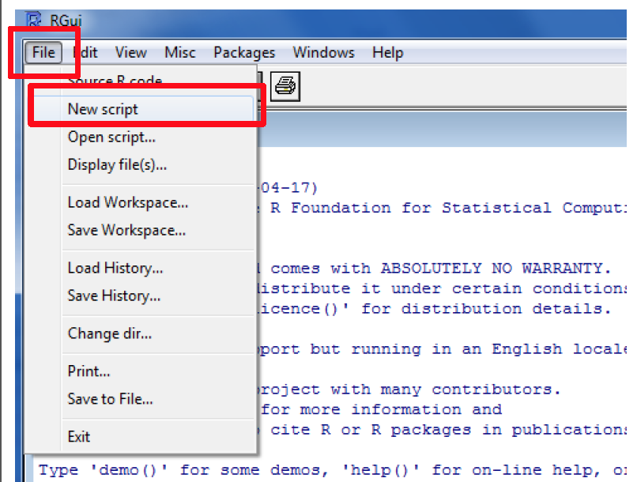

<style>
.reveal code .r{
    width:120%
    font:0.8em}
.section .reveal .state-background {
    background: white;}
.section .reveal h1,
.section .reveal p {
    color: black;
    position: relative;
    top: 4%;}
.reveal h1, .reveal h2, .reveal h3 {
  word-wrap: normal;
  -moz-hyphens: none;
}
.small-code pre code {
  font-size: 1em;
}
.midcenter {
    position: fixed;
    top: 50%;
    left: 50%;
}
.reveal .column {
    display:block;
}
</style>

Introduction to R
========================================================
author: Ganna Androsova
date: 2015-01-05
font-family: 'Arial'
transition: fade
<br>
<br>
<br>
<br>
<br>
<br>
<br>
<div style = "font-size:60%">Slides are adapted from presentation "Practicals in Bioinformatics" by Dr. Tatiana R. Baumuratova</div>

What is R?
========================================================

R is a language and environment for **statistical** computing and **graphics**.

Advantages of R:
- FREE software
- easy to download/install/update
- easy to process big files and analyze huge amounts of data
- integrated data visualization tools
- programs can be integrated in the text (for instance, .pdf file will contain then results of calculations, figures, etc. - RMarkdown)

More details on https://www.r-project.org/about.html

What can I do with R?
========================================================
- Data input/import
- Data output/export
- Basic operations (arithmetical, etc)
- Data visualization
- Data analysis
- much more...

How to install R on my PC?
========================================================

- go to http://cran.r-project.org
- choose your system
- choose **base**
- download R
- run the downloaded file

How to start coding?
========================================================

Create a new script with:
<div style="width:70%"></img></div>

What is called ‘inputs’?
========================================================
Inputs are your data, something you will work with further in your program.

Inputs may be:


Data types in R
========================================================

Call command **class( )** to see what data you are working with.

Variables in R
========================================================
Let's say your cases are Bob, Fred, Barb, Sue, and Jeff. 

Age, height, weight, race, year in school, and SAT score are called **variables**. 

You would ordinarily put this information into a data frame as follows:

name   |  age | hgt | wgt | race |gender|SAT 
-------|------|-----|-----|------|------|----
Bob    |   21 |  70 | 180 | Cauc |  M   |1080
Fred   |   18 |  67 | 156 |Af.Am |  M   |1210
Barbara|   18 |  64 | 128 |Af.Am |  F   | 840
Sue    |   24 |  66 | 118 | Cauc |  F   |1340
Jeff   |   20 |  72 | 202 |Asian |  M   | 880

Variables in R
========================================================
Numbers, like age and weight, are called **numerical variables**. 

The names of categories that the subject falls into, for example race ad gender, are called **categorical variables**.

Categorical variables are often called **factors** in R.

name   |  age | hgt | wgt | race |gender|SAT 
-------|------|-----|-----|------|------|----
Bob    |   21 |  70 | 180 | Cauc |  M   |1080
Fred   |   18 |  67 | 156 |Af.Am |  M   |1210
Barbara|   18 |  64 | 128 |Af.Am |  F   | 840
Sue    |   24 |  66 | 118 | Cauc |  F   |1340
Jeff   |   20 |  72 | 202 |Asian |  M   | 880

Variables in R
========================================================
When we think of categorical variables or factors, we are thinking of variables that have relatively few possible values. These values are called **levels**. The levels of gender, for example, are F and M.

When a variable has a different value for everyone, like the subject's name or address for example, it's often called a **character variable**.

Assignment
========================================================
class: small-code
In R you create things, called "objects", by a process called **assignment**.

To assign data to an object name in R:

```r
x = 7
```
This SHOULD NOT be read as "x equals 7", which will result in confusion later. Instead, the single equals sign means "takes the value" or "is assigned the value."

Here is another way to do assignment:

```r
x <- 7
```

Workspace
========================================================
class: small-code
There are several ways to check content of variable:
- Select the variable and press Ctrl+Enter (cmd + Enter for Mac)
- run command

```r
print(x)
```

```
[1] 7
```
- In R Console type **x** to see it's value.
- Check "Environment" tab in RStudio

Numeric variables
========================================================
class: small-code
Numeric data in R in either "double" or "integer". In practice, numeric computations always produce "double" results thus "numeric" name is used as a synonym. 

Integers are a little more than 2 billion, while the other numerics are much bigger.
They can be bigger because they are stored as double precision floating point numbers, which have two pieces: the exponent (like 308 below), and the "significant" (like 1.797693 below).

```r
.Machine$integer.max
```

```
[1] 2147483647
```

```r
.Machine$double.xmax
```

```
[1] 1.797693e+308
```

Numeric variables
========================================================
class: small-code
R will automatically convert between the numeric classes when needed.

Most math is done using double precision, so that is often the default storage.

```r
is.numeric(1)
```

```
[1] TRUE
```

```r
is.integer(1)
```

```
[1] FALSE
```

Numeric variables
========================================================
class: small-code
Sometimes you may want to specifically store a vector as integers if you know that they will never be converted to doubles (used as ID values or indexing) since integers require less storage space. 

```r
is.numeric(1L)
```

```
[1] TRUE
```

```r
is.integer(1L) #Putting capital 'L' after an integer forces it to be stored as an integer.
```

```
[1] TRUE
```

Create variable in R
========================================================
class: small-code
- create a new variable based on **a**

```r
a = 2
c = (a^5 - a)
c
```

```
[1] 30
```

Create a vector in R
========================================================
class: small-code
- create a vector with several elements by command **c(object,object,...)**, which combines objects into a vector

```r
a = c(1,2,3)
a
```

```
[1] 1 2 3
```

```r
a = c(1:3)
a
```

```
[1] 1 2 3
```

```r
a + 5
```

```
[1] 6 7 8
```

```r
a * 4
```

```
[1]  4  8 12
```
Basic R operations
========================================================
class: small-code

```r
a - 10
```

```
[1] -9 -8 -7
```

```r
sqrt(a)
```

```
[1] 1.000000 1.414214 1.732051
```

```r
exp(a)
```

```
[1]  2.718282  7.389056 20.085537
```

```r
log(a)
```

```
[1] 0.0000000 0.6931472 1.0986123
```

Basic R operations
========================================================
class: small-code
We can save the results in another vector called **b** and use parentheses for more complicated expressions:

```r
b = (a + sqrt(a))/(exp(2)+1)
print(b)
```

```
[1] 0.2384058 0.4069842 0.5640743
```

```r
a / b
```

```
[1] 4.194528 4.914195 5.318448
```

Basic R operations
========================================================
class: small-code

While performing operations on vectors, all of the vectors in an expression must be the same length. If the lengths of the vectors differ then you may get an error message, or worse, a warning message and unpredictable results:

```r
a = c(1,2,3)
b = c(10,11,12,13)
a + b
```

```
Warning in a + b: longer object length is not a multiple of shorter object
length
```

```
[1] 11 13 15 14
```

```r
a = c(1,2)
a + b
```

```
[1] 11 13 13 15
```
R has tendency to recycle data.

Logical
========================================================
class: small-code
Logical – binary, two possible values represented by **TRUE** and **FALSE**.

```r
a = c(3, 7, 1, 2, 4)
a > 2
```

```
[1]  TRUE  TRUE FALSE FALSE  TRUE
```

```r
a == 2
```

```
[1] FALSE FALSE FALSE  TRUE FALSE
```

```r
!(a <= 3)
```

```
[1] FALSE  TRUE FALSE FALSE  TRUE
```

Find which element is...
========================================================
class: small-code

```r
a
```

```
[1] 3 7 1 2 4
```

```r
which(a > 2)
```

```
[1] 1 2 5
```

```r
a[which(a > 2)]
```

```
[1] 3 7 4
```

Functions to Provide Information about Vectors
========================================================


Logical Operators
========================================================


Basic R operations
========================================================
class: small-code
As you work in R and create new vectors it can be easy to lose track of what variables you have defined. To get a list of all of the variables that have been defined use the ls() command:

```r
ls()
```

```
[1] "a" "b" "c" "x"
```

Naming of variables
========================================================
Among R naming conventions, the period.separated lowercase is the most preffered one.

E.g. new.plot, my.list, new.function, transition.matrix...

Give **MEANINGFUL** names:
- **matrix.multiplication** is better than **mult**

Andy Lester declared **The World's Worst Variable Name** to be:

                          data

Of course it's data! That's what variables contain! That's all they ever can contain. It's like you're packing up your belongings to move to a new house, and on the side of the box you write, in big black marker, "things".

Naming of variables
========================================================

Guess: what is the **second** worst variable name?


Naming of variables
========================================================

                          data2

```r
total = price * qty
total2 = total - discount
total2 = total2 + total * taxrate
total3 = purchase_order_value + available_credit

if ( total2 < total3 ) {
    print "You can't afford this order.";
}
```

If you're faced with naming something total2, change the existing name to something more specific.

Vectors
========================================================
class: small-code

You have already seen vector creation: **a = c(1,2,3)**

To generate a sequence of values from x to y with one step: **x:y**

```r
a = 2:10
a
```

```
[1]  2  3  4  5  6  7  8  9 10
```
or

```r
b = c(1, 16, 23:28)
b
```

```
[1]  1 16 23 24 25 26 27 28
```

Operations with vectors
========================================================


Operations with vectors
========================================================
class: small-code

```r
help(sort)
```

**help** will return a full description of the query command: what it does, what it needs as input, what will be produced in output

```r
sort(a, decreasing = FALSE)
```

```
[1]  2  3  4  5  6  7  8  9 10
```

```r
sort(a, decreasing = TRUE)
```

```
[1] 10  9  8  7  6  5  4  3  2
```

From vectors to matrices
========================================================
class: small-code

```r
a = c(1,2)
b = c(3,4)
```

- You may bind two vectors columnwise or rowwise: 

```r
cbind(a, b)
```

```
     a b
[1,] 1 3
[2,] 2 4
```

```r
c = rbind(a, b)
```
- But vectors must be of the same length!

From vectors to matrices
========================================================
class: small-code
To create a x-by-y matrix of 0s :

```r
matrix(0, nrow = 2, ncol = 3)
```

```
     [,1] [,2] [,3]
[1,]    0    0    0
[2,]    0    0    0
```
To create any matrix:

```r
matrix(c(1,2,3,4,5,6), nrow = 2, ncol = 3)
```

```
     [,1] [,2] [,3]
[1,]    1    3    5
[2,]    2    4    6
```

Row and column naming
========================================================
class: small-code

Give a vector with names, the length of which corresponds to dimentions of matrix:


```r
c = matrix(c(1,2,3,4,5,6,7,8,9), nrow = 3, ncol = 3)
names = c("first_row", "second_row", "third_row")
length(names)
```

```
[1] 3
```

```r
rownames(c) = names
colnames(c) = c("A", "B", "C")
print(c)
```

```
           A B C
first_row  1 4 7
second_row 2 5 8
third_row  3 6 9
```

Addressing elements
========================================================
class: small-code

Every element of your R object has it’s order number inside the object. This order number is called index.

```r
b = c(1, 16, 23:27)
b
```

```
[1]  1 16 23 24 25 26 27
```

```r
b[2]
```

```
[1] 16
```

Addressing elements
========================================================
class: small-code
To access an element in matrix, specify row index (or row name) and then column index (or name) as **[row_index, col_index]**

```r
c
```

```
           A B C
first_row  1 4 7
second_row 2 5 8
third_row  3 6 9
```

```r
c[1, 2]
```

```
[1] 4
```

```r
c[2, "B"]
```

```
[1] 5
```

Addressing elements in matrix
========================================================
class: small-code

Within the brackets you may specify various arguments, including not only numbers, but also conditions to which the desired elements must satisfy:

```r
c
```

```
           A B C
first_row  1 4 7
second_row 2 5 8
third_row  3 6 9
```

```r
c[1,]
```

```
A B C 
1 4 7 
```

```r
c[c>3]
```

```
[1] 4 5 6 7 8 9
```

Operations with matrix
========================================================
class: small-code
Other operations like **transpose**, **matrix multiplication** can be performed:

```r
d = t(c)
d
```

```
  first_row second_row third_row
A         1          2         3
B         4          5         6
C         7          8         9
```

```r
c %*% d
```

```
           first_row second_row third_row
first_row         66         78        90
second_row        78         93       108
third_row         90        108       126
```

Operations with matrix
========================================================
class: small-code

Be careful with the * operator: it does not perform matrix multiplication, but rather an entry-wise multiplication:

```r
c
```

```
           A B C
first_row  1 4 7
second_row 2 5 8
third_row  3 6 9
```

```r
d
```

```
  first_row second_row third_row
A         1          2         3
B         4          5         6
C         7          8         9
```

```r
c * d
```

```
            A  B  C
first_row   1  8 21
second_row  8 25 48
third_row  21 48 81
```

Data frames
========================================================
class: small-code

A data frame is used for storing data tables. It is a list of vectors of equal length. For example, the following variable df is a data frame containing three vectors n, s, b.

```r
numbers = c(2, 3, 5)
letters = c("aa", "bb", "cc")
logicals = c(TRUE, FALSE, TRUE)
df = data.frame(numbers, letters, logicals)
df
```

```
  numbers letters logicals
1       2      aa     TRUE
2       3      bb    FALSE
3       5      cc     TRUE
```

What is the difference between matrices and data frames?
========================================================
- Rows and columns of a matrix must have the same class (numeric, character, etc).  
- In a dataframe, you can have mixture of every class.
- You can convert from one to the other using **as.data.frame()** or **as.matrix()**.

WARNING: if you convert a dataframe with different classes of columns, then your matrix will just be all character.

Matrix vs. data frame?
========================================================
class: small-code
R has a built-in data frame called mtcars. Let's take first 5 rows and 5 columns:

```r
mtcars[1:5,1:5]
```

```
                   mpg cyl disp  hp drat
Mazda RX4         21.0   6  160 110 3.90
Mazda RX4 Wag     21.0   6  160 110 3.90
Datsun 710        22.8   4  108  93 3.85
Hornet 4 Drive    21.4   6  258 110 3.08
Hornet Sportabout 18.7   8  360 175 3.15
```

Matrix vs. data frame?
========================================================
class: small-code
Now convert it into matrix:

```r
as.matrix(mtcars[1:5,1:5])
```

```
                   mpg cyl disp  hp drat
Mazda RX4         21.0   6  160 110 3.90
Mazda RX4 Wag     21.0   6  160 110 3.90
Datsun 710        22.8   4  108  93 3.85
Hornet 4 Drive    21.4   6  258 110 3.08
Hornet Sportabout 18.7   8  360 175 3.15
```
-> nothing changed

Matrix vs. data frame?
========================================================
class: small-code
Change it's first element:

```r
mtcars[1,1] = "text"
```
Now convert it into matrix:

```r
as.matrix(mtcars[1:5,1:5])
```

```
                  mpg    cyl disp  hp    drat  
Mazda RX4         "text" "6" "160" "110" "3.90"
Mazda RX4 Wag     "21"   "6" "160" "110" "3.90"
Datsun 710        "22.8" "4" "108" " 93" "3.85"
Hornet 4 Drive    "21.4" "6" "258" "110" "3.08"
Hornet Sportabout "18.7" "8" "360" "175" "3.15"
```
-> all matrix is composed of characters (text)

-> numbers are not recognized as numbers (for algebraic operations) but as text

Data frames
========================================================
class: small-code

We can use the row and column names instead of the numeric coordinates.

```r
mtcars["Mazda RX4", "cyl"]
```

```
[1] 6
```
The number of data rows in the data frame is given by:

```r
nrow(mtcars)
```

```
[1] 32
```

```r
ncol(mtcars) #for number of columns
```

```
[1] 11
```

Data frames
========================================================
class: small-code
Access the specific column by **$column_name** (this only works for data frames)

```r
mtcars$cyl
```

```
 [1] 6 6 4 6 8 6 8 4 4 6 6 8 8 8 8 8 8 4 4 4 4 8 8 8 8 4 4 4 8 6 8 4
```

```r
mean(mtcars$cyl)
```

```
[1] 6.1875
```

```r
median(mtcars$cyl)
```

```
[1] 6
```

Working with data frames
========================================================
class: small-code


```r
quantile(mtcars$cyl)
```

```
  0%  25%  50%  75% 100% 
   4    4    6    8    8 
```

```r
min(mtcars$cyl)
```

```
[1] 4
```

```r
sd(mtcars$cyl)
```

```
[1] 1.785922
```

```r
summary(mtcars[,1:4]) #prints min, max, mean, median, and quantiles
```

```
     mpg                 cyl             disp             hp       
 Length:32          Min.   :4.000   Min.   : 71.1   Min.   : 52.0  
 Class :character   1st Qu.:4.000   1st Qu.:120.8   1st Qu.: 96.5  
 Mode  :character   Median :6.000   Median :196.3   Median :123.0  
                    Mean   :6.188   Mean   :230.7   Mean   :146.7  
                    3rd Qu.:8.000   3rd Qu.:326.0   3rd Qu.:180.0  
                    Max.   :8.000   Max.   :472.0   Max.   :335.0  
```

Working with data frames
========================================================
class: small-code

Change the column names of data frame with function **names( )**

```r
names(mtcars)[1] = "new_name"
```
To see first n elements of your data frame use **head(data_frame, n)**

```r
head(mtcars) #Gives first 6 rows if n is not specified
```

```
                  new_name cyl disp  hp drat    wt  qsec vs am gear carb
Mazda RX4             text   6  160 110 3.90 2.620 16.46  0  1    4    4
Mazda RX4 Wag           21   6  160 110 3.90 2.875 17.02  0  1    4    4
Datsun 710            22.8   4  108  93 3.85 2.320 18.61  1  1    4    1
Hornet 4 Drive        21.4   6  258 110 3.08 3.215 19.44  1  0    3    1
Hornet Sportabout     18.7   8  360 175 3.15 3.440 17.02  0  0    3    2
Valiant               18.1   6  225 105 2.76 3.460 20.22  1  0    3    1
```

Factors
========================================================
class: small-code
A **factor**-type vector contains a set of numeric codes with character-valued levels. Example, a family of two girls (1) and four boys (0):

```r
kids = factor(c(1,0,1,0,0,0), levels = c(0, 1), labels = c("boy", "girl"))
kids
```

```
[1] girl boy  girl boy  boy  boy 
Levels: boy girl
```

```r
class(kids)
```

```
[1] "factor"
```

```r
mode(kids)
```

```
[1] "numeric"
```

Factors
========================================================
class: small-code
Regardless of the levels/labels of the factor, the numeric storage is an integer with 1 corresponding to the first level (in alphabetic-order).

```r
kids + 1
```

```
[1] NA NA NA NA NA NA
```

```r
as.numeric(kids)
```

```
[1] 2 1 2 1 1 1
```

```r
as.numeric(kids) + 1
```

```
[1] 3 2 3 2 2 2
```

Lists
========================================================
class: small-code

An ordered collection of objects (components). A list allows you to gather a variety of (possibly unrelated) objects under one name.

```r
# example of a list with 4 components - a string, a numeric vector, a matrix, and a scaler 
mylist = list(name="Fred", mynumbers=a, mymatrix=c, age=5.3)

# example of a list containing two lists 
two_lists = list(mylist, list("first_elelment", "second_element"))
```
Identify elements of a list using the [[]] convention

```r
mylist[[1]] # 1st component of the list
```

```
[1] "Fred"
```

```r
mylist[["mynumbers"]] # component named mynumbers in list
```

```
[1] 1 2
```

Lists
========================================================
class: small-code
If you have nested lists: indicate with [[]] number of list followed by [] number of element of that list

```r
two_lists[[1]][3]
```

```
$mymatrix
           A B C
first_row  1 4 7
second_row 2 5 8
third_row  3 6 9
```

```r
two_lists[[2]][1]
```

```
[[1]]
[1] "first_elelment"
```


