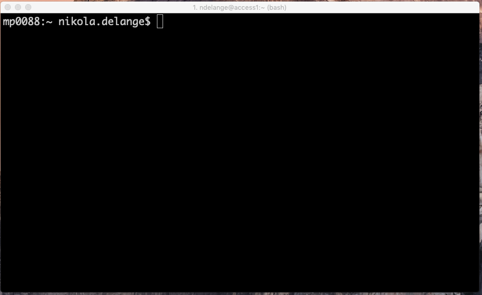
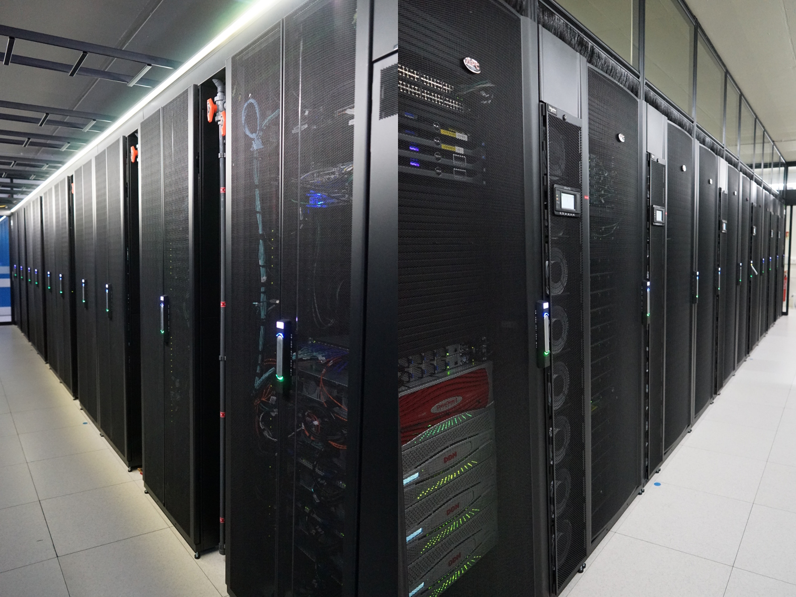
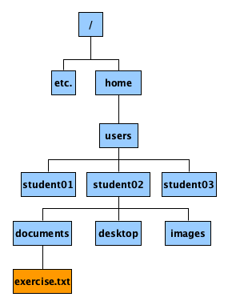
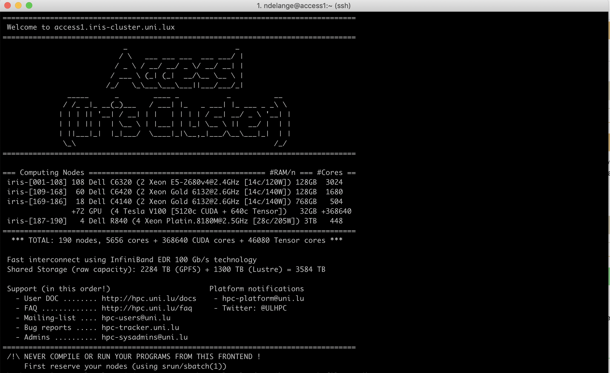

```{r setup, include=FALSE}
knitr::opts_chunk$set(echo = TRUE)

```

```{css, echo = FALSE}
.box-body {
  font-size: 16pt;
  }

.box-body > .chunk > h3 {
  font-size: 16pt;
  line-height: 24pt;
}

.ss {
  font-size: 16pt;
  
}

.p {
 font-size: 16pt;
}

.icon img{
  float: right;
  margin-left: 20px;
}
```

## General Information

### About me {.box-8 .bg-blue}
- Nikola de Lange
- 1st year PhD student
- PARK-QC Doctoral Training Unit

### Contact {.box-8}
- nikola.delange@uni.lu


## The Unix Shell

### What is the shell? {.bg-green .box-10 .offset-1}
- piece of software that provides a command line user interface of an operating system
- a program that runs other programs
- there is not only one shell
- most common Unix shell is *bash (Bourne again shell)* 


### {.box-8 .offset-2}



## Why do we use the shell?

### In general {.bg-green .box-6}
- the connection to compute servers
- flexible
- free
- fast 
- well documented

%end%

### {.box-6}


### In science {.bg-blue .box-6}
- reproducible 
- more computing power
- safer (backups)

%end%

### {.box-6}


## The filesystem

### Structure of an operating system{.box-6 .bg-yellow}
- tree
- root directory
- files
- processes

### {.box-6}


## Connect to the cluster
### Mac/Linux {.bg-green .box-10}
- `ssh -p 8022 student<no>@access-iris.uni.lu`

### Windows PuTTY{.bg-blue .box-8}
- Session 
    - Host Name: access-iris.uni.lu
    - Port 8022
- Connection > Data
    - Auto-login username: student`<no>`
- Connection > SSH > Auth
    - Load private key
    
## Iris

### {.box-12}

    

## On the cluster

### {.box-10 .bg-red}
**Don't run programs on the front node!**

### Jobs {.box-8 .bg-yellow}
- interactive session
- batch

### Job scheduling (interactive){.box-12}
On `access-iris`
```{bash eval=F}
srun -p interactive --qos qos-interactive --pty bash -i
srun -p interactive --qos qos-interactive --time=03:00 --pty bash -i

```


# Let's get started

## Practical session

### Material {.box-10}
https://swcarpentry.github.io/shell-novice/

